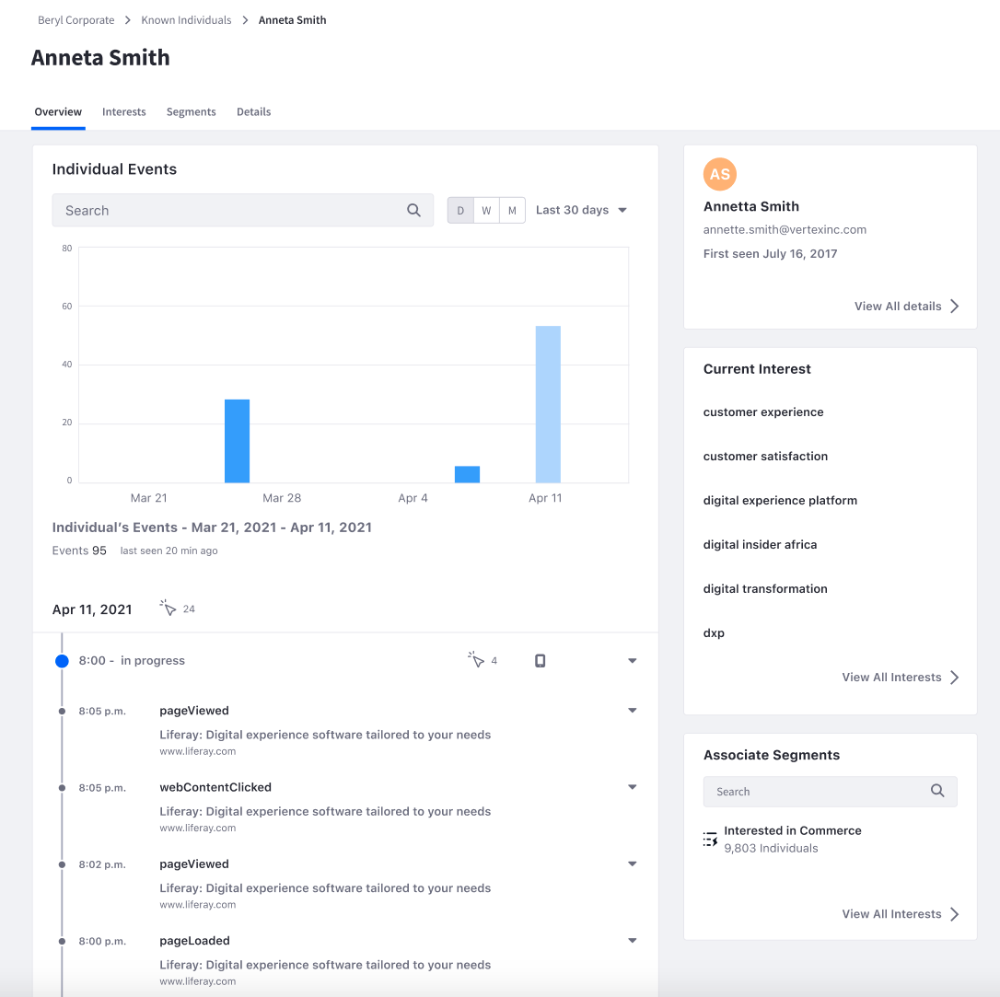

# Understanding Users with Analytics Cloud

Understanding who your visitors are and how they interact with your site is a crucial part of any business. Fortunately, Analytics Cloud comes with Liferay DXP. Analytic Cloud is a cloud-based SaaS tool that works together with your Liferay DXP instance. It aggregates your visitor data and presents useful metrics such as visitor count, session length, interests, and more. Use the traffic insights from Analytics Cloud to continue to optimize and improve your website. Follow a continuous loop to measure, understand, and optimize.

* **Measure:** See how your site pages and site content is performing.
* **Understand:** Use the analytics data to understand your audience better and what they are interested in.
* **Optimize:** Make informed decisions to optimize your site and deliver more relevant content.

There's a wide range of analytics data that is tracked by Analytics Cloud. The metrics can be grouped into two categories:

* **User Data:** Analytics data about individual visitors as well as segments on how they are interacting with your site.
* **Site Content Data:** Analytics data about your different site pages as well as different assets on the site pages.

## User Data

Analytics Cloud shows you different metrics about the visitors that come to your site. For example,

* Total number of individuals (both known and anonymous) in the last 30 days
* The change across time of the number of individuals interacting with your site
* Most popular interest topics
* Visitor distribution info across different attributes (e.g. date of birth)

Known visitors are individuals who are logged in to your Liferay DXP instance. Anonymous visitors are those who are not logged in. For known visitors, Analytics Cloud also gives detailed reports of how they are navigating your site. For example,

* Recent interaction history, including a detailed site activity stream
* Most popular interest topics
* Any segments the individual belongs to

User data also includes segment analytics. Segments are groupings of individuals you define based on shared attributes such as geography, industry, shared interest topics, and more. Track different metrics for the different segments that visit your site. For example,

* Total number of individuals in a segment across time
* Percentage of individuals in the segment who have interacted with your site recently
* Most popular interest topics of the segment
* Distribution info across different attributes (e.g. individual's home country)

## Site Content Data

Analytics Cloud aggregates data from your entire site and shows a comprehensive dashboard of how visitors are using your site. For example,

* The total number of individuals visiting your site across time
* A list of the most viewed pages
* A summary of where your traffic is coming from
* Popular search terms and popular interest topics
* Visitor location and device/browser type
* Cohort analysis (i.e. a table showing what percent of a previous day's visitors are returning)

You can drill down into any site page to see metrics about how each page is performing. For example,

* The number of individuals visiting the page over time
* The percentage of the visitors who are known and whether they belong to any segment
* Visitor location and device/browser type.

With Analytics Cloud, you get detailed analytics even on how individual Liferay assets are performing. For example, 

* For blogs - number of views, reading time, comments, ratings
* For documents and media - number of downloads, previews, comments, ratings
* For forms - number of submissions, views, completion times
* For other web content - number of views

## Conclusion

Analytics Cloud helps you learn what's important to your visitors so you can deliver improved content and optimized site experiences. See [getting started with Analytics Cloud](https://learn.liferay.com/w/analytics-cloud/getting-started) to learn more.

<!-- Link to Analytics Cloud demo video -->

Up Next: [Personalizing Experiences for Users](./personalizing-experiences-for-users.md)