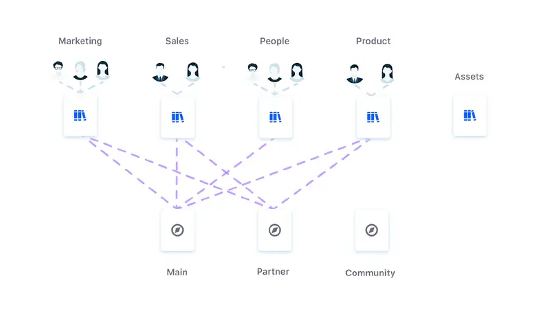

# Managing Clarity’s Digital Assets

In the context of content management, digital assets are any files or media you can use to enrich your content. This article focuses on the asset library, a Liferay feature that Clarity can use to manage their digital assets with low technical effort.

## Asset Libraries

Asset libraries declutter digital asset management by providing a collaborative hub for adding, editing, and sharing assets among multiple sites and users. Permissions and version control ensure that assets are accessible by the right people and kept up to date with the latest changes, all while maintaining security and transparency across the organization. Asset libraries can be structured with folders and tags, and they integrate seamlessly with Liferay’s other content management features.

## Exercise One: Creating Asset Libraries

1. Navigate to _Global Menu_ () &rarr; _Applications_ &rarr; _Content_ &rarr; _Asset Libraries_.

1. Click _New_ and enter the name “Clarity Branding and Logo”. Click _Save_.

1. In the asset library configuration page, navigate to _Sites_ in the sidebar menu.

1. In _Connected Sites_, click _Add_ and select “Clarity Public Enterprise Website.” 

1. Navigate to _General_ in the sidebar menu and click _Save_.

1. Return to the _Asset Libraries_ page. Click “Clarity Branding and Logo” to enter the management screen for the new asset library.

1. Select _Documents and Media_ &rarr; _New_ &rarr; _Multiple Files Upload_. 

1. Extract the images from `enablement-bootcamp-clarity/exercises/module-7-content-authoring-and-management/clarity-branding-and-logo.zip`

1. Upload the images and then click _Publish_.

1. Repeat steps 1-7 to create the following asset libraries. Be sure to upload the images from the corresponding zip file for each asset library.
   - “Error Pages”
   - “Leadership Headshots”
   - “Marketing Assets”
   - “Product Images”

You should now have five asset libraries of image content with which you can populate Clarity’s web pages.

## Exercise Two: Adding Clarity’s Logo to the Master Pages

1. Navigate to _Global Menu_ () &rarr; _Sites_ &rarr; _Clarity Public Enterprise Website_.

1. Navigate to _Site Menu_ &rarr; _Design_ &rarr; _Page Templates_ &rarr; _Masters_.

1. Click “Primary Master Page” to enter the page template editor.

1. In the sidebar menu on the left, select _Browser_.

1. Navigate to _Page Header_ &rarr; _Header Navigation Bar_ &rarr; _Grid_.

1. Select the first _Module_ &rarr; _Header Branding_ &rarr; _Image_ &rarr; _image-square_. Note: You can double-click on the _Image_ component in the header to navigate directly to this point.

1. In the menu on the right, click the + sign next to _Image_ to open the image selection window.

1. Click _Sites and Libraries_ in the breadcrumb menu, then select the _Asset Library_ tab. You should now see the five asset libraries you created in the previous exercise.

1. Select “Clarity Branding and Logo” and then select “logo-name-vector” to add the image to the header.

1. In the _Browser_ menu, navigate to _Page Footer_ &rarr; _Footer Branding_ &rarr; _Image_ &rarr; _image-square_.

1. Repeat steps 7-9 to add the image named “logo-full-name-vector” to the footer.

1. Select _Publish Master_ to save your changes to the master page template. 

The header and footer images will now be displayed on all pages that use the Primary Master Page.

## Conclusion

This concludes *Managing Clarity’s Digital Assets*. With your asset library in place, you can learn more about creating content from scratch with Liferay.

Next Up: [Creating Clarity's Web Content](./creating-claritys-web-content.md)

## Additional Resources

* [Asset Libraries](https://learn.liferay.com/web/guest/w/dxp/content-authoring-and-management/asset-libraries)
* [Documents and Media](https://learn.liferay.com/web/guest/w/dxp/content-authoring-and-management/documents-and-media)
