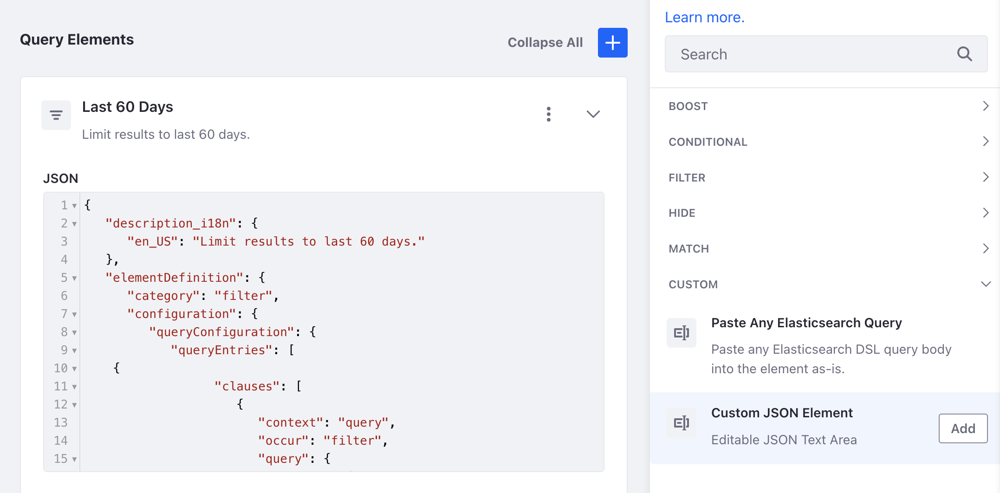
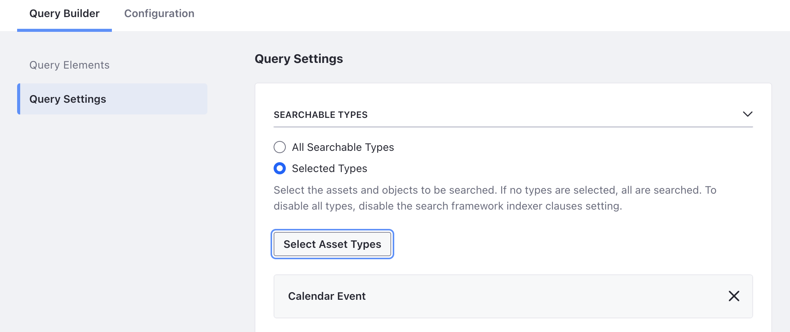
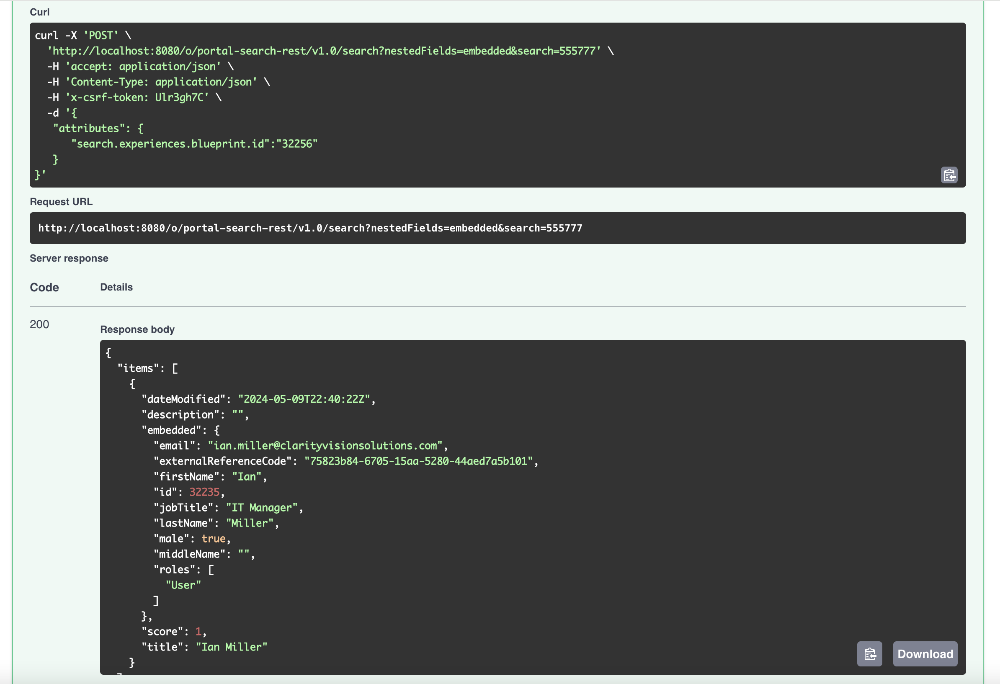

# Personalizing Search Experiences with Blueprints

As we saw in the previous lesson, using search facets is great in providing visitors a way to quickly filter search results. However, Clarity has some search use cases that they wish to further customize and personalize. This can be accomplished with the use of Liferay's search blueprints. The following are some examples that demonstrate the capabilities of search blueprints.

## Exercise: Customizing Search Results with Search Blueprints

<!-- ## Exercise 18a: Customizing Search Results with Search Blueprints -->

<!-- TASK: Create an introduction explaining Search Blueprints at a high-level. -->

Here you'll revisit the Open Positions results page and create a Search Blueprint to only return recent job listing articles as the Clarity Admin user.

<!--TASK: Change persona to avoid using Clarity Admin -->

To do this,

1. Sign in as the Clarity Admin user.

   * Username: `admin@clarityvisionsolutions.com`
   * Password: `learn`

1. Open the *Site Menu* (), expand *Content and Data*, and select *Web Content*.

1. Click on the *Structures* tab and click *Job Listing*. In the very right, click the *Properties* () icon. Take note of the Structure Key ID (i.e. 34060).

1. Open the *Global Menu* (), navigate to *Applications* &rarr; *Blueprints*.

1. Click the add button to add a new search blueprint. Enter `Job Listings Last 60 Days` as the title and click *Create*.

1. In the right menu of query elements, expand the *FILTER* section and find the *Filter by Exact Terms Match* element. Click *Add* for the element.

1. In the *Field* field, enter `ddmStructureKey`. In the *Values* field, enter the Structure Key ID of the job listing web content structure (e.g. 34060).

   

1. In the left navigation, click *Query Settings*.

1. Click *Selected Types* and click *Select Asset Types*.

1. Select *Web Content Article* and click *Done*.

1. In the top menu, click *Preview* to preview the Search Blueprint in action. For example, search for the term `Developer` to see developer related results.

1. Click *Add* () to add another query element above the first one.

1. Expand the *CUSTOM* section and find the *Custom JSON Element* element. Click *Add* for the element.

1. From the training workspace, go to the `[repository-folder]/exercises/lesson-18/` folder and open the `filter-last-60d.json` file on your machine.

1. Replace the sample code in the JSON Text Area with the data from the file.

   

1. In the top menu, click *Preview* to preview the Search Blueprint in action. For example, search for the term `Developer` to see developer related results. In the custom JSON element try editing the logic by changing `now-60d` to `now-1d`. Try another preview search.

1. Change the JSON element back to `now-60d`. Click *Save*.

Edit the Open Positions Page to use the search blueprints.

1. Navigate to the *Open Positions* page (i.e. *Careers* &rarr; *Open Positions*). In the top menubar, click the edit page () icon.

1. From the *Fragments and Widgets* menu, drag and drop a *Blueprints Options* widget to the bottom of the page below the *Search Options* widget.

1. Click the *Actions* menu () and select *Configuration*. Click *Select* to choose a search blueprint.

1. Click *Select* for the *Job Listings Last 60 Days* blueprint. Click *Save* and close the window.

1. Note, we can now remove the search Type Facet widget that filters for web content articles. The search Custom Filter widget that filters for job listing web content can also be removed.

1. Click *Publish*. The search results now only show job listings that were created in the last 60 days.

Great! You've created two search blueprints and applied them in the Open Positions page as an alternative to the Custom Filter widget you added in a previous exercise.

Next, you'll learn how to use search blueprints with collection providers.

## Exercise: Dynamic Collections with Search Blueprints

<!-- ## Exercise 18b: Dynamic Collections with Search Blueprints -->

   <!-- !!! note Instruction -->

One simple way to leverage search blueprints is with collection providers. Every time you create a search blueprint, a collection provider is automatically generated. Then, showing the results of the search blueprint is as easy as adding a collection display widget onto a site page. For example, Clarity wants to have a site page that automatically displays a list of upcoming events. A search blueprint can query upcoming events on their calendar to automatically fetch these upcoming events. While logged in as the Clarity Admin user, follow these steps to see how this works.

<!--TASK: Change persona to avoid using Clarity Admin -->

<!--TASK: Restructure to remove sub-steps. Consider using H3s.-->

1. Create a site page with a calendar widget.

   1. From the Site Menu (), navigate to *Site Builder* &rarr; *Pages*.

   1. Click *New* and select *Page*.

   1. Select *Primary Master Page*.

   1. Enter *Calendar* as the name and click *Add*.

   1. Select *Fragments and Widgets* in the left menu and select the *Widgets* tab. Scroll down to the Collaboration section and drag a *Calendar* widget onto the page. Click *Publish*.

   1. In the list of site pages, find the calendar page you just created, click the options icon and select *View*.

   1. Select the *Month* view and click on any date that is before your current date and enter `Past Event 1` as the name and click *Save*.

   1. Click on any date that is after your current date and enter `Future Event 1` as the name and click *Save*.

   1. Add one more event after Future Event 1 and enter `Future Event 2` as the name and click *Save*.

      

1. Enable the Collections with Search Blueprints feature flag.

   1. Open the *Global Menu* (), navigate to *Control Panel* &rarr; *Instance Settings*.

   1. Click *Feature Flags* and select *Beta* in the left navigation. Enable `Collections with Search Blueprints (LPS-129412)`.

1. Create a future events Search Blueprints Element.

   1. From the Global Menu, navigate to *Applications* &rarr; *Blueprints*.

   1. Click on the *Elements* tab and click *Add*.

   1. Enter *Future Events* as the title and click *Create*.

   1. From the training workspace, go to the `[repository-folder]/exercises/lesson-18/` folder and open the `filter-future-events.json` file on your machine.

   1. Replace the sample JSON with the data from the file.

   1. Click *Save*.

1. Create a future events Search Blueprint.

   1. Still in the search blueprints application, click on the *Blueprints* tab.

   1. Click *Add* to create a new blueprint. Enter *Future Events* as the name and click *Create*.

   1. In the right menu of query elements, expand the *FILTER* section and find the *Future Events* element you created in the previous step. Click *Add* for the element.

   1. In the left navigation, click *Query Settings*. Change the searchable type to *Selected Types*. Click *Select Asset Types* and check *Calendar Event* and click *Done*.

      

   1. Click *Save* for the blueprint.

1. Create a future events site page with a collection provider.

   1. From the Site Menu (), navigate to *Site Builder* &rarr; *Pages*.

   1. Click *New* and select *Page*.

   1. Select *Primary Master Page*.

   1. Enter *Future Events* as the name and click *Add*.

   1. Select *Fragments and Widgets* in the left menu and select the *Fragments* tab. In the search bar, search for `collection` and find the *Collection Display* fragment. Drag the fragment onto the page.

   1. Click on the *Collection Display* fragment you just added. In the configuration menu on the right, click *Select Collection* ().

   1. In the new window select the *Collection Providers* tab. Select the *Future Events* collection provider.

   1. Under style display, select *Bulleted List*.

   1. Click *Publish*.

      

      The search blueprint automatically provides a collection of future events.

You now have created and configured a search blueprint that uses a collection provider to display future calendar events.

Next, you'll learn how to leverage search blueprints with custom fields, then query the fields in Liferay's headless APIs.

## Exercise: Search Blueprints with Custom Fields

<!-- ## Exercise 18c: Search Blueprints with Custom Fields -->

Occasionally businesses need to integrate with other web services. For example, the employee benefits system Clarity utilizes wants to reference Clarity employees based on the registration ID numbers the service uses. In Liferay, a custom field can be added to user accounts to add this additional field. Then Liferay's headless APIs can be used to query this custom field. While logged in as the Clarity Admin user, follow the steps below to see this in action.

**Note:** The user account headless APIs cannot filter for custom fields directly. Therefore, a search blueprint is leveraged to be able to query for this custom field.

1. From the Global Menu, go to *Control Panel* &rarr; *Custom Fields*.

1. Select *User* and click *New* to begin creating a custom field.

1. Select *Input Field* and enter these details.

   | Field      | Value            |
   |:-----------|:-----------------|
   | Field Name | `RegistrationId` |
   | Data Type  | Integer          |

1. Click *Save*.

1. From the Global Menu, go to *Control Panel* &rarr; *Users & Organizations*.

1. Select *Ian Miller*, scroll down to the bottom, and enter `555777` for the registration ID.

1. Click *Save*.

1. From the Global Menu, navigate to *Applications* &rarr; *Blueprints*.

1. Click *Add* () to begin creating a search blueprint.

1. For title, enter `RegistrationId` and click *Create*.

1. In the right menu of query elements, expand the *FILTER* section, find the *Filter by Exact Terms Match* element, and click *Add* for the element.

1. Enter these values:

   | Field  | Value                                                  |
   |:-------|:-------------------------------------------------------|
   | Field  | `expando__keyword__custom_fields__RegistrationId_long` |
   | Values | `${keywords}`                                          |

   

1. Click *Save* and take note of ID number of the search blueprint (e.g. `32256`).

1. In the Global Menu, navigate to *Control Panel* &rarr; *Instance Settings*.

1. Click *Feature Flags* and go to *Beta* in the left navigation.

1. Scroll down and enable `Search Headless API (LPS-179669)`.

   **Note**: Beta features are not recommended for production use, but this feature will be available as a full feature Q3 2024.

1. Use a new browser window and access Liferay's API Explorer at `http://localhost:8080/o/api`.

1. Click the *REST Applications* drop-down menu and select *portal-search-rest/v1.0*.

1. Expand the *postSearchPage* endpoint panel and scroll down to the Request Body section.

1. From the downloaded course bundle, navigate to the `[repository-folder]/exercises/lesson-18/` folder, then open the `api-post-search.json` file.

1. Copy the data from the file and paste it into the *Request Body* field.

1. Replace `{blueprint ID}` with the ID number of your search blueprint.

1. For *nestedFields*, enter `embedded`.

1. For *search*, enter `555777`.

1. Click *Execute*.

1. Verify this returns Ian Miller's user information.

   

   In this way, Liferay can be set up as a headless system that can be utilized by a third-party service.

You've used a custom registration ID field with search blueprints to retrieve user information.

Congratulations! You've completed all exercises for day two of Building Enterprise Websites.

Next, you'll learn how you can use Liferay Objects to build forms.

## Conclusion

Congratulations! You've completed Module 9 - Search.

[Back to Building Enterprise Websites with Liferay](../../building-enterprise-websites-with-liferay.md)
