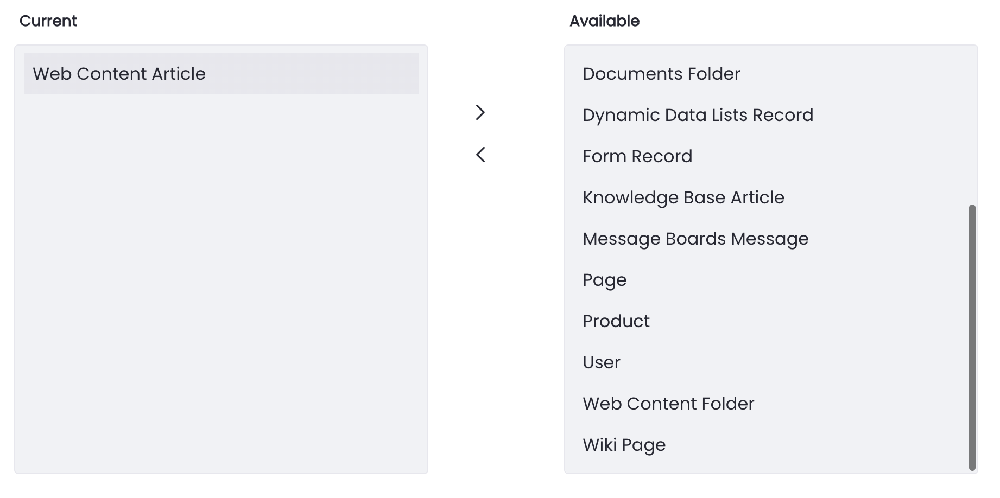

# Understanding and Customizing Search Results Pages

Clarity wants to have site visitors be able to search for content and find content quickly and easily. This can be accomplished by creating good navigation and leveraging Liferay search features. For example, if a visitor performs a global search with the search bar in the website's top header, the search results should show everything (e.g. products, blog posts, documents, etc.). Or a visitor might click the products navigation tab in the top header and be shown a catalog of products. If a visitor clicks on the products tab, the search results should only show products and not any other type of site content. This matches the visitor's expectation and results in good user experience.

## Exercise 1: Understanding and Configuring a Product Page

We saw in [Module 7 - Content Authoring and Management](../module-7-content-authoring-and-management.md) how the Clarity team added different products (e.g. eyeglasses, sunglasses, etc.) onto the site. Let's take a closer look at the product list page to understand the different Liferay search widgets and how to configure them.

1. Navigate to `[server]:[port]/web/clarity/product-list` page (e.g. http://localhost:8080/web/clarity/product-list). See how most of the page is already built with different search widgets. 

   
   
   The left side module is made up of a search bar widget, a specification facet widget, and an option facet widget. The right side module is made up of a sort widget and a search results widget. Note that the search results widget under the commerce category of widgets is different from the search results widget under the search category of widgets. Only the commerce one will return products.

   Below these two modules, there is a search options widget. If you inspect the configuration of this widget, you will see that _Allow Empty Searches_ is enabled. This setting returns all available assets without any search queries.

1. In the top menubar, click the edit page icon. Select _Fragment and Widgets_ in the left menu and select the _Widgets_ tab. Scroll down to the search widget section and locate the category facet widget. Drag the widget onto the left module below the search bar. Click _Publish_. 

   

   The product list can now be used by customers to filter by product category. 

## Exercise 2: Filtering Results with Custom Facets

So far we've seen that search results can be filtered by content type (e.g. blogs, web content, etc.) or keyword categories (e.g. different categories found in the FAQ section.). But search results can also be filtered by custom facets with custom fields that you define. For example, as Clarity expands to other markets, they may need FAQs that are region specific. FAQ content can be tagged with a custom region and then filtered across them.

1. From the applications menu, navigate to _Control Panel_ &rarr; _Custom Fields_. Scroll down the list and click _Web Content Article_. Click _New_ to create a new field.

1. Select the _Dropdown_ field type. Input `Region` as the field name. Then for values, input `EMEA, NA, LATAM, APAC`. Click _Save_.

1. From the product menu, navigate to _Content and Data_ &rarr; _Web Content_. Open the _FAQs_ folder.

1. Click into the first article. Scroll down in the properties tab in the right menu. Select a region for the custom field (e.g. APAC). Click _Publish_. 

1. Click into the other articles and select different regions at random.

1. Navigate to the search results page `[server]:[port]/web/clarity/search` page (e.g. http://localhost:8080/web/clarity/search). 

1. In the top menubar, click the edit page icon. Select _Fragment and Widgets_ in the left menu and select the _Widgets_ tab. Scroll down to the search widget section and locate the custom facet widget. Drag the widget onto the left module below the type facet widget.

   

1. Click the options for the custom facet widget and click _Configuration_. Input `expando__keyword__custom_fields__Region.raw` for the aggregation field. Input `Region` for the custom heading. Click _Save_. Then publish the page. The ability to filter by the custom region field is now available for the custom facet widget.

   

## Conclusion

Great job! Visitor's to Clarity's site have a clear and simple way to search for content and filter through different Clarity products. Next, we'll turn our attention to Liferay blueprints to bring personalization to the search experience.

Next Up: [Personalizing search experiences with blueprints](./personalizing-search-experiences-with-blueprints.md)
