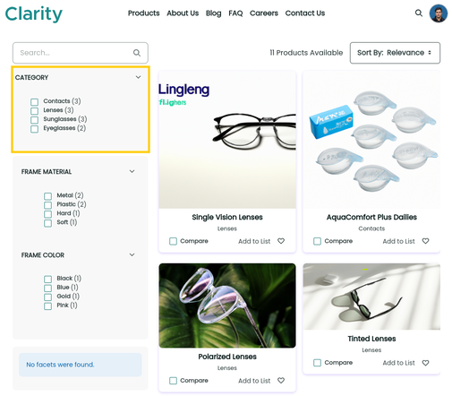
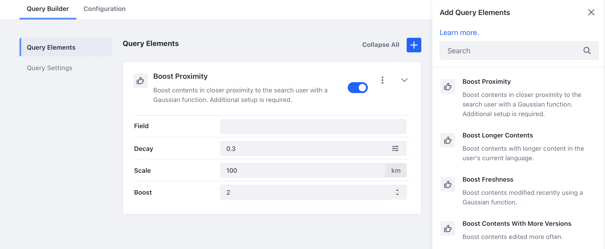

# Working with Liferay Search

Before we talk about searching for Clarity products and site content, let's learn about how Liferay search works and some of its important features.

## About Liferay Search

As modern businesses generate and store vasts amount of data, the need is ever greater to have tools that can be used to quickly and effectively search and retrieve this data. Having effective search tools means empowering employees to be productive and reducing time wasted looking for information.

Fortunately Liferay works in conjunction with [Elasticsearch](https://www.elastic.co/elasticsearch), a best-of-breed search engine built for modern web applications. By leveraging the power of Elastic search, together with its own search infrastructure, some key features Liferay search offers are:

* Comprehensive indexing that supports a wide range of content types (e.g. blogs, documents, web content, etc.)
* Search facets and search filters
* Flexible and template driven UI, for highly configurable search pages
* Blueprints for creating personalized search results

Let's take a closer look at how each of these work.

### Search Indexing

Liferay stores its information in a database. However, directly searching database tables can be a time-consuming task. Therefore most Liferay entities utilize a search index. Whenever a Liferay entity is created, a separate entry is created in the search index. Each entry has a collection of fields for that entity. For example, a blog entry might contain index fields for the title, content, tags, etc. This indexing is then used together with Elasticsearch to provide an effective and efficient way to search for data. Some of the Liferay entities that utilize the search index out of the box are:

* Blog entries
* Categories
* Documents and media
* Knowledge base articles
* Message board messages and thread
* Objects
* Organizations
* Users
* Tags
* Web content articles
* Wiki pages

### Refining Search

Together with Liferay's search index, Elasticsearch provides a powerful and effective way to search for content. Search results can be further refined through the use of facets, sorting, and more.

Search facets are a way to refine search results across specific content and criteria. Out of the box, Liferay offers a collection of different search facets. For example, a type facet could be used by a site visitor to quickly filter out blog entries, documents, or site pages. We'll see in the next lesson how category facets can be used by Clarity to filter across their products based on things such as color, fit, and material.

Sorting is another way search results can be refined. Sort alphabetically by title or user, by create date or modified date, etc. Users can choose an alternative sorting strategy that meets their needs

### Configurable Search Pages

As we saw in module 6, site pages can quickly be built with the use of out of the box widgets. This also applies to search pages. Liferay offers many search widgets that can be dragged and dropped onto a site page to quickly create a customized search results page. All this makes it easy for even non-technical team members to create search pages effortlessly. Liferay even provides search page templates to use without needing to create one from scratch.

Some of the available search widgets are:

* Low level search options
* Various types of search facets
* Similar results
* Sort
* Suggestions

### Search Blueprints

Blueprints offer the ability to create targeted search results with the use of implicit search criteria. That is, automatically adding search criteria to a search query that is not part of what the user entered. A simple example might be boosting search results based geolocation and prioritizing certain results that are near in proximity to the user's IP address.

Modifying the search query itself typically requires developing custom code, but Blueprints offers this functionality without the need to deploy any code. Customization is done through a UI-based configuration. Simple enough for even non-technical members to utilize. Some elements that can be configured are:

* Boosting search results based on different criteria
* Conditional search results based on certain keywords or categories
* Limiting the search query based on different criteria
* Hiding certain content and certain results

We'll see in a lesson to follow a specific example of Clarity utilizing search blueprints.

## Conclusion

Now that you have an initial understanding of Liferay's each functionality, let's dive into Clarity's specific use cases and requirements.

Next Up: [Understanding and Customizing Search Results Pages](./understanding-and-customizing-search-results-pages.md)

## Additional Resources

See our documentation to learn about working with search in Liferay.

* [Working with Search Pages](https://learn.liferay.com/w/dxp/using-search/search-pages-and-widgets/working-with-search-pages)
* [Search Results](https://learn.liferay.com/w/dxp/using-search/search-pages-and-widgets/search-results)
* [Search Facets](https://learn.liferay.com/w/dxp/using-search/search-pages-and-widgets/search-facets)
