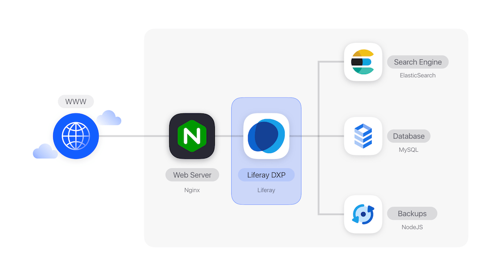

---
toc:
   - ./cloud-configuration/setting-up-the-github-repository.md
   - ./cloud-configuration/configuring-your-sites-domain.md
   - ./cloud-configuration/setting-up-clustering-for-the-liferay-service.md
   - ./cloud-configuration/configuring-auto-scaling.md
   - ./cloud-configuration/rotating-your-database-password.md
   - ./cloud-configuration/installing-a-hotfix.md
uuid: 9f762025-c335-481c-b9d4-921e3021555c
---

# Cloud Configuration

You've walked through the process of setting up and using the Cloud console to deploy changes in LXC. LXC-SM uses the same Cloud console for deploying changes and custom code, so you can get started with the console and tooling with LXC-SM using the [same process as for LXC](./setting-up-your-cloud-project.md). But with LXC-SM, you have more to manage: you can also fully manage your own core Liferay services! 

```{note}
The next two modules (Cloud Configuration and the [Cloud Development Lifecycle](./cloud-development-lifecycle.md)) require a project on LXC-SM.
```

Each of your development or production environments includes all of these as separate services in a Cloud network:

* Your [Liferay instance](https://learn.liferay.com/w/liferay-cloud/using-the-liferay-dxp-service)
* An [Nginx web server](https://learn.liferay.com/w/liferay-cloud/platform-services/web-server-service)
* An [Elasticsearch instance](https://learn.liferay.com/w/liferay-cloud/platform-services/search-service)
* A [MySQL database](https://learn.liferay.com/w/liferay-cloud/platform-services/database-service/database-service)
* A service for [manual or automated backups](https://learn.liferay.com/w/liferay-cloud/platform-services/backup-service/backup-service-overview)



You also have a [CI service](https://learn.liferay.com/w/liferay-cloud/platform-services/continuous-integration) in a separate `infra` environment, which controls any builds you've created or deployed for your other environments.

For more information on your reponsibilities with an LXC-SM project, see [here](https://help.liferay.com/hc/en-us/articles/360059798531-DXP-Cloud-Shared-Activities).

In LXC-SM, it's your responsibility to configure and manage your environments according to your specific needs. Here, you'll learn how to

* Set up the Git repository to deploy builds for your entire project
* Configure a custom domain for your Liferay instances
* Enable clustering and auto-scaling
* Change (rotate) your database password
* Install a hotfix

[Let's Go!](./cloud-configuration/setting-up-the-github-repository.md)
