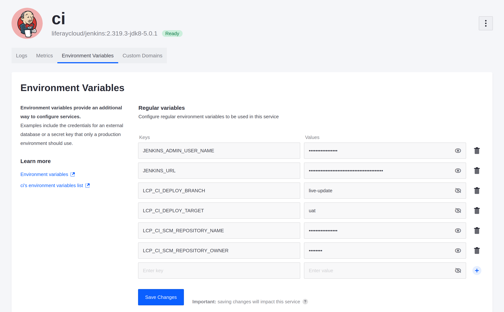

# Setting Up Automatic Deployment

Kyle is able to begin developing and testing with Liferay Cloud, but it's easier if he can test his changes immediately after deployment. 

Here, you'll configure a branch to deploy newly pushed changes to your UAT environment automatically. 

## Add the Configuration

Configure automatic deployment via the `LCP_CI_DEPLOY_BRANCH` and `LCP_CI_DEPLOY_TARGET` CI service environment variables.

1. In the Liferay Cloud console, navigate to your `infra` environment.

1. Click on the CI service.

1. Click the *Environment Variables* tab.

1. Set these environment variable values:

   * **LCP_CI_DEPLOY_BRANCH**: `live-update`

   * **LCP_CI_DEPLOY_TARGET**: `uat`

   

1. Click *Save Changes*.

The CI service restarts with the new configuration. Once it's back up, builds created from that point on via the `live-update` branch are deployed to your UAT environment automatically. 

## Test with a New Push

Next, make a commit and test that automatic deployment is working properly.

1. Open your command prompt in your project repository.

1. Create and switch to a new branch called `live-update`. You'll use this branch to deploy immediately any new developments you push up to UAT.

   ```bash
   git checkout -b live-update
   ```

1. Add and commit a dummy file to trigger a new build.

   ```bash
   touch dummy.txt
   ```

   ```bash
   git add dummy.txt
   ```

   ```bash
   git commit -m "First automatic deployment"
   ```

1. Push the change to your remote `live-update` branch.

   ```bash
   git push origin live-update
   ```

1. Return to the Liferay Cloud console and click *Deployments*.

   

Your new commit appears in the list of deployments, deployed to the UAT environment.

Now you can deploy any new developments or changes straight from your repository for testing. Next, you'll [practice using a backup to revert changes from development](./restoring-data-from-a-backup.md).

# Relevant Concepts

* [Automatically Deploying CI Service Builds](https://learn.liferay.com/w/liferay-cloud/build-and-deploy/automatically-deploying-ci-service-builds)
