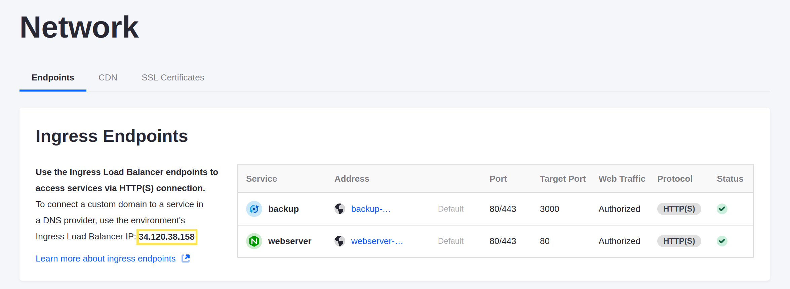
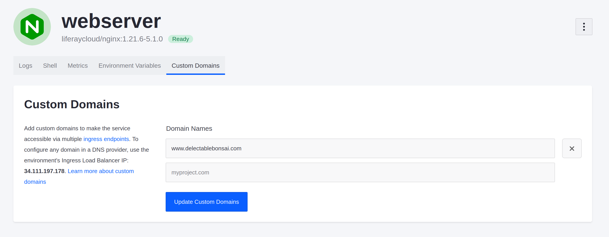
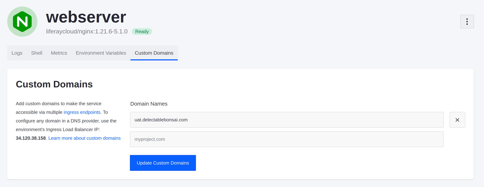
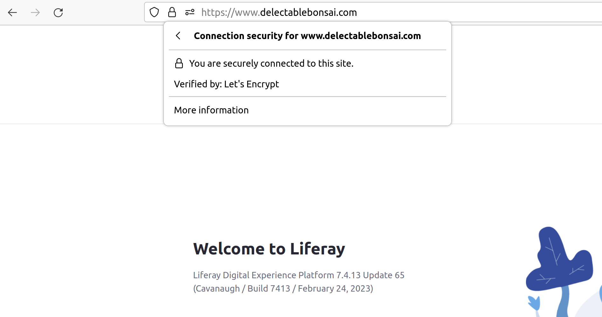

# Configuring Your Site's Domain

Now that the Delectable Bonsai site is up and running, it needs a web domain for regular users.

Here, you'll register and configure a custom domain for your site.

```{important}
This exercise requires you to reserve your own custom domains using a domain registration service. Skip this exercise if you are not ready to pay any fees associated with claiming your domains.
```

## Finding Your Ingress Load Balancer IP Address

First, find the IP address for your Ingress load balancer for your production environment.

In the Liferay Cloud console, navigate to your production environment and click *Network* from the left-side menu. On the Network page, your load balancer's IP address is shown in the *Ingress Endpoints* section.



## Registering Your Custom Domains

Next, use the domain registration service of your choice to register your desired domain with the IP address for your production environment. Choose a domain name that you plan to use for your own site. Register the domain as a type `A` record.

If you plan to configure additional custom domains or subdomains for your other environments, find the IP addresses from the *Network* page in those environments and them as well.

See your chosen domain registration service's documentation for more information on registering your domains.

## Configuring Your Web Server Service

Finally, configure your web server service to use the custom domain that you registered.

1. Navigate to your production environment in the Liferay Cloud console.

1. Click *Services* from the left-side menu.

1. Select your `webserver` service.

1. Click the *Custom Domains* tab.

1. Add a new entry to the *Domain Names* list with the domain you registered.

    Here is an example using `www.delectablebonsai.com`:

    

1. Click *Update Custom Domains*.

Your web server registers the new domain name you configured. If you registered an additional domain or subdomain, configure your UAT environment's web server service following the same process.



## Verifying Your Custom Domains

It takes some time for your Liferay instance to update the route to your site and automatically generate an SSL certificate for your domain via [Let's Encrypt](https://letsencrypt.org/). This can take less than an hour or many hours to complete.

```{note}
Securing and updating the load balancer with an SSL certificate for your domain usually takes longer than updating the route to your site. If you try to access the site with your custom domain before the certificate update completes, your browser shows security warnings until it does.
```

Once the process completes, access your chosen domain in a browser to see it route to your Liferay instance. Your browser shows that the connection is secured and verified by Let's Encrypt.



Next, you'll [enable clustering for your Liferay service](./setting-up-clustering-for-the-liferay-service.md) to handle higher traffic.

## Relevant Concepts

* [Custom Domains](https://learn.liferay.com/w/liferay-cloud/infrastructure-and-operations/networking/custom-domains)
* [Custom SSL Certificates](https://learn.liferay.com/w/liferay-cloud/infrastructure-and-operations/networking/load-balancer#custom-ssl)
* [VPN Integration](https://learn.liferay.com/w/liferay-cloud/infrastructure-and-operations/networking/vpn-integration-overview)
