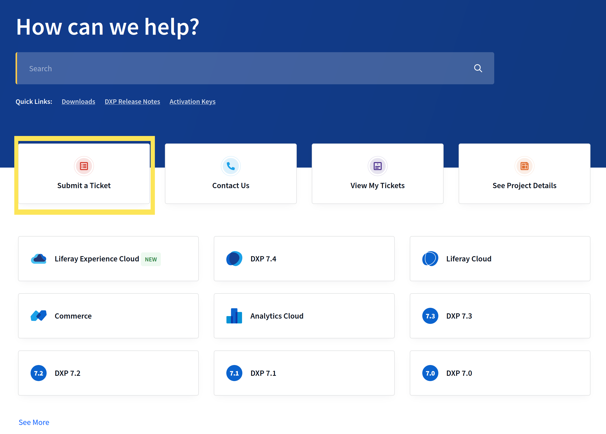
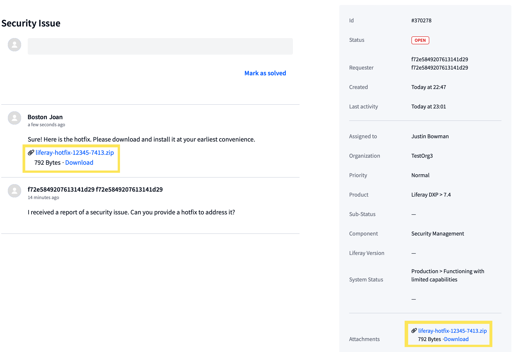

# Installing a Hotfix

Keeping your Liferay instance up-to-date is a critical part of maintenance in Liferay Cloud. If you have to patch an issue before it appears in the [next version of Liferay](https://learn.liferay.com/w/liferay-cloud/using-the-liferay-dxp-service/updating-your-dxp-instance-to-a-new-minor-version), however, you can deploy a hotfix. Hotfixes are a temporary solution provided by Liferay Support to fix these issues until you are ready to update to the fixed version.

Here, you'll walk Kyle through the process of requesting and installing a hotfix. He has already scheduled downtime for the site so the hotfix can be deployed and tested in production. 

## Request a Hotfix

Request a hotfix if you need a short-term fix for a specific issue in Liferay DXP. This can be a known issue that has been recently fixed or a new issue that you discovered in your Liferay instance. In either case, create a request on [Liferay's Help Center](https://help.liferay.com).



Create a new ticket, and a Liferay Support staff member will respond on the ticket to assist you. If you need a hotfix to resolve your issue, Liferay will walk you through the process to provide one for you on the ticket.

You'll receive email updates whenever Liferay staff updates your ticket, including when your hotfix is ready. Once the hotfix is ready to download, download it from the ticket you created with either of the links on the page.



## Create a New Build with Your Hotfix

Once you have the hotfix, commit it to your repository and push it into a new CI build.

1. In your project repository, copy the hotfix into the `liferay/configs/common/patching/` folder.

   Place the hotfix in the `common/` folder (so it applies to all environments) to use the same build for both UAT and production.

1. Add and commit the hotfix to your repository.

   ```bash
   git add .
   ```

   ```bash
   git commit -m "Install new hotfix for issue..."
   ```

1. Push up the branch with your changes.

   ```bash
   git push origin [branch_name]
   ```

Liferay Cloud detects your changes and creates a new build in CI that you can deploy. Wait a few minutes for the build to complete.

## Deploy and Test the Hotfix

Test the hotfix in your UAT environment before applying it to production.

1. In the Cloud console, click *Builds* at the top of the screen.

1. When your new build at the top of the list completes, click *Actions* (  ) &rarr; *Deploy to...*

   

1. In the Select Environment drop-down menu, select your UAT environment.

1. Check the checkboxes under Deploy Confirmation to acknowledge the impact of the change.

1. Click *Deploy Build*.

   Your UAT environment's services restart using your hotfix after a delay.

1. Once the services are back up and running, log into your UAT Liferay instance and test your issue to confirm the hotfixes resolved it.

## Deploy to Production

Once you've confirmed the hotfix works correctly, repeat the [deployment process](#deploy-and-test-the-hotfix) for your production environment during your reserved downtime. Remember to remove the hotfix when you later update to the Liferay version that fixes the same issue.

Congratulations! You've completed the self-managed Cloud Setup and Management module of the Cloud Administrator course.

## Relevant Concepts

* [Deploying to the Liferay Service](https://learn.liferay.com/w/liferay-cloud/using-the-liferay-dxp-service/deploying-to-the-liferay-service)
* [Updating Your Liferay Instance to a New Minor Version](https://learn.liferay.com/w/liferay-cloud/using-the-liferay-dxp-service/updating-your-dxp-instance-to-a-new-minor-version)
* [Upgrading Your Liferay DXP Instance](https://learn.liferay.com/w/liferay-cloud/using-the-liferay-dxp-service/upgrading-your-liferay-dxp-instance)
