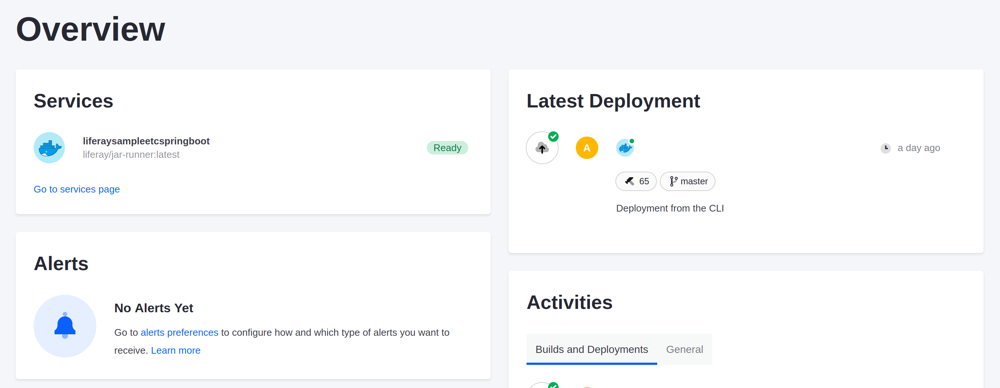
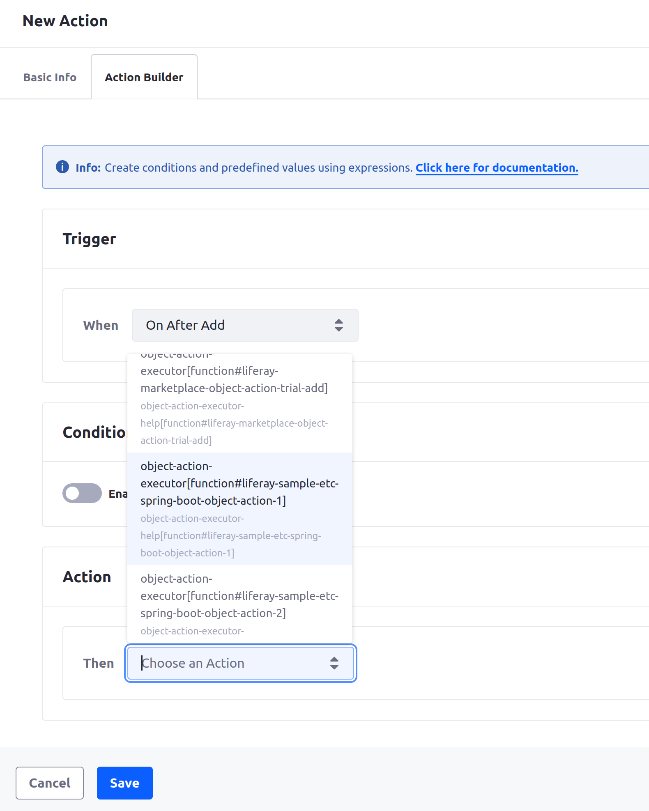
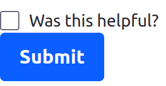
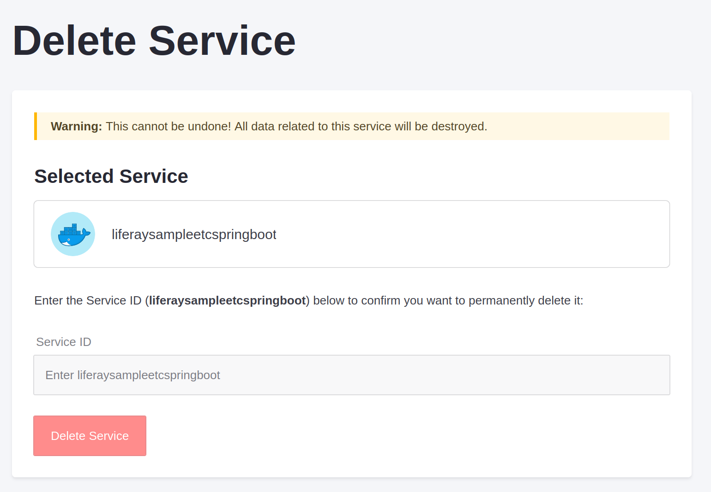

# Deploying and Managing a Microservice Client Extension Project

Kyle wants to start developing a custom application using a [microservice client extension](https://learn.liferay.com/w/dxp/building-applications/client-extensions/microservice-client-extensions#object-action-client-extensions) to help keep track of user-submitted feedback.

Here, you'll start by trying out a sample microservice client extension using [Spring Boot](https://spring.io/projects/spring-boot) from [Liferay's sample workspace](https://github.com/liferay/liferay-portal/tree/master/workspaces/liferay-sample-workspace).

## Download the Sample Workspace

Download and unzip the sample workspace for client extensions on your machine:

```bash
curl -o com.liferay.sample.workspace-latest.zip https://repository.liferay.com/nexus/service/local/artifact/maven/content\?r\=liferay-public-releases\&g\=com.liferay.workspace\&a\=com.liferay.sample.workspace\&\v\=LATEST\&p\=zip
```

```bash
unzip com.liferay.sample.workspace-latest.zip
```

Once you have the workspace unzipped, open the `client-extensions/liferay-sample-etc-spring-boot/` folder to proceed.

## Configure the Sample Spring Boot Project

The sample Spring Boot project uses an `application.properties` file to register important values, including the target Liferay instance's domain. Configure the Spring Boot project before you deploy it.

1. In the sample Spring Boot project you downloaded, open the `src/main/resources/application.properties` file.

1. Add properties for the `com.liferay.lxc.dxp.domains` and `com.liferay.lxc.dxp.mainDomain` using your UAT site's domain (e.g., `uat.delectablebonsai.com`):

   ```properties
   com.liferay.lxc.dxp.domains=YOUR DOMAIN
   com.liferay.lxc.dxp.mainDomain=YOUR DOMAIN
   ```

1. Add another property for the `https` protocol:

   ```properties
   com.liferay.lxc.dxp.server.protocol=https
   ```

Now the project is correctly configured for your LXC environment and ready to deploy.

## Build and Deploy the Project

Build and deploy the project to your LXC environment from the sample Spring Boot project's folder.

1. Run this command to build the project into a deployable [LUFFA](https://learn.liferay.com/w/dxp/building-applications/client-extensions/packaging-client-extensions):

   ```bash
   ../../gradlew clean build
   ```

   The build first runs the `bootJar` Gradle task (because it's [defined in the `client-extension.yaml` file](https://learn.liferay.com/w/dxp/building-applications/client-extensions/working-with-client-extensions#assembling-client-extensions)), and then generates the LUFFA containing all of the necessary components for deployment in the `dist/` folder.

1. Use the CLI tool to deploy the built LUFFA:

   ```bash
   lcp deploy --extension dist/liferay-sample-etc-spring-boot.zip
   ```

   When prompted, choose the number that corresponds to your UAT client extension environment.


The client extension is deployed to your UAT environment, and it appears in the Cloud console after a delay. The Ready status appears when the service container is running and the Spring Boot application starts.



## Add Object Data

[Liferay objects](https://learn.liferay.com/w/dxp/building-applications/objects) are an ideal way to persist and manipulate data in Liferay with your client extensions.

Create an object definition with an [action](https://learn.liferay.com/w/dxp/building-applications/objects/creating-and-managing-objects/actions) that invokes one of the [object action client extensions](https://learn.liferay.com/w/dxp/building-applications/client-extensions/microservice-client-extensions#object-action-client-extensions) in the project you deployed.

### Create an Object Definition

1. Log into your UAT Liferay instance.

1. Open the Applications menu (  ) &rarr; *Control Panel* &rarr; *Objects*.

1. On the Objects page, click *Add* (  ), and fill in the New Custom Object form:

   * **Label**: Feedback Input

   * **Plural Label**: Feedback Inputs

   * **Object Name**: `FeedbackInput`

   

1. Click *Save*.

   The object definition is created as a draft, but it still needs a field and an action to use the object action client extension.

### Add a Boolean Field

1. Click the *Feedback Input object definition* on the objects list to edit it.

1. Click the *Fields* tab.

1. Click *Add* (  ), and fill in the New Field form:

   * **Label**: Was this helpful?

   * **Field Name**: `helpful`

   * **Type**: Boolean

1. Click *Save*.

### Add an Action Invoking Your Client Extension and Publish

1. Click the *Actions* tab.

1. Click *Add* (  ).

1. Fill in the Basic Info form for the action:

   * **Action Label**: New Feedback

   * **Action Name**: `NewFeedback`

1. Click the *Action Builder* tab.

1. In the Trigger drop-down menu, select *On After Add*.

1. In the Action drop-down menu, select `object-action-executor[function#liferay-sample-etc-spring-boot-object-action-1]`.

   

1. Click *Save*.

1. Navigate back to the object definition's Details tab and click *Publish*.

Now the object definition is published and you can use it to submit object data.

### Submit Some Object Data

Now add a form using your new object definition so you can test the object action.

1. Navigate back to your site's home page.

1. Click _Edit_ (  ) at the top of the page.

1. In the list of fragments on the left side of the screen, drag the *Form Container* fragment onto the page.

   

1. In the Form Container's drop-down menu, select your new *Feedback Input object definition*.

1. Click *Publish* at the top of the page.

  

  The form appears on the page with a single "Was this helpful?" checkbox.

1. Click the *Submit* button.

An object entry is created once you submit the form, and that invokes the object action client extension you deployed.

## Examine the Results in the Cloud Console

Now that you've triggered the object action, check the Spring Boot application's logging to see that the call was successful.

1. Log into the Cloud console and navigate to your UAT environment.

1. Click *Services* to see the full list of your deployed microservices.

1. Select the `liferaysampleetcspringboot` service.

The Logs tab appears by default on the service's page, and you can see the Spring Boot application logs printing out the object data Liferay sent to it.


Now you can see the object action works successfully.

## Delete the Microservice

Kyle plans to try customizing this object action, but doesn't need this version deployed on the UAT environment while he figures out what to add to it.

Delete the service from the console now that you're done using the sample microservice.

1. On the service's page, click *Actions* (  ) in the top-right corner, and click *Delete Service*.

1. Enter `liferaysampleetcspringboot` to confirm the impact of the deletion.

   

   ```{warning}
   Deleting the service in the Cloud console fully removes the service's data, but it does not remove the client extensions that have been deployed to Liferay. If you want to remove all data from this project, you must delete the client extensions (and the OAuth 2 profile that it automatically created) from Liferay itself.
   ```

   <!-- We don't want to have these kinds of asides in the training. If they should delete everything (because it won't be used again), include that in the instructions. If they should not delete everything (perhaps because it's useful in a later exercise), explain why they're not deleting it (because they'll use it later).

   We want to keep everything as concrete and focused on the task at hand as possible. -Rich -->

1. Click *Delete Service*.

After a delay, the service is deleted and disappears from the Cloud console.

Now you've successfully tested the sample Spring Boot application in your UAT environment. Next, you'll  troubleshoot a problem in the console.

## Relevant Concepts

* [Working with Client Extensions](https://learn.liferay.com/w/dxp/building-applications/client-extensions/working-with-client-extensions)
* [Microservice Client Extensions](https://learn.liferay.com/w/dxp/building-applications/client-extensions/microservice-client-extensions)
