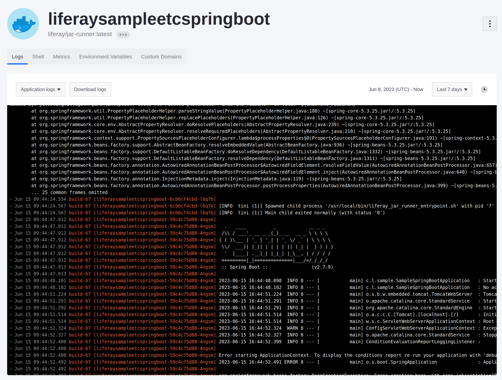
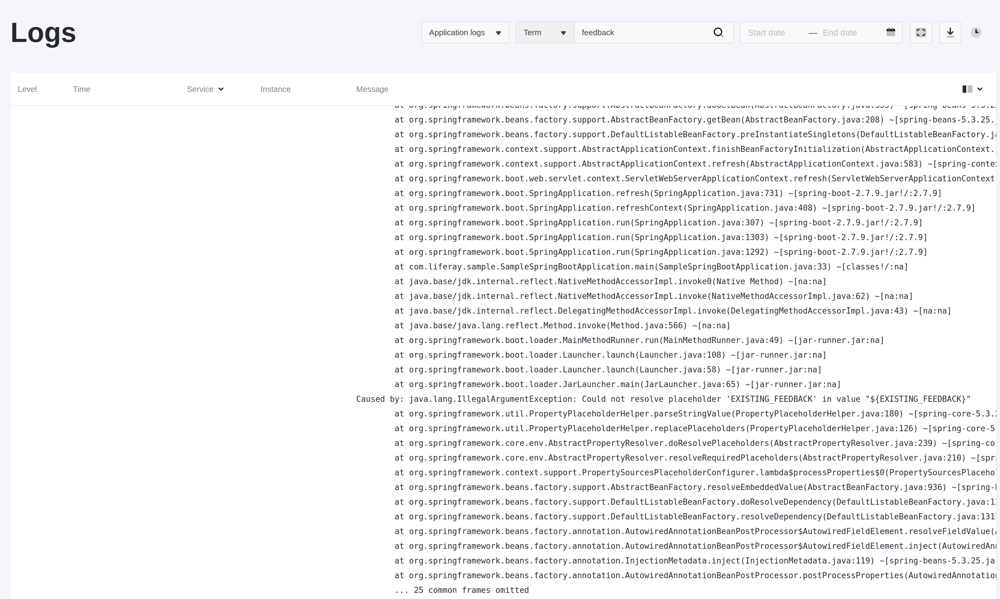
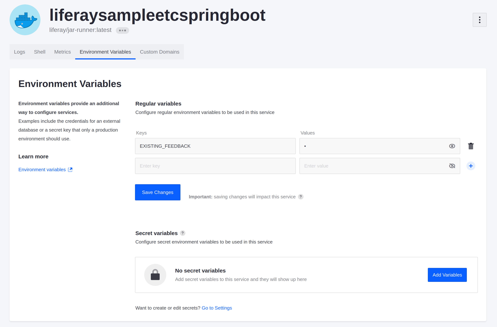

# Troubleshooting a Microservice in the Cloud Console

Previously, you tested using an [object action client extension](https://learn.liferay.com/w/dxp/building-applications/client-extensions/microservice-client-extensions#object-action-client-extensions) to log when a feedback entry is submitted in Liferay. Now, Kyle wants to add a simple counter variable to the Spring Boot application to log the total number of entries.

Here, you'll modify the sample client extension project you [deployed previously](./deploying-and-managing-a-microservice-client-extension-project.md), troubleshoot a problem in the Cloud console when something goes wrong, and resolve the issue.

## Add a Counter to the Object Action REST Controller

The [sample Spring Boot client extension](https://github.com/liferay/liferay-portal/tree/master/workspaces/liferay-sample-workspace/client-extensions/liferay-sample-etc-spring-boot) uses the `ObjectAction1RestController.java` file to log object data received from Liferay. Kyle wants to add a simple variable that counts each new feedback entry, and adds it to a pre-existing number of entries for a new log message.

Add some additional code here to implement this behavior.

1. In the `liferay-sample-etc-spring-boot` folder that you [deployed the Spring Boot project from previously](./deploying-and-managing-a-microservice-client-extension-project.md#download-the-sample-workspace), open the `src/main/java/com/liferay/sample/ObjectAction1RestController.java` file.

1. Add a `count` variable as a field in the class:

    ```java
    public class ObjectAction1RestController extends BaseRestController {

    private int count = 0;

    ...
    ```
1. Add another field to inject the value of pre-existing entries:

    ```java
    @Value("${EXISTING_FEEDBACK}")
    protected int existingFeedback;
    ```

1. Add an extra line to the `import` statements at the top for this value injection to work:

    ```java
    import org.springframework.beans.factory.annotation.Value;
    ```

1. Use these new variables to add additional logging. Add these lines before the `return` statement in the `post` method:

    ```java
    count++;

    int total = count + existingFeedback;

    _log.info("Total feedback so far: " + total);
    ```

Now you have enough code for a minimal counter implementation.

## Deploy the Updated Project

Now open your command prompt in the `liferay-sample-etc-spring-boot/` folder to rebuild and deploy the project.

1. Build the project into a new deployable LUFFA:

    ```bash
    ../../gradlew clean build
    ```

1. Use the CLI tool to deploy the built LUFFA:

    ```bash
    lcp deploy --extension dist/liferay-sample-etc-spring-boot.zip
    ```

    When prompted, choose the number that corresponds to your UAT client extension environment.

The client extension project is deployed to your environment, and it appears in the Cloud console after a delay.

## Check the Microservice

The `liferaysampleetcspringboot` service appears in the Cloud console, but even if you wait a while, the "Ready" status does not seem to appear.


Try triggering the object action the same way you did previously.

1. Log into your UAT Liferay instance.

1. Click *Submit* on the form to create a new object entry and trigger the action.

1. Go back to the Cloud console and click on the `liferaysampleetcspringboot` service.

Even if you wait a minute, the logs don't show the new message you added, or even the logging for the new entry. You can also see there are error messages above.



If you wait a while longer, you can see that the service is continually restarting because of these errors. Your new code seems to have broken something.

## Search the Application Logs

In the Liferay Cloud console, search the application logs for signs of what went wrong with the microservice. Use the Logs page so you can use filtering and searching tools to find relevant information.

1. Select *Logs* from the left-side menu.

1. On the Logs page, make sure *Application logs* is selected from the drop-down menu at the top of the screen.    

    You only have one client extension service running, so there's no need to filter by service.

1. Look for some clue related to the new variables you added by searching for the term "feedback".

    

The logs filter down to a complete stack trace, where the root Exception is clearly related to the variable you added via injection.

```
Caused by: java.lang.IllegalArgumentException: Could not resolve placeholder 'EXISTING_FEEDBACK' in value "${EXISTING_FEEDBACK}"
```

Now Kyle realizes the problem: Spring Boot can't find the value for `EXISTING_FEEDBACK` anywhere!

## Add the Missing Environment Variable

Spring Boot can inject values from environment variables with the same name in the container. Try adding the `EXISTING_FEEDBACK` value as an environment variable for the service.

1. Click *Services* in the left-side menu to return to where your `liferaysampleetcspringboot` service is listed.

1. Click the `liferaysampleetcspringboot` service.

1. Click the *Environment Variables* tab.

1. Add a new environment variable to the *Regular variables* list. Use `EXISTING_FEEDBACK` for the key and add `2` as the value (for the two entries you've created so far).

    

1. Click *Save Changes*.

1. Click the Actions menu (  ) at the top of the screen and click *Restart Service* so the new variable is properly initialized.

The service restarts again after a delay with the new environment variable.

## Verify the Environment Variable is Present

Try using the shell to make sure that the environment variable was added correctly where Spring Boot can detect it. Shell access in the console lets you directly see what's in the environment your microservice runs in.

1. While you're on the service's page, click the *Shell* tab.

1. Use a `printenv` command to check whether the new environment variable is present:


The environment variable is present where Spring Boot should be able to use it.

## Test the New Logging Again

Try testing the new changes one more time.

1. Go back to your UAT Liferay instance (and make sure you're logged in).

1. Click *Submit* on your input object's form.

1. Go back to the Cloud console again and navigate to the `liferaysampleetcspringboot` service page to see the logs.


Now you can see the object action client extension works again, and your new log message appears alongside the existing logging. If you submit more values on your Liferay instance, the counter value increments each time.

Congratulations! You've completed the Liferay Experience Cloud module of the Cloud Administrator course.

## Relevant Concepts

* [Object Action Client Extensions](https://learn.liferay.com/w/dxp/building-applications/client-extensions/microservice-client-extensions#object-action-client-extensions)
* [Reading Liferay Cloud Service Logs](https://learn.liferay.com/w/liferay-cloud/troubleshooting/reading-liferay-cloud-service-logs)
* [Shell Access](https://learn.liferay.com/w/liferay-cloud/troubleshooting/shell-access)
* [Troubleshooting Services](https://learn.liferay.com/w/liferay-cloud/troubleshooting/troubleshooting-services)
* [Self-Healing](https://learn.liferay.com/w/liferay-cloud/troubleshooting/self-healing)
