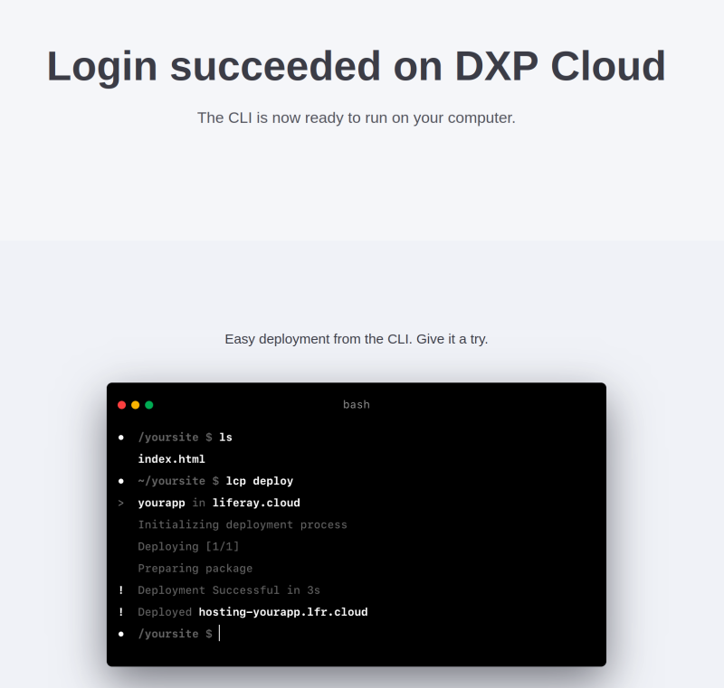

# Using the CLI Tool

Now that the Delectable Bonsai site is up and running on Liferay Experience Cloud, Kyle is ready to start deploying [client extensions](https://learn.liferay.com/w/dxp/building-applications/client-extensions) the development team created. To get started, he needs to install the [command-line tool](https://learn.liferay.com/w/liferay-cloud/reference/command-line-tool).

Here, you'll install the CLI tool and log into the Cloud console with it.

## Install the CLI Tool

Install the tool at the command line with this command:

```bash
curl https://cdn.liferay.cloud/lcp/stable/latest/install.sh -fsSL | sudo bash
```

```{note}
If you have a Windows environment, you can download and run the [Windows installer](https://cdn.liferay.cloud/lcp/stable/latest/lcp-install.exe) instead.
```

Once this completes, you are able to use the tool with the `lcp` command.

## Use the Tool to Log In

You must log in through the CLI tool to deploy client extension projects.

Run the `lcp login` command to log in, and enter `y` when prompted to open a browser.


A browser tab automatically opens to `https://console.liferay.cloud/login`. If your console session has expired, log in again with the credentials you received to authorize the CLI tool.



Now the tool can connect to your environments to deploy your projects, including client extensions.

Excellent! You've completed this module on setting up your cloud instance. 

Next: learn to [deploy code to your LXC instance](../deploying-code-to-lxc.md). 

## Relevant Concepts

* [Liferay Cloud Command-Line Tool](https://learn.liferay.com/w/liferay-cloud/reference/command-line-tool)
