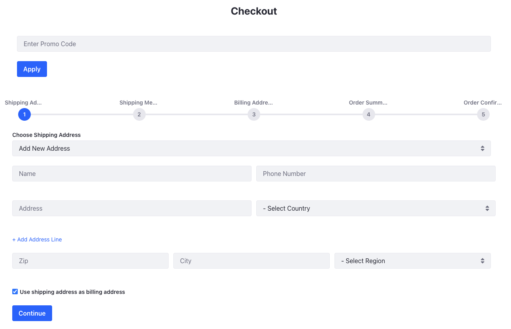

# Creating a Checkout Page

Before you can check out and submit an order, you must have a checkout page. This is also necessary for the mini cart fragment to work correctly. 

## Creating a New Page

1. Open the *Product Menu* (), and navigate to *Site Builder* &rarr; *Pages*.

1. To add a child page, click *Add* () next to the shop page and click *Add Page*.

1. Select the master page template.

1. Enter the name as `Checkout` and click *Add*. This opens the new page in edit mode.

## Customizing the Checkout Page

1. Drag and drop a container on the page. Change the Container Width to *Fixed Width*.

1. Go to the *Styles* tab and in the Spacing settings, choose *Spacer 5* for the margin on the top of the element.

1. Drag and drop a Heading fragment inside the fixed width container.

1. Set the header title to *Checkout*.

1. Go to the *Styles* tab and in the Spacing settings, choose *Spacer 4* for the margin at the bottom of the element.

1. In the Text settings, set the text alignment to center.

1. Drag and drop the *Checkout* widget inside the fixed width container.

The checkout page is now ready to use.

## Adding the Coupon Code Widget

Next, you must add the coupon code widget to the Checkout page so that customers can enter discount codes during checkout. 

1. Drag and drop a *Coupon Code* widget below the checkout title.

1. Go to the *Styles* tab and in the Spacing settings, choose *Spacer 4* for the padding on the top, left, right, and bottom of the element.

1. Choose *Spacer 4* for the margin at the bottom of the element.

1. Click *Publish*.

## Adding the Mini Cart Fragment to the Header

Once you have created the Orders page and Checkout page, you can add the mini cart fragment to the page header. The mini cart fragment requires you to have these pages to work correctly. 

1. Open the *Product Menu* () and navigate to *Design* &rarr; *Page Templates*.

1. Select the master page template.

1. Select the Grid in the header and change the Number of Modules to *4*.

1. Resize the grid as shown in the image below. 

   

   The module for the logo and the nav links should be the same size as before. The search module is one size less to accommodate the mini cart fragment.

1. Drag and drop the *Mini Cart* fragment inside the last module of the grid.

1. Click *Publish Master*.

Next: [Creating a Discount and Enabling Guest Checkout](./creating-a-discount-and-enabling-guest-checkout.md)
