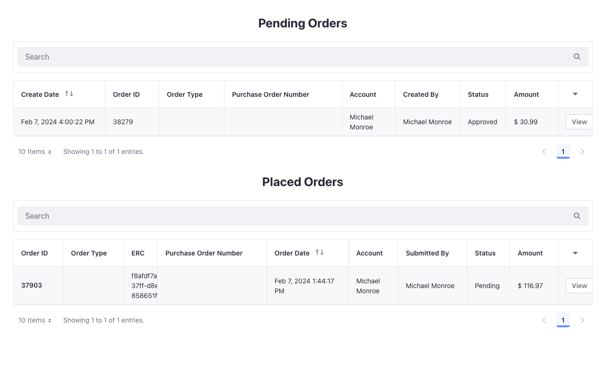

# Creating an Orders Page

The Orders page displays a customer's open orders and placed orders. You can select pending orders and continue to check out or delete them completely. You can select a placed order to view more details about a specific order. 

## Creating a New Page

1. Open the *Product Menu* (), and navigate to *Site Builder* &rarr; *Pages*.

1. To add a child page, click *Add* () next to the shop page and click *Add Page*.

1. Select the master page template.

1. Enter the name as `Orders` and click *Add*. This opens the new page in edit mode.

## Customizing the Orders Page

1. Drag and drop a container on the page. Change the Container Width to *Fixed Width*.

1. Go to the *Styles* tab and in the Spacing settings, choose *Spacer 5* for the margin on the top of the element.

1. Drag and drop a heading fragment below it.

1. Set the header title to *Pending Orders*.

1. Go to the *Styles* tab and in the Spacing settings, choose *Spacer 4* for the margin at the bottom of the element.

1. In the Text settings, set the text alignment to center.

1. Drag and drop the Open Carts widget inside the fixed width container below the heading fragment.

1. Drag and drop another heading fragment below the open carts widget.

1. Set the header title to *Placed Orders*.

1. Go to the *Styles* tab and in the Spacing settings, choose *Spacer 4* for the margin on the top and bottom of the element.

1. In the Text settings, set the text alignment to center.

1. Drag and drop the Placed Orders widget inside the fixed width container below the heading fragment.

The orders page is ready to use now. 

Next: [Creating a Checkout Page](./creating-a-checkout-page.md)
