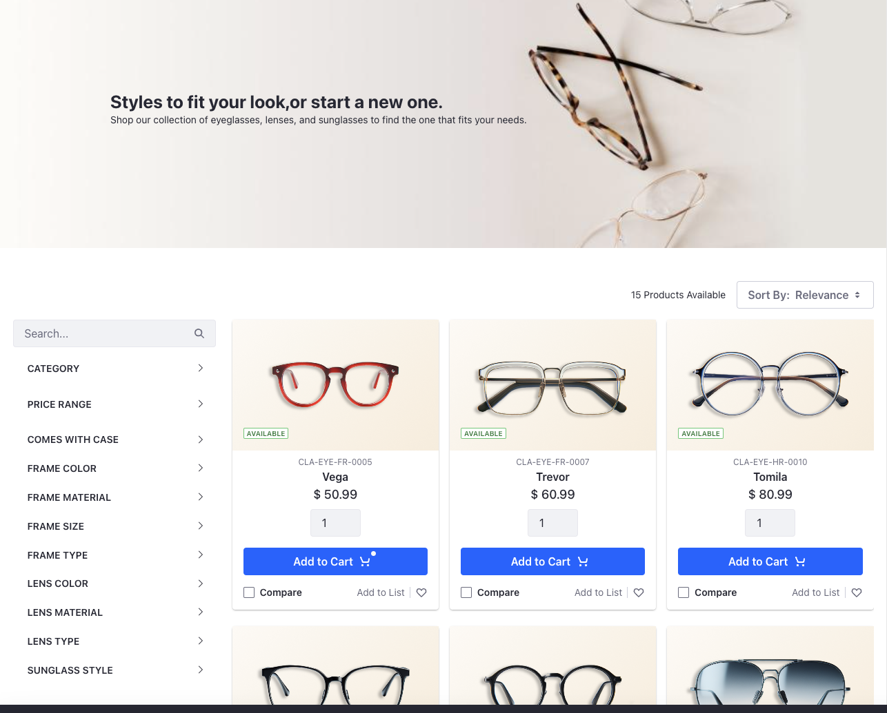

# Creating the Shop Page

The shop page is the first point of access to Clarity's product catalog. The page contains a list of all the products, their associated facets, and search and sort functionality.  



## Adding a Banner

The first element on the shop page is a banner: 

1. Open the *Product Menu* () and go to *Site Builder* &rarr; *Pages*.

1. Select the shop page. This opens the page in edit mode.

1. Drag and drop a container from the left menu. 

1. Click the container and open its settings (in the right sidebar menu). In the General section, set the minimum height of the banner to 40VH. This ensures the banner takes up 40% of the Viewport Height of the current device.

1. Set the container's Content Display to *Flex Column* and Justify Content to *Start*.

1. Go to the *Styles* tab and click *Add* () under the Background Image section.

1. Choose the `catalog-hero.jpg` image from Documents and Media.

1. Drag and drop a Heading fragment inside the container, followed by a Paragraph fragment below it.

1. Click the Heading fragment and set its content to :  `Styles to fit your look,or start a new one.`

1. From the right sidebar menu, click *Styles*.

1. In the Spacing settings, choose *Spacer 5* for the margin on the left of the element.

   The value for each spacer setting is defined by the page's [Style Book](https://learn.liferay.com/en/w/dxp/site-building/site-appearance/style-books).

1. Click the Paragraph fragment and set its content to :  `Shop our range of eyeglasses, lenses, and sunglasses to find the one that fits your needs.`

1. From the right sidebar menu, click *Styles*.

1. In the Spacing settings, choose *Spacer 5* for the margin on the left of the element.

## Adding a Container for Products and Facets

1. Drag and drop another container below the container added earlier.

1. Click the container and open its settings. In the General section, set the Container Width to *Fixed Width*.

1. Go to the *Styles* tab and in the Spacing settings, choose *Spacer 5* for the margin on the top of the element.

1. Drag and drop a Grid fragment inside this container.

1. In the right sidebar menu, set the *Number of Modules* to 2.  Adjust the size of the first module so that it takes up one-fourth of the total size of the container. 

## Adding the Search Bar and Facets

1. Inside the first module of the grid, drag and drop a Search Bar fragment from the left menu.

1. Go to its Styles section from the right sidebar menu and set its Margin Top to `3.5rem`.

1. Click *Actions* () on the fragment, and choose *Configuration*.

1. Set the scope to *Everything* and click *Save*.

1. Drag and drop the following widgets one below the other:

   1. Category Facet
   2. Price Range Facet
   3. Specification Facet

1. Click *Actions* () on the category facet, and choose *Configuration*.

1. Choose *Select Vocabularies* and select *Clarity* from the Global scope.

1. Click *Save*.

1. Click *Actions* () on the price range facet, and choose *Configuration*.

1. In the *Ranges JSON Array* textarea, paste the following array:

   ```json
   [
      {'range': '[0 TO 25]'}\, 
      {'range': '[25.01 TO 35]'}\, 
      {'range': '[35.01 TO 50]'}\, 
      {'range': '[50.01 TO 75]'}\, 
      {'range': '[75.01 TO *]'}
   ]
   ```

1. Click *Save*.

1. Lastly, drag and drop a Search Options widget below the specification facet.

1. Click *Actions* () and select *Configuration*. 

1. Check the box to *Allow Empty Searches*.

1. Click *Save*.

1. In the left hand layout menu, hide the search options widget.

## Adding the Products

1. From the left menu, drag and drop a Sort widget from the Commerce section to the second module of the grid.

1. Right below this, drag and drop the Search Results widget, again from the Commerce section.

1. Click *Publish*.

With that you have a catalog page displaying all the products in the catalog. There's also a search bar for products along with several functioning facets. 

Next: [Creating a Catalog Page](./creating-a-catalog-page.md)
