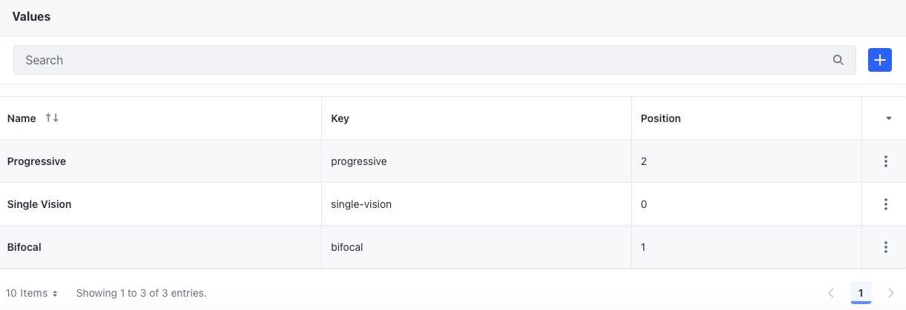

# Adding Options

In the first module, we created 3 products all having a single SKU. SKU stands for Stock Keeping Unit. Oftentimes, there may be products that have multiple SKUs. For instance, a product that comes in different quantities. In this lesson, you’ll learn how to edit an existing product and add multiple SKUs to it using options.

1. Open the *Global Menu* () and navigate to *Commerce* &rarr; *Options*.

1. Click the *Add* () button and enter the following information:

   **Name:** Quantity

   **Option Field Type:** Select from List

   

1. Click *Submit*.

1. Select the created option.

1. Enable all 3 toggles: *Use in Faceted Navigation*, *Required*, *SKU Contributor*.

1. In the *Values* section, click the *Add* () button.

1. Enter name as 100ml and position as 0.

1. Click *Submit*. 

1. Repeat the same for two more values: 180ml with position 1 and 250ml with position 2. 

   

1. Click *Save*.

This creates an option template called quantity that you can add to products. You also have the option to directly create options from the product configuration page. 

## Adding Options to a Product

When adding an SKU contributing option to a product, it renders the existing SKU inactive. After adding the option to a product, you have the option to generate all SKU combinations based on the options.

1. Open the *Global Menu* () and navigate to *Commerce* &rarr; *Products*.

1. Select *Sap Infused Maple Syrup*.

1. Go to the *SKUs* tab and delete the DBSY001 sku.

1. Go to the *Options* tab and search for *Quantity*.

1. Click *Select*.

1. Select the added option and enable the toggles: *Use in Faceted Navigation*, *Required*, *SKU Contributor*.

1. Click *Save*.

1. Go to the *SKUs* tab and click the *Add* () button. 

1. Select *Generate All SKU Combinations*.

   

1. Click on each SKU option and change the name as follows:

   | SKU   | Name     |
   | :---- | :------- |
   | 100ml | DBSY001A |
   | 180ml | DBSY001B |
   | 250ml | DBSY001C |

      

1. Repeat the above steps for the other two products with the following information.

   | Product                        | SKUs                         |
   | :----------------------------- | :--------------------------- |
   | Sap Infused Orange Maple Syrup | DBSY002A, DBSY002B, DBSY002C |
   | Sap Infused Honey Maple Syrup  | DBSY003A, DBSY003B, DBSY003C |

1. Click *Publish*. 

This creates 3 SKUs each for the 3 products in the catalog giving a total of 9 SKUs. In the next lesson, you’ll add product images for each of the created products.

Next: [Adding Media](./adding-media.md)