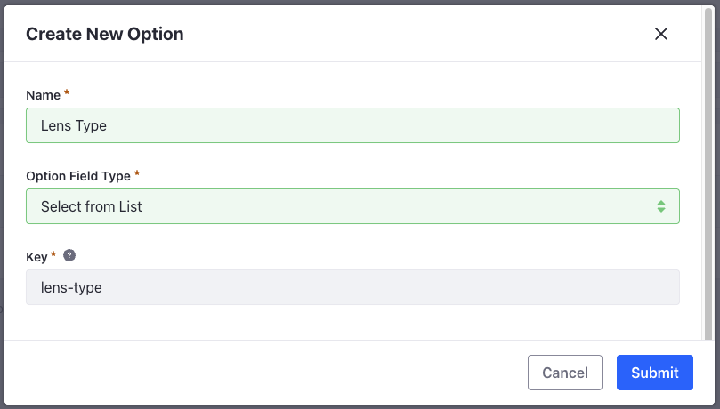

# Adding Options

In the first module, you created three products all having a single SKU, or Stock Keeping Unit. Often, there may be products that have multiple SKUs. For instance, a product that has different quantities. In this lesson, you’ll learn how to edit an existing product and add multiple SKUs using options.

1. Open the *Global Menu* () and navigate to *Commerce* &rarr; *Options*.

1. Click *Add* () and enter the following information:

   **Name:** Lens Type

   **Option Field Type:** Select from List

   

1. Click *Submit*.

1. Select the created option.

1. Enable all three toggles: *Use in Faceted Navigation*, *Required*, *SKU Contributor*.

1. In the *Values* section, click *Add* ().

1. Enter name as *Single Vision* and position as 0.

1. Click *Submit*. 

1. Repeat the same for two more values: *Progressive* with position 1 and *Bifocal* with position 2. 

   

1. Click *Save*.

This creates an option template called *Lens Type* that you can add to multiple products. You also have the option to directly create options from the product configuration page. Repeat the steps for another option, *Lens Coating*, with the following values.

* Blue Light Filter
* Blue Light Filter + UV Protection

## Adding Options to a Product

When adding an SKU contributing option to a product, it renders the existing SKU inactive. After adding the option to a product, you can generate all SKU combinations based on the available options. Since you've created two options, one with 3 values and one with 2 values, it adds 6 SKUs for a single product. 

1. Open the *Global Menu* () and navigate to *Commerce* &rarr; *Products*.

1. Select *Maliyah*.

1. Go to the SKUs tab and delete the *CLA-FR-EYE-001* sku.

1. Go to the Options tab and search for *Lens Type*.

1. Click *Select*. Repeat the same for lens coating. 

1. Click *Save*.

1. Go to the *SKUs* tab and click *Add* (). 

1. Select *Generate All SKU Combinations*.

   

1. Click on each SKU option and change the name as follows:

   | SKU                                            | Name             |
   | :--------------------------------------------- | :--------------- |
   | SINGLE VISIONBLUE LIGHT FILTER                 | CLA-EYE-FR-0001A |
   | SINGLE VISIONBLUE LIGHT FILTER + UV PROTECTION | CLA-EYE-FR-0001B |
   | BIFOCALBLUE LIGHT FILTER                       | CLA-EYE-FR-0001C |
   | BIFOCALBLUE LIGHT FILTER + UV PROTECTION       | CLA-EYE-FR-0001D |
   | PROGRESSIVEBLUE LIGHT FILTER                   | CLA-EYE-FR-0001E |
   | PROGRESSIVEBLUE LIGHT FILTER + UV PROTECTION   | CLA-EYE-FR-0001F |

   

1. Repeat the above steps for the other two products with the following information.

   | Product   | SKUs                                                                                                       |
   | :-------- | :--------------------------------------------------------------------------------------------------------- |
   | Fleurette | CLA-EYE-FR-0002A, CLA-EYE-FR-0002B, CLA-EYE-FR-0002C, CLA-EYE-FR-0002D, CLA-EYE-FR-0002E, CLA-EYE-FR-0002F |
   | Lateefah  | CLA-EYE-FR-0003A, CLA-EYE-FR-0003B, CLA-EYE-FR-0003C, CLA-EYE-FR-0003D, CLA-EYE-FR-0003E, CLA-EYE-FR-0003F |

1. Click *Publish*. 

This creates six SKUs each for the three products in the catalog giving a total of 18 SKUs. In the next exercise, you’ll add product images for each of the created products.

Next: [Adding Media](./adding-media.md)
