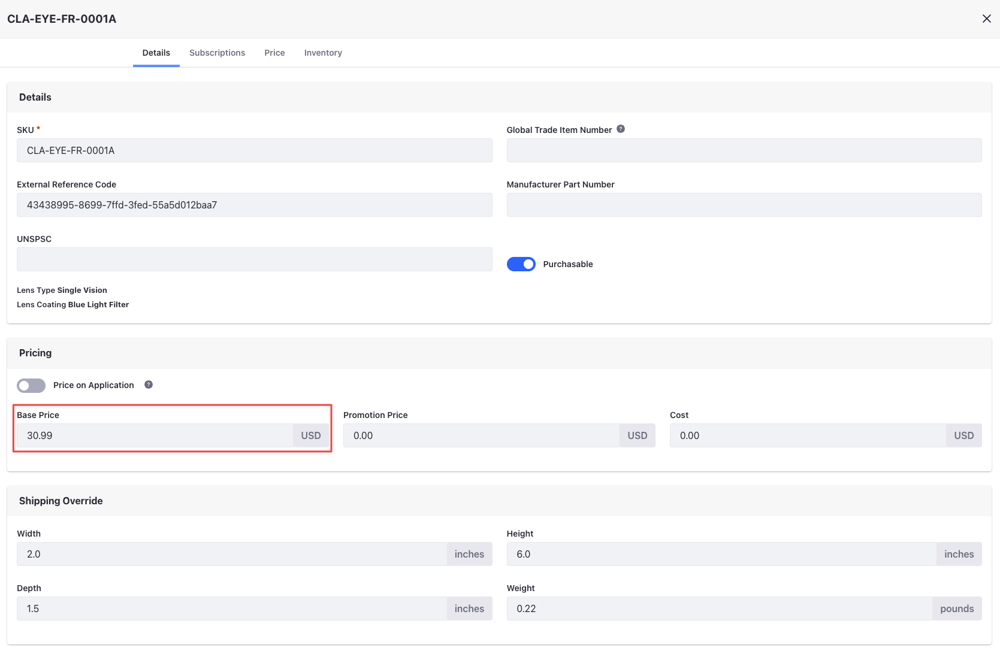

# Configuring SKUs

Now that we’ve configured all of the basic details for a product, it’s time to configure the SKUs. The SKUs represent the actual physical item in the warehouse and configuring them involves configuring their dimensions, inventory, and pricing. 

## Configuring SKU Prices

After creating the catalog, a base price list and a base promotion list is automatically created. You'll now add prices for each SKU. There are two ways to do this. The first way is to add pricing information from the product configuration page. The second way is to directly add an entry in the base price list through the pricing application. The steps below shows how to add pricing information from the product configuration page. 

1. Open the *Global Menu* () and navigate to *Commerce* &rarr; *Products*.

1. Select *Sap Infused Maple Syrup*.

1. Click on the *SKUs* tab.

1. Select the SKU corresponding to the 100ml option.

1. Under the *Pricing* section, enter the *Base Price* as $12.99.

   

Leave the *Promotion Price* and *Cost* fields blank. You can also navigate to the *Price Lists* tab and click on the *Actions* () icon and select *Edit* to enter a price in the base price list. 

## Configuring SKU Dimensions and Weight

Remember adding the dimensions and weight for the products on the configuration page? These dimensions are automatically applied to all SKUs in the product as well. In our example, there are 3 SKUs for one product, each of varying quantity. The dimensions and weight of each of these’ll differ. To change it for each SKU, 

1. Open the *Global Menu* () and navigate to *Commerce* &rarr; *Products*.

1. Select *Sap Infused Maple Syrup*.

1. Click on the *SKUs* tab.

1. The dimensions for the 100ml SKU needn’t be changed.

1. Select the SKU corresponding to the 180ml option.

1. Under the *Shipping Override* section, enter the following values:

   **Width:** 2.0

   **Height:** 7.0

   **Depth:** 1.5

   **Weight:** 0.4

   

1. Click *Publish*.

1. Select the SKU corresponding to the 250ml option.

1. Under the *Shipping Override* section, enter the following values:

   **Width:** 6.0

   **Height:** 7.8

   **Depth:** 6.0

   **Weight:** 0.5

1. Click *Publish*.

This completes the configuration for one product. Repeat the steps above for the other two products with the following information. 

   | Product                        | SKU Dimensions and Weight                                 |
   | :----------------------------- | :-------------------------------------------------------- |
   | Sap Infused Orange Maple Syrup | DBSY002A - Width: 2, Height: 6, Depth: 1.5, Weight: 0.22  |
   |                                | DBSY002B - Width: 2, Height: 7, Depth: 1.5, Weight: 0.4   |
   |                                | DBSY002C - Width: 2, Height: 7.8, Depth: 1.5, Weight: 0.5 |
   | Sap Infused Honey Maple Syrup  | DBSY003A - Width: 2, Height: 6, Depth: 1.5, Weight: 0.22  |
   |                                | DBSY003B - Width: 2, Height: 7, Depth: 1.5, Weight: 0.4   |
   |                                | DBSY003C - Width: 2, Height: 7.8, Depth: 1.5, Weight: 0.5 |

## Configuring SKU Inventory

Just as with pricing, there are two ways to add inventory for a SKU. The first way is to add inventory through the product configuration page. The second way is to directly add inventory for each SKU through the Inventory application. The steps below shows how to add inventory from the product configuration page. 

1. Open the *Global Menu* () and navigate to *Commerce* &rarr; *Products*.

1. Select *Sap Infused Maple Syrup*.

1. Click on the *SKUs* tab.

1. Select the SKU corresponding to the 100ml option.

1. Click on the *Inventory* tab.

   Only the warehouse in Minnesota serves consumer orders and business orders whereas the warehouse in Oklahoma is solely for fulfilling business orders. 

1. Enter the quantity as 870 for the Minnesota warehouse. 

   

1. Click *Save*. 

Repeat the same process for each SKU of all products. After adding the inventory, you can confirm this by going to the Inventory application. 

1. Open the *Global Menu* () and navigate to *Commerce* &rarr; *Inventory*. 

1. Verify that the inventory is available for all the SKUs. You can also add inventory from here by clicking the *Add* () button and entering the SKU, warehouse, quantity, and clicking the Submit button.

We’ve completed adding and configuring channels, a catalog, warehouses, and products. It’s now time to build the storefront. In the next module, we'll build out the B2C storefront. 
