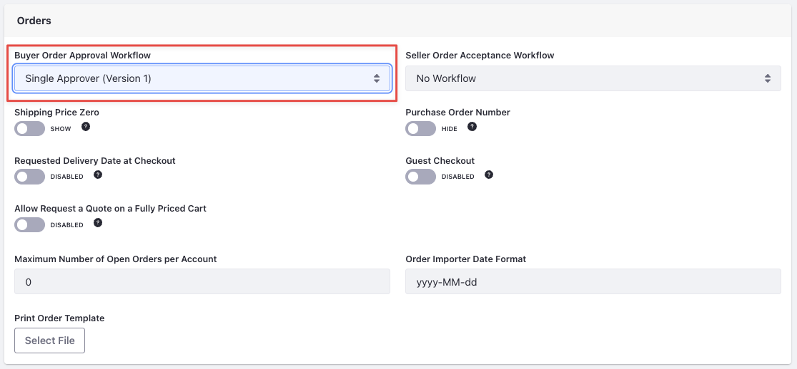
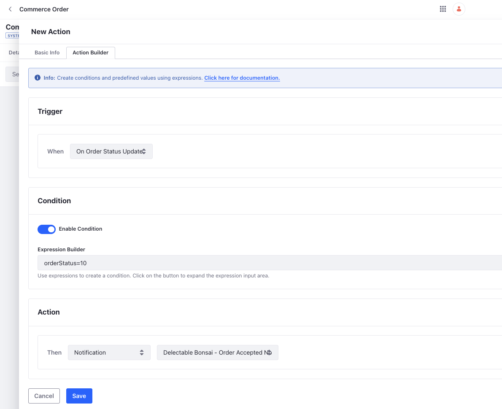

# Configuring Workflows and Notifications

Preston Palmer, the order manager, wants to review and approve orders placed by Robert Read, the buyer for Almighty Vision, for budget reasons. Clarity’s B2B site employs a buyer order approval workflow using the out-of-the-box single approver workflow. This ensures that all orders placed by buyers are approved by their order managers. This workflow helps when there’s a budget allocated for buying and requires approvals.

1. Open the *Global Menu* () and navigate to *Commerce* → *Channels*. 

1. Select the B2B channel created earlier. 

1. In the Orders section, select *Single Approver (Version 1)* from the Buyer Order Approval Workflow drop-down.

   

1. Click *Save*.

## Creating a Notification Template

Kyle, the administrator, needs your help to notify users when an order is accepted. To do this, you must set up a notification template and an object action for the commerce order system object. 

1. Open the *Global Menu* () and navigate to *Control Panel* → *Templates*. 

1. Click *Add* () and select *Email*.

1. Enter these details:

   **Name:** Clarity - Order Accepted Notification Template

   **Description:** Notification template for emails sent when orders are accepted by Clarity.

   **To:** `[%COMMERCEORDER_AUTHOR_EMAIL_ADDRESS%]`

   **From Address:** `orders@clarity.com`

   **From Name:** `Orders @ Clarity`

   **Subject:** `Your Order: [%COMMERCEORDER_ID%] has been accepted`

   **Template:**

   ```
   Hi [%COMMERCEORDER_AUTHOR_FIRST_NAME%] [%COMMERCEORDER_AUTHOR_LAST_NAME%],

   Your recent order from Clarity with Order ID: [%COMMERCEORDER_ID%] has been accepted. Visit the orders page from your account to know the latest status of your order. 

   Thanks,

   Orders @ Clarity
   ```

   Here are all the variables you can use in your notification template:

   | Variable                                         | Description                        |
   | :----------------------------------------------- | :--------------------------------- |
   | [%COMMERCEORDER_AUTHOR_SUFFIX%]                  | Author Suffix                      |
   | [%COMMERCEORDER_AUTHOR_PREFIX%]                  | Author Prefix                      |
   | [%COMMERCEORDER_AUTHOR_FIRST_NAME%]              | Author First Name                  |
   | [%COMMERCEORDER_AUTHOR_LAST_NAME%]               | Author Last Name                   |
   | [%COMMERCEORDER_AUTHOR_MIDDLE_NAME%]             | Author Middle Name                 |
   | [%COMMERCEORDER_AUTHOR_ID%]                      | Author ID                          |
   | [%COMMERCEORDER_CURRENCYCODE%]                   | Currency Code                      |
   | [%COMMERCEORDER_EXTERNALREFERENCECODE%]          | External Reference Code            |
   | [%COMMERCEORDER_ID%]                             | ID                                 |
   | [%COMMERCEORDER_MODIFIEDDATE%]                   | Modified Date                      |
   | [%COMMERCEORDER_ORDERSTATUS%]                    | Order Status                       |
   | [%COMMERCEORDER_ORDERTYPEEXTERNALREFERENCECODE%] | Order Type External Reference Code |
   | [%COMMERCEORDER_ORDERTYPEID%]                    | Order Type ID                      |
   | [%COMMERCEORDER_SHIPPINGAMOUNT%]                 | Shipping Amount                    |
   | [%COMMERCEORDER_STATUS%]                         | Status                             |

1. Click *Save*.

This creates a notification template for sending notifications whenever an order is accepted. You must now create an object action on the commerce order system object to trigger this. 

## Creating a Commerce Order Object Action

1. Open the *Global Menu* () and navigate to *Control Panel* → *Objects*. 

1. Select the *Commerce Order* system object.

1. Navigate to the *Actions* tab and click *Add* ().

1. Enter *Order Accepted* as the Action Label. The action name gets populated automatically. 

1. Go to *Action Builder*.

1. Under Trigger, select *On Order Status Update* from the drop-down.

1. Activate the *Enable Condition* toggle, and enter this expression:

   `orderStatus=10`

   Each [order status](https://learn.liferay.com/web/guest/w/commerce/order-management/orders/order-life-cycle) corresponds to an integer. See below to learn more.

   | Order Status      | Integer Value |
   | :---------------- | :------------ |
   | Open              | 2             |
   | In Progress       | 6             |
   | Pending           | 1             |
   | Processing        | 10            |
   | Shipped           | 15            |
   | Completed         | 0             |
   | Cancelled         | 8             |
   | Partially Shipped | 14            |
   | On Hold           | 20            |

1. Under Action, choose *Notification* and select the *Clarity Order Accepted* notification template. 

   

1. Click *Save*. 

This creates the object action on the commerce order system object. It gets triggered every time an order is accepted and sends the email based on the template. 

Next: [Creating and Configuring Warehouses](./creating-and-configuring-warehouses.md)
