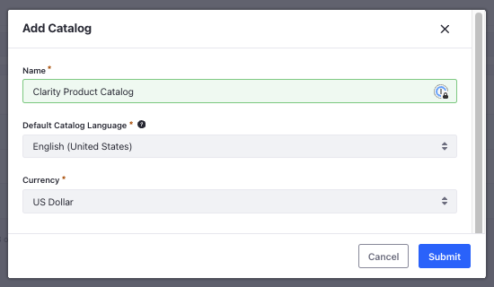

# Creating and Configuring Catalogs

Clarity caters to businesses and consumers and has a wide range of products. Damian, the category manager, must create a catalog to store these products. Some products are fulfilled by third-party suppliers, and they’ll have their own catalogs. This happens in a later module. 

To create a new catalog,

1. Open the *Global Menu* () and navigate to *Commerce* &rarr; *Catalogs*.

1. Click *Add* () and enter this information:

   **Name:** Clarity Product Catalog

   **Default Language:** English (United States)

   **Currency:** US Dollar

   

1. Click *Submit*.

After creating a catalog, a base price list and a base promotion list are also created automatically. There’s an option to add a default catalog image. When you don’t have images for products in the catalog, the default catalog image appears as the product image. 

To add the default image, 

1. Click on *Select File* in the *Default Catalog Image* card.

1. Choose `square-color.png` from the library.

1. Click *Save*.

You also have the option to link the catalog to a supplier account. This happens in a later module, so for now, leave the rest of the defaults. 

Next: [Creating Products](./creating-products.md)
