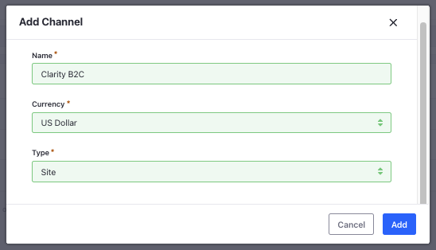

# Creating and Configuring Channels

A channel is a place where you sell products. In Liferay, you must link a channel to a site to be able to sell products on that site. Delectable Bonsai operates two online stores, one for B2C customers and one for B2B customers. To support this, you must help Kyle create two channels and link them to their corresponding sites. 

To create a channel,

1. Open the *Global Menu* () and navigate to *Commerce* → *Channels*.

1. Click the *Add* () button and enter the following details:

   **Name:** Delectable Bonsai B2C

   **Currency:** USD

   **Type:** Site

   

1. Click *Add*.

This creates a new channel for the B2C store. Repeat the steps to create a B2B channel with the following information. 

| Name                  | Currency | Type |
| :-------------------- | :------- | :--- |
| Delectable Bonsai B2B | USD      | Site |

After creating both the channels, you must link them to the corresponding Liferay sites and configure them. 

## Configuring the B2C Channel

For the B2C channel, we’ll configure a payment method, shipping method, and ensure that the site type is set to B2C. In the *Details* section, set the *Commerce Site Type* to *B2C*. When the [site type](https://learn.liferay.com/web/guest/w/commerce/starting-a-store/sites-and-site-types#site-types) is B2C, every account in the site must be a personal account. Select the *Type* tab, and click *Select Site*. Choose the *Delectable Bonsai B2C* site and click *Save*. You can now use this channel to accept customer orders from your site. 

```{note}
There’s also a B2X type that permits both personal and business accounts. See [Site Types](https://learn.liferay.com/web/guest/w/commerce/starting-a-store/sites-and-site-types#site-types) for more information. You can also use [Liferay’s accelerators](https://learn.liferay.com/web/guest/w/commerce/starting-a-store/accelerators) to jumpstart your online store. 
```

Delectable Bonsai offers their B2C customers an option to pay by PayPal. Customer orders are shipped using a flat rate shipping method. You can use Liferay’s out-of-the-box payment and shipping methods to implement both of these. 

To add PayPal as a payment method, follow the instructions [here](https://learn.liferay.com/web/guest/w/commerce/store-management/configuring-payment-methods/paypal).

### Configuring Flat Rate Shipping Method

1. Go to the *Shipping Methods* section and select *Flat Rate*.

1. Activate it using the toggle.

1. Click *Save*.

1. Go to the *Shipping Options* page, click the *Add* () button.

1. Enter the name as *Regular Shipping* and amount as *$9.99*.

1. Click *Save*.

1. Click the *Add* () button once more.

1. Enter the name as *Express Shipping* and amount as *$12.99*.

1. Click *Save*.

## Configuring the B2B Channel

For the B2B channel, we’ll configure a payment method, shipping method, and ensure that the site type is set to B2B. In the *Details* section, set the *Commerce Site Type* to *B2B*. When the [site type](https://learn.liferay.com/web/guest/w/commerce/starting-a-store/sites-and-site-types#site-types) is B2B, every account in the site must be a business account. Select the *Type* tab, and click *Select Site*. Choose the *Delectable Bonsai B2B* site and click *Save*. 

Delectable Bonsai offers their B2B customers an option to pay by money order. They ship using a variable shipping rate that's calculated based on the weight of the shipment. You can use Liferay’s out-of-the-box payment and shipping methods to implement both of these. 

### Configuring Money Order

1. Go to the *Payment Methods* section and select *Money Order*.

1. Activate it using the toggle.

1. Click *Save*.

   We want this to be eligible for all order types. If you want a specific message page to appear during checkout, go to the *Configuration* tab and enable the message page. You can also customize the message that appears in this checkout step. 

### Configuring Variable Rate Shipping Method

1. Now, go to the *Shipping Methods* section and select *Variable Rate*.

1. Activate it using the toggle.

1. Click *Save*.

1. Go to the *Shipping Options* page, click the *Add* () button.

1. Enter the name as *Standard Shipping* and click *Save*.

1. Go to *Shipping Option Settings* and click the *Add* () button. 

1. Select the shipping option created earlier from the dropdown.

1. In the *Settings* section, enter the following details:

   **Shipping Option:** Standard Shipping

   **Weight From:** 0.0

   **Weight To:** 10.0

   **Fixed Price:** 4.99

   **Price per Unit of Weight:** 2.99

   

1. Repeat this two more times with the following details: 

   | Shipping Option   | Weight From | Weight To | Fixed Price | Price per Unit of Weight |
   | :---------------- | :---------- | :-------- | :---------- | :----------------------- |
   | Standard Shipping | 10.01       | 20.0      | 5.99        | 3.99                     |
   | Standard Shipping | 20.01       | 30.0      | 6.99        | 4.99                     |

In the next section, we’ll set up order notifications and enable buyer order approval workflows. We’ll see how the order lifecycle changes when there’s a workflow in place and how users are notified when an order is accepted. 

Next: [Configuring Workflows and Notifications](./configuring-workflows-and-notifications.md)
