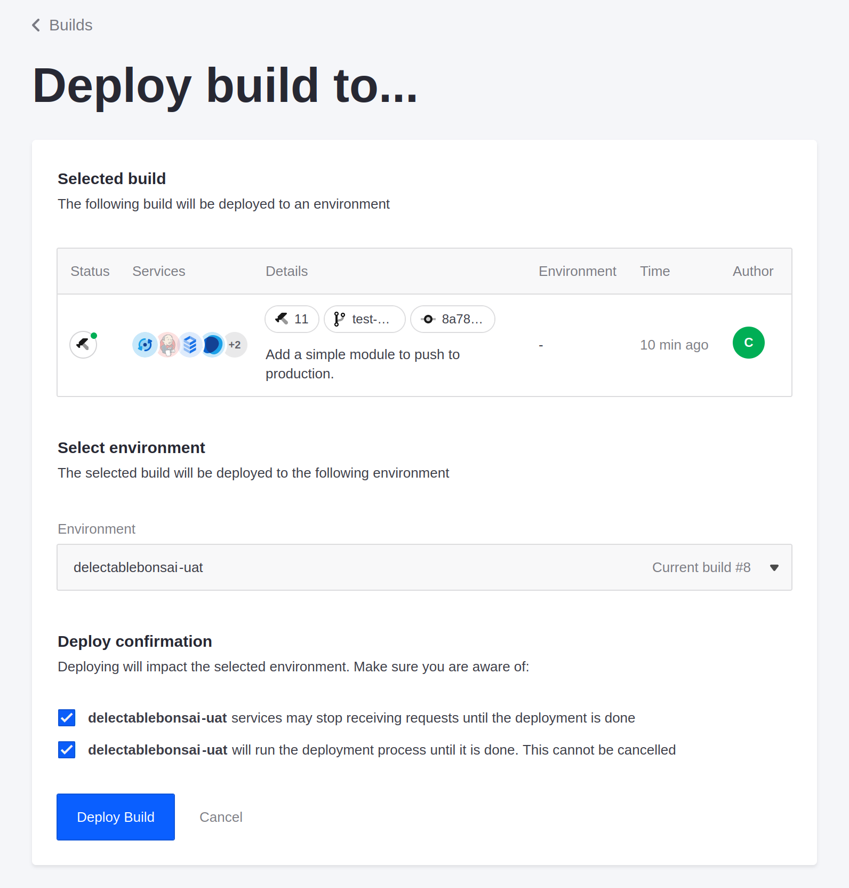
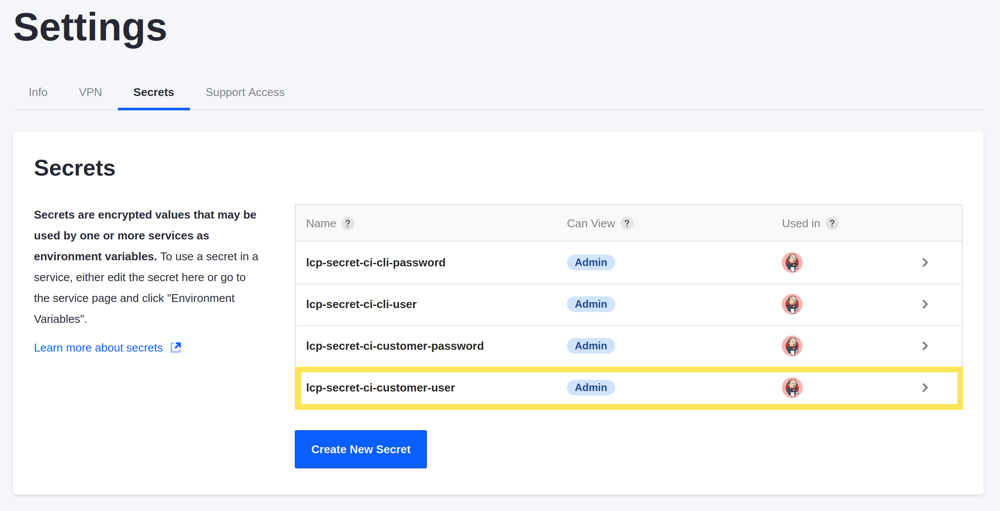

# Deploying and Promoting to Production

As Kyle begins to work on development with Liferay Cloud, he goes through his first full deployment process by deploying and promoting a simple widget module.

Deploy and test an example widget to walk through the whole process.

## Pushing Up New Code

Download an example module with a new, simple widget to deploy to your Liferay Cloud environment for these steps.

1. Open a command prompt within your project repository's `liferay/` directory.

1. Download and unzip the example's source code into a `modules/` folder.

    ```bash
    curl https://resources.learn.liferay.com/courses/latest/en/liferay-administrators/fundamentals/liferay-e3v7.zip -O
    ```

    ```bash
    unzip liferay-e3v7.zip -d modules/
    ```

1. Commit and push the source code to your remote repository on GitHub.

    ```bash
    git add modules
    ```

    ```bash
    git commit -m "Add a simple module to push to production."
    ```

    ```bash
    git push origin [branch_name]
    ```

Your `infra` environment creates a new build from your push that you can deploy from the Liferay Cloud console once it's complete.

## Deploying to UAT

Next, deploy the build to your UAT environment for testing.

```{note}
Whether you deploy to UAT or another `dev` environment depends on your subscription and your own workflow. Once you configure automatic deployment, you can skip manually deploying to the first environment in the process.
```

1. In the Liferay Cloud console, click *Builds* at the top of the screen.

1. Find the new build from your push and click *Deploy build to...*

    

1. From the *Environment* drop-down menu, select your UAT environment.

1. Click the checkboxes to confirm the impact of the deployment.

    

1. Click *Deploy Build*.

Your UAT environment's services restart, and once they are back up, the example module is deployed to the Liferay instance.

## Accessing Your UAT Environment

Next, manually test the new widget to ensure it's working correctly.

1. Navigate to your `infra` environment.

1. Click *Settings* on the left side of the screen.

1. Select the *Secrets* tab.

1. Click the `lcp-secret-ci-customer-user` secret.

    

1. Click *View* to confirm the secret value you need to log into your UAT instance.

    

    ```{tip}
    The default username is `customer`.
    ```

1. Click the back arrow to return to the list of secrets.

1. Click the `lcp-secret-ci-customer-password` secret.

1. Click *View* to see the secret value. You can click the value itself to copy it to your clipboard.

1. Navigate to your UAT environment.

1. Click *Visit Site* at the top of the page.

1. When prompted for credentials, enter the username and password you found from the `lcp-secret-ci-customer-user` and `lcp-secret-ci-customer-password` secrets, respectively.

Now you have successfully logged in and accessed your UAT Liferay instance.

## Acceptance Testing

Next, test the new widget to make sure it's working properly.

1. Log in as the default [administrator](https://learn.liferay.com/web/guest/w/dxp/getting-started/introduction-to-the-admin-account).

1. Click the edit icon (  ) at the top of the page to access a list of widgets.

1. From the *Fragments and Widgets* side bar, click the *Widgets* tab.

1. Scroll down and expand the *Sample* section to find the new widget, *E3V7 Widget*.

    

1. Drag it anywhere on the page to see how it looks. The example widget displays simple text.

Now that you've confirmed the widget is working, continue to promote the build to production.

## Deploying to Production

Kyle needs to get approval from his manager, Marcus, before he can promote the build to production. Once it's approved, he can deploy the same build to production during a planned period of downtime.

Deploy the build to production now that it's passed your testing process.

1. In the Liferay Cloud console, click *Builds*.

1. Using the same build as before from the list, click *Deploy build to...*

1. Under the *Environment* drop-down menu, select your production environment.

1. Click the checkboxes to confirm the impact of the deployment.

1. Click *Deploy Build*.

The production environment's services restart with the new addition from the build. Once the services are back up, you can visit your production environment's Liferay instance to see the new widget appear there, too.

Next, you'll use a backup to undo changes applied to your environment during development.

## Related Concepts

* [The Liferay Cloud Deployment Workflow](https://learn.liferay.com/w/liferay-cloud/build-and-deploy/overview-of-the-liferay-cloud-deployment-workflow)
* [Deploying to the Liferay Service](https://learn.liferay.com/w/liferay-cloud/using-the-liferay-dxp-service/deploying-to-the-liferay-service)
* [Deploying Changes via the Liferay Cloud Console](https://learn.liferay.com/w/liferay-cloud/build-and-deploy/deploying-changes-via-the-liferay-cloud-console)
* [Logging into Your Liferay Cloud Services](https://learn.liferay.com/w/liferay-cloud/getting-started/logging-into-your-liferay-cloud-services)
