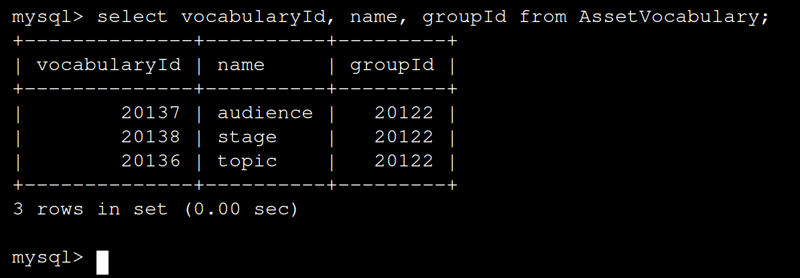

# Using the Liferay Service's Shell

In order to more effectively observe his effects on the Liferay database during testing, Kyle tries using the Liferay service's shell to query it directly.

Here, you'll use the shell and directly query a Liferay instance's database from the console.

## Accessing the Shell

Access the Liferay service's shell via the service's page.

1. In the Liferay Cloud console, navigate to your UAT environment.

1. Click *Services* on the left side of the screen.

1. Click the Liferay service.

1. Click the *Shell* tab.

1. Enter `ls` into the shell to see the Liferay Home directory contents.

    

```{note}
Changes you make to your Liferay instance through the shell are not permament. They are overwritten the next time your service restarts.
```

## Using the MySQL Client

Next, use the MySQL client to directly interface with your Liferay instance's database and view live data.

1. Enter `mysql` into the shell to log into the MySQL client with the default user.

    ```{note}
    Logging in with the default database user gives read-only access to the database. For testing that requires directly manipulating data, you must log in [with the database service's credentials](https://learn.liferay.com/w/liferay-cloud/using-the-liferay-dxp-service/using-the-mysql-client#logging-in-with-read-and-write-privileges).
    ```

1. Enter `show tables;` to show a list of all existing tables that you can scroll through.

    

1. Try running another query to see a list of all [vocabularies](https://learn.liferay.com/w/dxp/content-authoring-and-management/tags-and-categories/organizing-content-with-categories-and-tags) across all sites:

    ```sql
    select vocabularyId, name, groupId from AssetVocabulary;
    ```

    

1. Finally, log out of the MySQL client when you are finished:

    ```sql
    quit
    ```

Next, you'll deploy a simple custom service to your UAT environment.

## Related Concepts

* [Shell Access](https://learn.liferay.com/web/guest/w/liferay-cloud/troubleshooting/shell-access)
* [Using the MySQL Client](https://learn.liferay.com/web/guest/w/liferay-cloud/using-the-liferay-dxp-service/using-the-mysql-client)
