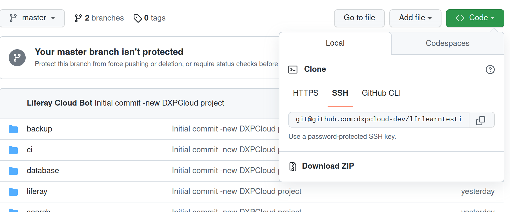

# Setting Up the GitHub Repository

<!-- While I love your storytelling, we want to focus foremost on the concept and only secondarily on the story. I'll re-write the below paragraph to give you an example of what I mean. -Rich -->

The first task to do after you've had your Liferay Cloud account provisioned is to set up the project's Git repository so you can deploy configurations as an administrator. Since Delectable Bonsai wants to have at least two administrators for backup purposes, both Marcus and Kyle must follow the below steps. 

Set up the repository and complete your first push to ensure it's working.

## Install the CLI Tool

First, you must install the CLI tool so you can deploy changes quickly to different services in Liferay Cloud. 

Install the CLI tool via your command prompt.

**On Linux/MacOS**:

```bash
curl https://cdn.liferay.cloud/lcp/stable/latest/install.sh -fsSL | bash
```

**On Windows**:

Download the latest version of the [Windows installer](https://cdn.liferay.cloud/lcp/stable/latest/lcp-install.exe) and follow the steps in the wizard.

## Transfer to Your Own GitHub Repository

<!-- Is there a reason we don't just tell them to click the Fork button, fork it to their account, then clone their version, and finally add upstream back? That seems much more straightforward, and we could even link to GitHub's [fork a repo](https://docs.github.com/en/get-started/quickstart/fork-a-repo) docs. -Rich -->

Begin by setting up your own GitHub repository to switch your Liferay Cloud project over to.

<!-- Yes, at Liferay, we are used to SSH because we've been using it from the beginning. But GitHub now recommends using https and caching your credentials (see here: https://docs.github.com/en/get-started/quickstart/set-up-git). Something tells me we shouldn't get into setting up Git/GitHub, because this stuff can change. Why don't we change this whole thing to two steps that point to the two GitHub docs: 1. Set up Git, and 2. Fork a repo. -Rich -->

1. On the provisioned repository's page on [GitHub](https://github.com), click the *Code* button and copy the SSH link to the repository. See the official [GitHub documentation](https://docs.github.com/en/authentication/connecting-to-github-with-ssh/generating-a-new-ssh-key-and-adding-it-to-the-ssh-agent) for help if you have not generated an SSH key on your machine yet.

    

1. Run this command to clone the repository into a directory on your own system, in a new directory for the project:

    ```bash
    git clone [copied link] BonsaiSyrup
    ```

1. Create a [new private repository on GitHub](https://docs.github.com/en/get-started/quickstart/create-a-repo), and copy the SSH link for it.

1. Remove the old origin from your local repository:

    ```bash
    git remote remove origin
    ```

1. Add your new repository as the new origin using link you copied:

    ```bash
    git remote add origin <copied link>
    ```

Now you have your own private repository with the Liferay Cloud project structure.

## Configure the Webhook

Next, configure a webhook to allow Liferay Cloud to access the new repository.

1. On the GitHub website, go to your repository’s Settings page and click *Webhooks*.

   

1. Click *Add Webhook*.

1. In the *Payload URL* field, add the domain of your Liferay Cloud `infra` environment's CI service with `github-webhook/` at the end (e.g., `https://ci-bonsai-infra.lfr.cloud/github-webhook/` for the `bonsai` project).

1. In the *Content type* drop-down menu, select *application/json*.

1. Ensure that *Enable SSL verification* is selected.

   

1. Under *Which events would you like to trigger this webhook?*, select *Let me select individual events*.

1. Select *Pushes* and *Pull Requests* from the list of events that appears.

   

1. Ensure that the *Active* checkbox is selected.

1. Click *Add webhook*.

Now your repository allows Liferay Cloud to access it.

## Point Liferay Cloud to Your Private Repository

Finally, configure the CI service in your `infra` environment to work with the private repository.

1. Log in to the Liferay Cloud console.

1. Navigate to your `infra` environment, and click *Services*.

1. Select the CI service.

1. Under the *Environment Variables* tab, add the values for these environment variables:

    | **Name** | **Value** |
    | :--- | :--- |
    | `LCP_CI_SCM_PROVIDER` | `github` |
    | `LCP_CI_SCM_REPOSITORY_NAME` | <Your repository's name> |
    | `LCP_CI_SCM_REPOSITORY_OWNER` | <Your repository owner's account> |
    | `LCP_CI_SCM_TOKEN` | <Personal access token> |

    Use a [personal access token](https://docs.github.com/en/authentication/keeping-your-account-and-data-secure/creating-a-personal-access-token) that has every permission checked under the *repo* and *admin:repo_hook* categories.

Once the CI service restarts, any pushes or pull requests to your private repository trigger new builds in your Liferay Cloud project.

Next, you'll use the repository to complete your first push and deployment.

## Related Concepts

* [Configuring Your GitHub Repository](https://learn.liferay.com/liferay-cloud/latest/en/getting-started/configuring-your-github-repository.html)
* [Command-Line Tool](https://learn.liferay.com/liferay-cloud/latest/en/reference/command-line-tool.html)
* [Configuring Your Bitbucket Repository](https://learn.liferay.com/liferay-cloud/latest/en/getting-started/configuring-your-bitbucket-repository.html)
* [Configuring Your GitLab Repository](https://learn.liferay.com/liferay-cloud/latest/en/getting-started/configuring-your-gitlab-repository.html)
