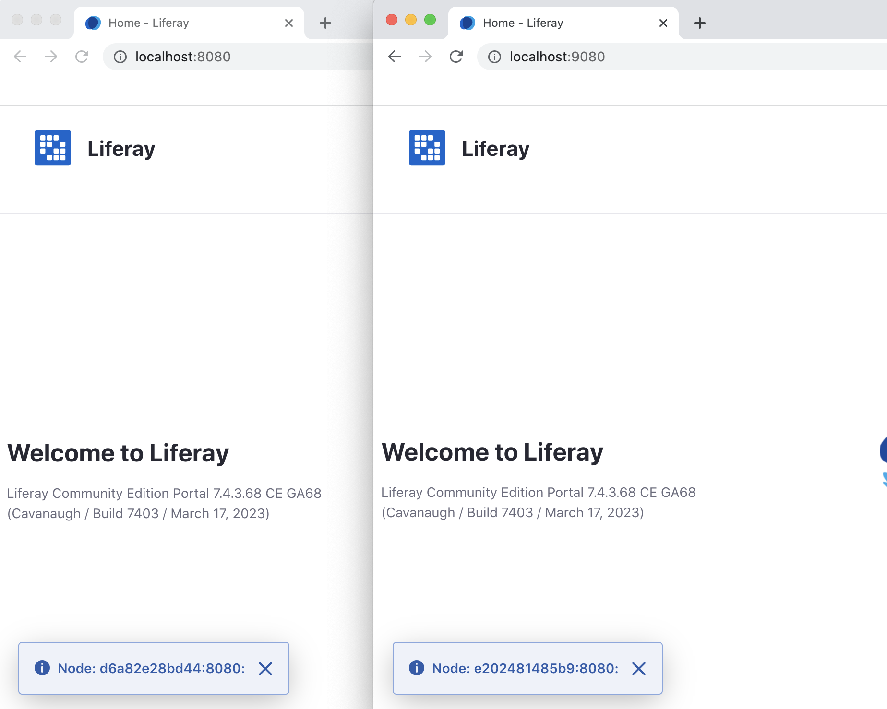

---
toc:
uuid: a58b8853-86af-4a1c-8f52-1b9c7f705b78
---
# Configuring the DXP Cluster

Two docker containers can be run to demonstrate a simple clustered environment. See [Clustering for High Availability](https://learn.liferay.com/web/guest/w/dxp/installation-and-upgrades/setting-up-liferay/clustering-for-high-availability) to learn more.

## Configuring Elasticsearch for Each Node

1. Navigate back to the same local folder (i.e. `[your_folder]`) where you set up Elasticsearch's data volume. Create two new folders.

   ```bash
   mkdir -p liferay-1/files/osgi/configs liferay-2/files/osgi/configs
   ```

1. Generate a configuration file for the `liferay-1` node.

   ```bash
   cat <<EOT >> liferay-1/files/osgi/configs/com.liferay.portal.search.elasticsearch6.configuration.ElasticsearchConfiguration.config
   operationMode="REMOTE"
   transportAddresses="elasticsearch:9300"
   clusterName="LiferayElasticsearchCluster"
   EOT
   ```

1. Generate a configuration file for the `liferay-2` node.

   ```bash
   cat <<EOT >> dxp-2/files/osgi/configs/com.liferay.portal.search.elasticsearch6.configuration.ElasticsearchConfiguration.config
   operationMode="REMOTE"
   transportAddresses="elasticsearch:9300"
   clusterName="LiferayElasticsearchCluster"
   EOT
   ```

## Deploying Each Cluster Node

1. Find the IP address of the `elasticsearch` and `some-mariadb` containers.

   ```bash
   docker network inspect bridge
   ```

   Replace `[IP address]` below with the respective IP address of `elasticsearch` and `some-mariadb`.

1. Start the first Liferay node.

   ```bash
   docker run -it \
      --add-host elasticsearch:[IP address] \
      --add-host some-mariadb:[IP address] \
      -e LIFERAY_JDBC_PERIOD_DEFAULT_PERIOD_JNDI_PERIOD_NAME="" \
      -e LIFERAY_JDBC_PERIOD_DEFAULT_PERIOD_DRIVER_UPPERCASEC_LASS_UPPERCASEN_AME=org.mariadb.jdbc.Driver \
      -e LIFERAY_JDBC_PERIOD_DEFAULT_PERIOD_URL="jdbc:mariadb://some-mariadb:3306/dxp_db?useUnicode=true&characterEncoding=UTF-8&useFastDateParsing=false" \
      -e LIFERAY_JDBC_PERIOD_DEFAULT_PERIOD_USERNAME=root \
      -e LIFERAY_JDBC_PERIOD_DEFAULT_PERIOD_PASSWORD=my-secret-pw \
      -e LIFERAY_CLUSTER_PERIOD_LINK_PERIOD_ENABLED=true \
      -e LIFERAY_CLUSTER_PERIOD_LINK_PERIOD_CHANNEL_PERIOD_LOGIC_PERIOD_NAME_PERIOD_CONTROL=control-channel-logic-name-1 \
      -e LIFERAY_CLUSTER_PERIOD_LINK_PERIOD_CHANNEL_PERIOD_LOGIC_PERIOD_NAME_PERIOD_TRANSPORT_PERIOD_NUMBER0=transport-channel-logic-name-1 \
      -e LIFERAY_CLUSTER_PERIOD_LINK_PERIOD_AUTODETECT_PERIOD_ADDRESS=some-mariadb:3306 \
      -e LIFERAY_WEB_PERIOD_SERVER_PERIOD_DISPLAY_PERIOD_NODE=true \
      -e LIFERAY_DL_PERIOD_STORE_PERIOD_IMPL=com.liferay.portal.store.db.DBStore \
      --name liferay-1 \
      -p 11311:11311 \
      -p 8009:8009 \
      -p 8080:8080 \
      -v $(pwd)/liferay-1:/mnt/liferay \
      liferay/portal:latest
   ```

1. Start the second Liferay node.

   ```bash
   docker run -it \
      --add-host elasticsearch:[IP address] \
      --add-host some-mariadb:[IP address] \
      -e LIFERAY_JDBC_PERIOD_DEFAULT_PERIOD_JNDI_PERIOD_NAME="" \
      -e LIFERAY_JDBC_PERIOD_DEFAULT_PERIOD_DRIVER_UPPERCASEC_LASS_UPPERCASEN_AME=org.mariadb.jdbc.Driver \
      -e LIFERAY_JDBC_PERIOD_DEFAULT_PERIOD_URL="jdbc:mariadb://some-mariadb:3306/dxp_db?useUnicode=true&characterEncoding=UTF-8&useFastDateParsing=false" \
      -e LIFERAY_JDBC_PERIOD_DEFAULT_PERIOD_USERNAME=root \
      -e LIFERAY_JDBC_PERIOD_DEFAULT_PERIOD_PASSWORD=my-secret-pw \
      -e LIFERAY_CLUSTER_PERIOD_LINK_PERIOD_ENABLED=true \
      -e LIFERAY_CLUSTER_PERIOD_LINK_PERIOD_CHANNEL_PERIOD_LOGIC_PERIOD_NAME_PERIOD_CONTROL=control-channel-logic-name-2 \
      -e LIFERAY_CLUSTER_PERIOD_LINK_PERIOD_CHANNEL_PERIOD_LOGIC_PERIOD_NAME_PERIOD_TRANSPORT_PERIOD_NUMBER0=transport-channel-logic-name-2 \
      -e LIFERAY_CLUSTER_PERIOD_LINK_PERIOD_AUTODETECT_PERIOD_ADDRESS=some-mariadb:3306 \
      -e LIFERAY_WEB_PERIOD_SERVER_PERIOD_DISPLAY_PERIOD_NODE=true \
      -e LIFERAY_DL_PERIOD_STORE_PERIOD_IMPL=com.liferay.portal.store.db.DBStore \
      --name liferay-2 \
      -p 11312:11311 \
      -p 9009:8009 \
      -p 9080:8080 \
      -v $(pwd)/liferay-2:/mnt/liferay \
      liferay/portal:latest
   ```

1. You can now visit each node. `Liferay-1` is available at `http://localhost:8080`. And `Liferay-2` is available at `http://localhost:9080`.

   

```{note}
Running two Liferay docker nodes may require increasing your default CPU and memory resource settings.
```

## Relevant Concepts

- [Maintaining Clustered Installations](https://learn.liferay.com/en/w/dxp/installation-and-upgrades/maintaining-a-liferay-installation/maintaining-clustered-installations)