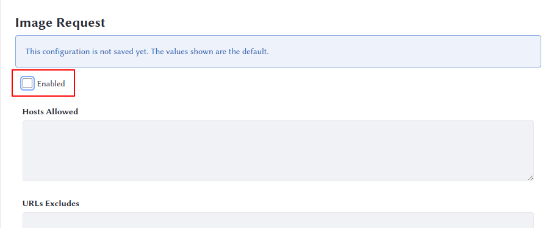

# Authentication Verifiers

{bdg-secondary}`LXC-SM or Self-hosted`

Authentication Verifiers are internal instances of code that determine that the provided credentials---whether that's a user name/password, a token, an HTTP header, or a parameter---match a user account. Liferay has built-in implementations for the most common situations, such as when remote clients use HTTP Basic authentication, send credentials in request parameters, use the `JSESSIONID`, or other shared secrets. 

It's important to note that authentication verifiers _do not_ provide credentials; they only verify existing credentials that have already been provided, along with authenticated sessions. 

## Configuring Authentication Verifiers

Delectable Bonsai wants to lock down certain features they won't be using. Since they have no plans for connecting their instance to LibreOffice/OpenOffice for file conversion, they've decided to turn off the Image Request Authentication Verifier. 

1. Go to _Control Panel_ &rarr; _System Settings_ &rarr; _Security &rarr; _API Authentication_. 

1. The Image Request authentication verifier is the first in the list, so it's selected already. Uncheck the _Enabled_ check box. 

1. Click _Save_. 

You have now disabled the Image Request authentication verifier. For a list of what the other ones do, see the link below. 

## Relevant Concepts

[Using Authentication Verifiers](https://learn.liferay.com/w/dxp/installation-and-upgrades/securing-liferay/securing-web-services/using-authentication-verifiers)
