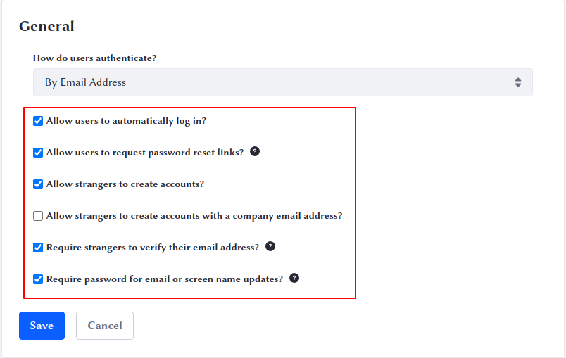
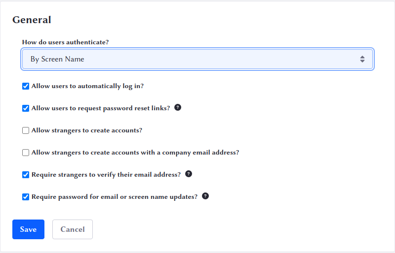

# Configuring Sign In

Liferay's sign-in widget is configurable and adjusts to how you've set its options. In a prior step, you configured two [virtual instances](../../configuration/configuring-virtual-instances.md). One of these is for a public-facing, external website. The other is for an internal intranet meant for employees or partners. 

Guest users should be able to access the external site and register for accounts to purchase products, participate in forums, submit recipes, and otherwise interact with Delectable Bonsai. In contrast, no one should have access to the internal website except for users who have been registered by administrators. For this reason, you must adjust authentication differently for the two sites. 

## Configuring Authentication on the Public Website

1. Navigate to the main (public) website at <http://localhost:8080>. 

1. Log in as the administrator, [Kyle Klein](../../users-accounts-organizations/managing-users.md).

1. Go to _Global Menu_ &rarr; _Instance Settings_ &rarr; _Platform_ &rarr; _User Authentication_. 

1. Make sure all boxes are checked except _Allow strangers to create accounts with a company email address_. Delectable Bonsai wants only members of the Marketing department to have accounts on the public website, and they will be created by administrators. 

   

1. Click _Save_. 

Because it's a public website, unscrupulous users who register themselves may decide to give themselves a screen name like _root_ or _admin_. You can prevent that. 

1. Click _Reserved Credentials_ on the left. 

1. In the Screen Names field, type the screen names you don't want users to have, one per line: 
   - admin
   - root
   - president

1. Click _Save_. 

Since you required users to verify their emails in the previous step, you don't need to reserve email addresses prospective users can't access. 

Excellent! You've now configured authentication for the public website. Now you can move on to the internal website. 

## Configuring Authentication on the Internal Website

Delectable Bonsai's internal intranet is called Breakfast, at the domain name `breakfast.delectablebonsai.com`. You created it in a [prior step](../../configuration/configuring-virtual-instances.md), and you made Kyle Klein an administrator of that instance. If you didn't follow those instructions, please follow them now and come back here. 

Now you can configure authentication on the internal intranet. 

1. Go to <http://breakfast.delectablebonsai.com:8080> in your browser and log in as Kyle Klein. 

1. Go to _Global Menu_ &rarr; _Instance Settings_ &rarr; _Platform_ &rarr; _User Authentication_. 

1. This time, change How do users authenticate? to _By Screen Name_. 

1. Uncheck _Allow strangers to create accounts_. 

1. Click _Save_. 

   

Internal users authenticate using a screen name given to them by administrators, not by their email addresses. 

Awesome! You've now configured authentication for the internal website. 

Next: [Authentication Verifiers](./authentication-verifiers.md)

## Relevant Concepts

- [Authentication Basics](https://learn.liferay.com/w/dxp/installation-and-upgrades/securing-liferay/authentication-basics)
- [User Authentication](https://learn.liferay.com/web/guest/w/dxp/system-administration/configuring-liferay/virtual-instances/user-authentication)
