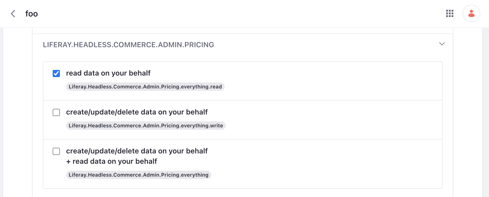
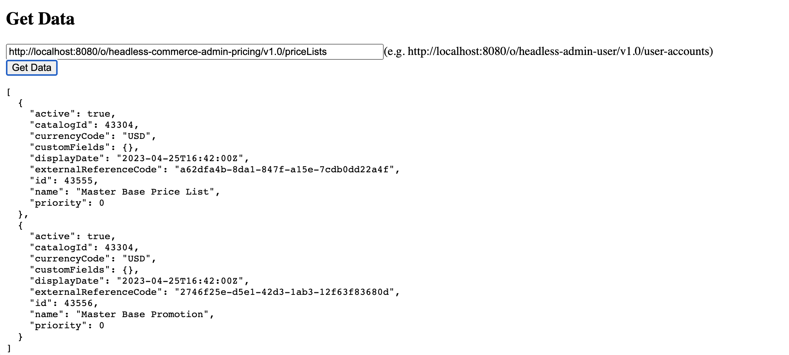

# Authorizing with OAuth2

Use Liferay's OAuth2 tools to authorize third-party applications to access data. For example, a Delectable Bonsai partner wants to sell the maple syrup products with up-to-date pricing. They request Delectable Bonsai to provide access to the price list API. Follow the steps below to see this in action.

## Setting Up OAuth2

1. Open the _Global Menu* () and navigate to _Control Panel_ &rarr; _Security_ &rarr; _OAuth 2 Administration_.

1. Click _Add_ () to create a new OAuth2 application. 

1. Give the application a name (e.g., foo). Set the Website URL as `http://localhost:3000` and the Callback URI as `http://localhost:3000/grant-type-authorization-code`. Click *Save*.

1. Copy the Client ID and Client Secret to your clipboard. To get the Client Secret click *Edit*. Copy the value from the pop-up window. These values are needed later in the sample React app. 

1. Click the _Scopes_ tab at the top of the page. Scroll down, click _LIFERAY.HEADLESS.COMMERCE.ADMIN.PRICING_, then check the box for _read data on your behalf_. 

   

   Click *Save*. Your OAuth2 Application now has read privileges for the commerce pricing API category.

1. Next, open the *Global Menu* (), click the *Control Panel* tab, and go to *System Settings* &rarr; *Security Tools*.

1. Go to the *Portal Cross-Origin Resource Sharing (CORS)* tab and click *Default Portal CORS Configuration*.

1. Add a *URL Pattern* with the value `/o/headless-commerce-admin-pricing/*` and click *Save*. This enables CORS for the `headless-commerce-admin-pricing` category of APIs.

## Deploy the Sample React App

1. Download and unzip the [OAuth2 React App](https://resources.learn.liferay.com/dxp/latest/en/headless-delivery/using-oauth2/liferay-c2b6.zip).

   ```bash
   curl https://resources.learn.liferay.com/dxp/latest/en/headless-delivery/using-oauth2/liferay-c2b6.zip -O
   ```

   ```bash
   unzip liferay-c2b6.zip
   ```

   ```bash
   cd liferay-c2b6
   ```

1. Verify that `node` and `yarn` are installed. If not, run the setup script and follow the prompts:

   ```bash
   ./setup_tutorial.sh
   ```

1. Navigate into the app's root directory and start the React server.

   ```bash
   cd c2b6-custom-element
   ```

   ```bash
   yarn install && yarn start
   ```

1. Open the React app running at `http://localhost:3000`. Click _Authorization Code Flow_. 

1. Enter `http://localhost:8080/o/oauth2/authorize` for the Liferay authorize URL. Paste the client ID from your clipboard. Click _Authorize_.

1. If you're not already logged in, you are redirected to the Liferay login page before being sent to the authorization page. Enter your username and password (e.g. *test@liferay.com:learn*) and click *Sign In*. On the authorization page, click *Authorize*. If you are already logged in, you are sent directly to the authorization page.

1. Enter `http://localhost:8080/o/oauth2/token` for the Liferay token URL. Paste the client ID and client secret from your clipboard. Click _Get Token_.

1. Enter `http://localhost:8080/o/headless-commerce-admin-pricing/v1.0/priceLists` for the request URL. Click _Get Data_.

   

Next: [Managing AntiSamy](../managing-antisamy.md)

## Relevant Concepts

- [Using OAuth2](https://learn.liferay.com/w/dxp/headless-delivery/using-oauth2)
- [Creating an OAuth2 Application](https://learn.liferay.com/w/dxp/headless-delivery/using-oauth2/creating-oauth2-applications)
