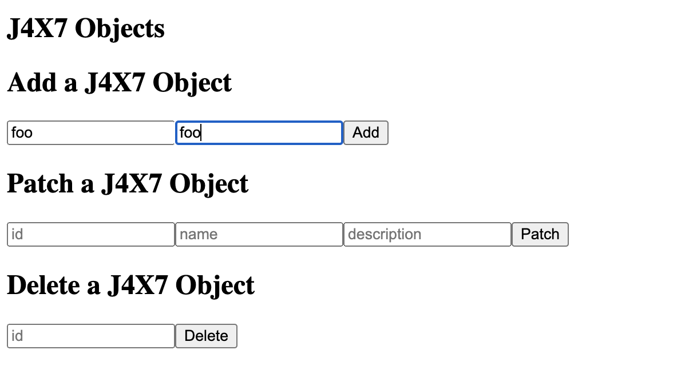

# Securing Web Services

Use the different web service tools Liferay offers to protect your system as different applications and clients interact with Liferay. See [securing Liferay web services](https://learn.liferay.com/w/dxp/installation-and-upgrades/securing-liferay/securing-web-services) to learn more.

## Understanding Service Access Policies

Use the service access policy tool to set which web services have public access. You can view a list of the default policies. Follow the steps below to add a new policy. See [setting service access policies](https://learn.liferay.com/w/dxp/installation-and-upgrades/securing-liferay/securing-web-services/setting-service-access-policies) to learn more.

1. Make an API request without passing any credentials. 

   ```bash
   curl "localhost:8080/o/headless-admin-user/v1.0/my-user-account"
   ```

   Note, that a forbidden error response is returned.

1. Navigate to _Global Menu_ () &rarr; _Control Panel_ &rarr; _Service Access Policy_.

1.  Click _Add_ ().

2. Configure the new policy as follows:

   * Input `MY_USER_ACCOUNT_GUEST_ACCESS` as the name.
   * Toggle the enabled switch on.
   * Toggle the default switch on.
   * Input `My User Account Guest Access` as the title.
   * Input `com.liferay.headless.admin.user.internal.resource.v1_0.UserAccountResourceImpl` as the service class.
   * Input `getMyUserAccount` as the method name.
   * Click _Save_.

3. Make the same API request.

   ```bash
   curl "localhost:8080/o/headless-admin-user/v1.0/my-user-account"
   ```

   Liferay now returns the user account info of the guest user. Allow or deny access in this way for other services.

## Enabling Cross-Origin Resource Sharing

When a server from a different domain tries to access Liferay web services, the cross-origin resource sharing (CORS) policy allows or denies each request. Follow the steps below to see an example of this with a React application running locally. See [setting up CORS](https://learn.liferay.com/w/dxp/installation-and-upgrades/securing-liferay/securing-web-services/setting-up-cors) to learn more.

1. Create a Liferay object.

   * Navigate to _Global Menu_ () &rarr; _Control Panel_ &rarr; _Objects_.
   * Click _Add_ ().
   * Input the following:
     * Label: `J4X7-Object`
     * Plural Label: `J4X7-Objects`
     * Name: `J4X7Object`
   * Click _Save_.
   * Select the J4X7-Object you just created. Click the _Fields_ tab.
   * Click _Add_ () and add the following field:
     * Label: `name`
     * Field Name: `name`
     * Type: `Text`
   * Click _Save_.
   * Click _Add_ () and add the following field:
     * Label: `description`
     * Field Name: `description`
     * Type: `Text`
   * Click _Save_.
   * Click back to the _Details_ tab and click _Publish_.

1. Download and unzip the React application.

   ```bash
   curl https://resources.learn.liferay.com/dxp/latest/en/building-applications/developing-a-javascript-application/using-react/liferay-j4x7.zip -O
   ```

   ```bash
   unzip liferay-j4x7.zip
   ```

   ```bash
   cd liferay-j4x7
   ```

1. Navigate to the application's folder and start the React server.

   ```bash
   cd j4x7-custom-element
   ```

   ```bash
   yarn start
   ```

1. Try to add a J4X7 object entry. Input `foo` as the name and description and click _Add_.

   

   See that the entry was prevented from being added.

1. In Liferay, navigate to _Global Menu_ () &rarr; _Control Panel_ &rarr; _System Settings_. Note, a CORS policy can also be configured at the instance level (i.e. for LXC users).

1. Add a CORS policy for the object.

   * Click _Security Tools_.
   * Click _Portal Cross-Origin Resource Sharing (CORS)_ in the left navigation.
   * Click _Default Portal CORS Configuration_.
   * Add a *URL Pattern* with the value `/o/c/j4x7objects/*` and click *Update*.

1. Back in the React app, add a J4X7 object entry. Input `foo` as the name and description and click _Add_.

   

   With the CORS policy updated, a J4X7 object entry is now successfully added.

## Relevant Concepts

- [Setting Service Access Policies](https://learn.liferay.com/w/dxp/installation-and-upgrades/securing-liferay/securing-web-services/setting-service-access-policies)
- [Setting Up CORS](https://learn.liferay.com/w/dxp/installation-and-upgrades/securing-liferay/securing-web-services/setting-up-cors)