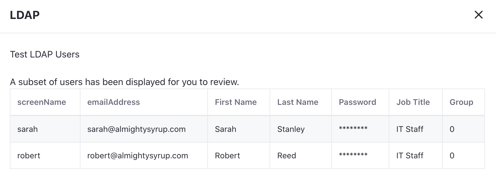

# Connecting to LDAP

An LDAP server can be configured at the system level or instance level in Liferay. Choose the [configuration scope](https://learn.liferay.com/w/dxp/system-administration/configuring-liferay/understanding-configuration-scope) based on your needs. Note, when configuring at the system scope, you must specify each instance ID. See [Connecting to an LDAP Directory](https://learn.liferay.com/w/dxp/users-and-permissions/connecting-to-a-user-directory/connecting-to-an-ldap-directory).

Delectable Bonsai must import user data from a company they just acquired. Connect to the company's LDAP server with the steps below.

1. Navigate to _Global Menu_ () &rarr; _Control Panel_ &rarr; _Instance Settings_. 

1. Under security, click _LDAP_.

1. In the left navigation, click _Servers_. 

1. Click _Add_.

1. In the new page, fill in the LDAP connection information.

   * Server Name: `Almighty Syrup`
   * Base Provider URL: `ldap://127.0.0.1:389`
   * Base DN: `dc=almightysyrup,dc=com`
   * Principal: `cn=admin,dc=almightysyrup,dc=com`
   * Credentials: `learn`

   

   Click _Test LDAP Connection_. A new popup window shows that Liferay has successfully connected to the LDAP server. Click the _X_ and close the window.

1. Next, fill in the LDAP user information section. Make sure that required fields such as name and email are mapped correctly. Click _Test LDAP Users_ to preview the mapping of user fields.

   

1. Next, fill out the LDAP groups information. Click _Test LDAP Groups_ to see a preview.

1. Finally, fill out the LDAP export information. Click _Save_.

The next step is [importing and exporting users](./importing-and-exporting-users.md).

## Relevant Concepts

[Connecting to an LDAP Directory](https://learn.liferay.com/w/dxp/users-and-permissions/connecting-to-a-user-directory/connecting-to-an-ldap-directory)
