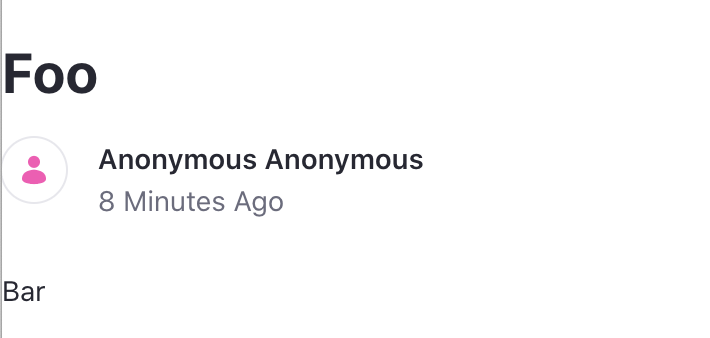

# Managing and Deleting Personal Data

Liferay provides user data tools for managing and deleting personal user data. Though these tools can help with GDPR requirements, they do not guarantee compliance. See [managing user data](https://learn.liferay.com/w/dxp/users-and-permissions/managing-user-data) to learn more.

## Exporting Personal Data

You may need to export personal user data. For example, Sarah Stanley is requesting a copy of all her personal data. Follow the steps to export her user data.

1. Navigate to _Global Menu_ () &rarr; _Control Panel_ &rarr; _Users and Organizations_.

1. Click _Options_ () for Sarah Stanley. Click _Export Personal Data_.

1. In the next page, click _Add_ () to start a new export process.

1. In the next page, select all items you wish to export. For example, select all personal data from blogs. Click _Export_ after making your selection.

   

1. The next page shows an export process for each category of personal data. To download, click _Options_ () and select _Download_. The personal user data is downloaded to your machine.

<!-- Not sure we're done here. What format is the data in? How can you read it? -Rich --> 

## Anonymizing Personal Data

Choose to anonymize personal data if you want to keep existing content on your site. For example, you want to keep blog posts of former employees without their personal data. Follow the steps to anonymize data.

1. Navigate to _Global Menu_ () &rarr; _Control Panel_ &rarr; _Users and Organizations_.

1. Click _Options_ () for Sarah Stanley. Click _Delete Personal Data_. Click _OK_ in the pop-up window explaining that the user must first be deactivated.

1. The next page shows all personal data associated with the user. Select each category you wish to anonymize (e.g. Select blogs).

   

1. Click _Options_ () for either All Selected or for each category and click _Anonymize_. Click _OK_ in the pop-up window. The user's personal data has now been anonymized (e.g. Blog posts no longer show the author as the user.)

   

## Deleting Personal Data

Finally, you can choose to delete personal data completely. This option deletes any data or content the user generated.

1. Navigate to _Global Menu_ () &rarr; _Control Panel_ &rarr; _Users and Organizations_.

1. Click _Options_ () for the user to delete. Click _Delete Personal Data_. Click _OK_ in the pop-up window explaining that the user must first be deactivated.

1. The next page shows all personal data associated with the user. Select each category you wish to delete (e.g. Select message boards).

1. Click _Options_ () for either All Selected or for each category and click _Delete_. Click _OK_ in the pop-up window. Any existing content was generated by the user has now been deleted.

Congratulations! You have completed this module on user data.

## Relevant Concepts

- [Exporting User Data](https://learn.liferay.com/en/w/dxp/users-and-permissions/managing-user-data/exporting-user-data)

- [Sanitizing User Data](https://learn.liferay.com/en/w/dxp/users-and-permissions/managing-user-data/sanitizing-user-data)

- [Configuring the Anonymous User](https://learn.liferay.com/en/w/dxp/users-and-permissions/managing-user-data/configuring-the-anonymous-user)
