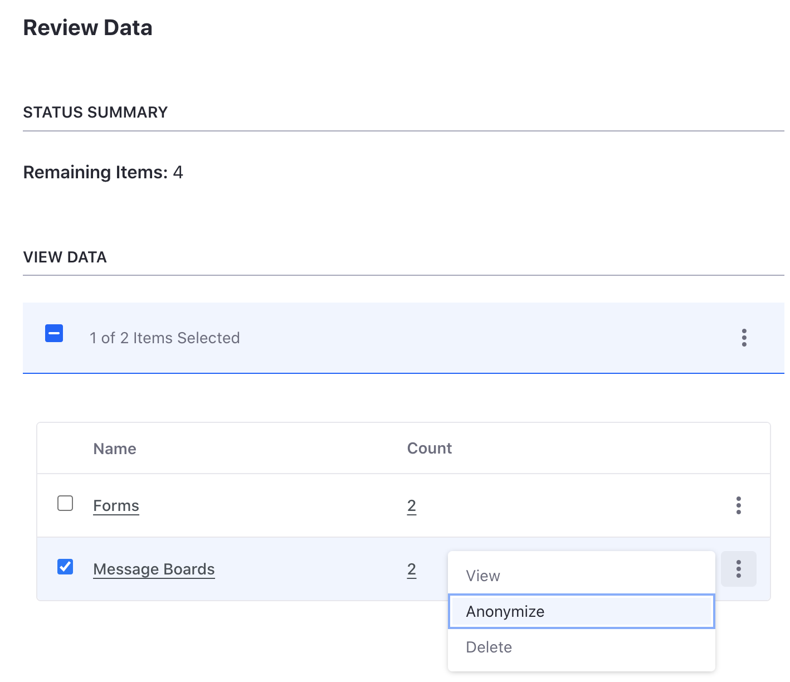

# Managing and Deleting Personal Data

Liferay provides user data tools for managing and deleting personal user data. Though these tools can help with GDPR requirements, they do not guarantee compliance. See [managing user data](https://learn.liferay.com/w/dxp/users-and-permissions/managing-user-data) to learn more.

## Exporting Personal Data

Morally and sometimes legally, individuals have a right to request their personal data, and Tommy Tanner has requested his Message Boards data. Follow the steps to export it for him.

1. Log back into Liferay as the administrator.

1. Navigate to _Global Menu_ () &rarr; _Control Panel_ &rarr; _Users and Organizations_.

1. Click _Options_ () for Tommy Tanner. Click _Export Personal Data_.

1. On the next page, click _Add_ () to start a new export process.

1. On the next page, select all items you wish to export. For example, select all personal data from message boards. Click _Export_ after making your selection.

   

1. The next page shows an export process for each category of personal data. To download, click _Options_ () and select _Download_. The personal user data is downloaded to your machine. You can now send it to Tommy. 

1. On your local machine, unzip the downloaded file. The folders contain XML files that are both machine and human readable. 

## Anonymizing Personal Data

Choose to anonymize personal data if you want to keep existing content without personally identifiable information.

1. Navigate to _Global Menu_ () &rarr; _Control Panel_ &rarr; _Users and Organizations_.

1. Click _Options_ () for Tommy Tanner. Click _Delete Personal Data_. Click _OK_ in the pop-up window explaining that the user must first be deactivated.

1. The next page shows all personal data associated with the user. Choose each category you wish to anonymize. Select the message boards category.

   

1. Click _Options_ () next to message boards and click _Anonymize_. Click _OK_ in the pop-up window. The user's personal data has now been anonymized by having the name changed to the anonymous user. 

   

## Deleting Personal Data

Finally, you can choose to delete personal data completely. This option deletes data or content the user generated.

1. Navigate to _Global Menu_ () &rarr; _Control Panel_ &rarr; _Users and Organizations_.

1. Click _Filter and Order_ and select _Inactive_.

1. Click _Options_ () for Tommy Tanner. Click _Delete Personal Data_.

1. The next page shows all personal data associated with the user. Select the _forms_ category.

1. Click _Options_ () next to the forms category and click _Delete_. Click _OK_ in the pop-up window. 

   Note, some user data, such as form data, requires review and anonymization. On the next page, click _Anonymize_. Click _OK_ in the pop-up window.

1. The next pop-up window gives the option to delete the user. Click _Cancel_ to keep the user.

Congratulations! You have completed this module on user data.

## Relevant Concepts

- [Exporting User Data](https://learn.liferay.com/en/w/dxp/users-and-permissions/managing-user-data/exporting-user-data)

- [Sanitizing User Data](https://learn.liferay.com/en/w/dxp/users-and-permissions/managing-user-data/sanitizing-user-data)

- [Configuring the Anonymous User](https://learn.liferay.com/en/w/dxp/users-and-permissions/managing-user-data/configuring-the-anonymous-user)
