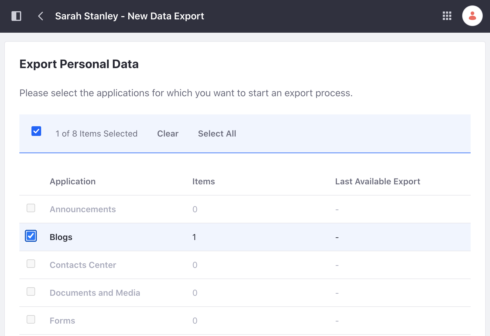

---
toc:
uuid: 1793412f-135e-4ee3-bb27-a46e3383ff7c
---
# Understanding GDPR

Liferay gives you tools to manage and delete personal user data. Note, though these tools are aimed at helping you with GDPR requirements but they do not guarantee compliance. See [managing user data](https://learn.liferay.com/dxp/latest/en/users-and-permissions/managing-user-data.html) to learn more.

## Exporting User Data

A previous employee may ask for a copy of their personal data. Follow the steps to export user data.

1. Navigate to _Global Menu_ () &rarr; _Control Panel_ &rarr; _Users and Organizations_.

1. Click _Options_ () of the user to export data. Click _Export Personal Data_.

1. In the next page, click _Add_ () to start a new export process.

1. In the next page, select all the items you wish to export. For example, select all personal data from blogs or documents and media. Click _Export_ after making your selection.

   

1. The next page shows an export process for each category of personal data. To download, click _Options_ () and select _Download_.

## Anonymizing User Data

You can choose to anonymize personal data if you have a need to keep existing content. For example, you want to keep blog posts of a former employee. Follow the steps to anonymize data.

1. Navigate to _Global Menu_ () &rarr; _Control Panel_ &rarr; _Users and Organizations_.

1. Click _Options_ () of the user to anonymize. Click _Delete Personal Data_. Click _OK_ in the pop-up window explaining that the user must first be deactivated.

1. The next page shows all the personal data associated with the user. Select each category you wish to anonymize (e.g. Select blogs or documents and media).

   

1. Click _Options_ () for either all selected or for each category and click _Anonymize_. Click _OK_ in the pop-up window. The user's personal data has now been anonymized (e.g. Blog posts no longer show the author as the user.)

   

## Deleting User Data

Finally, you can choose to delete personal data completely. Follow the steps below.

1. Navigate to _Global Menu_ () &rarr; _Control Panel_ &rarr; _Users and Organizations_.

1. Click _Options_ () of the user to delete. Click _Delete Personal Data_. Click _OK_ in the pop-up window explaining that the user must first be deactivated.

1. The next page shows all the personal data associated with the user. Select each category you wish to delete (e.g. Select message boards).

1. Click _Options_ () for either all selected or for each category and click _Delete_. Click _OK_ in the pop-up window. Any existing content was generated by the user has now been deleted.

## Relevant Concepts
- [Exporting User Data](https://learn.liferay.com/dxp/latest/en/users-and-permissions/managing-user-data/exporting-user-data.html)
- [Sanitizing User Data](https://learn.liferay.com/dxp/latest/en/users-and-permissions/managing-user-data/sanitizing-user-data.html)
- [Configuring the Anonymous User](https://learn.liferay.com/dxp/latest/en/users-and-permissions/managing-user-data/configuring-the-anonymous-user.html)
