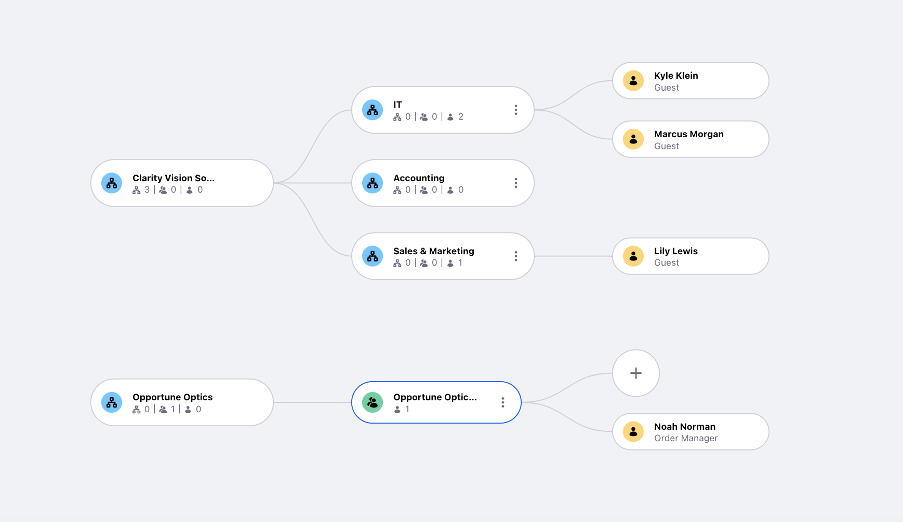

---
toc:
- ./users-accounts-organizations/creating-organizations.md
- ./users-accounts-organizations/creating-users.md
- ./users-accounts-organizations/setting-roles-and-permissions.md
- ./users-accounts-organizations/working-with-accounts.md
uuid: e300d45a-acd8-4206-8f7c-8f49ec3cc1f6
---
# Users, Accounts, Organizations, and Permissions

```{toctree}
:maxdepth: 3

users-accounts-organizations/creating-organizations.md
users-accounts-organizations/managing-users.md
users-accounts-organizations/setting-roles-and-permissions.md
users-accounts-organizations/working-with-accounts.md
```

With your Liferay DXP environment configured and up and running, it is time to start creating users, organizations, and accounts. 

Now you'll create four user accounts assigned across two different organizations. Users must belong to their respective organizations and be assigned appropriate permissions.



**Kyle Klein** - An IT staffer tasked to help his company, Delectable Bonsai, configure Liferay as their digital experience platform.

**Marcus Morgan** - An IT manager and Kyle's boss. 

**Lily Lewis** - An account manager for Marvelous Markets and staff member of Delectable Bonsai's Sales and Marketing department.

**Noah Norman** - A store manager for Marvelous Markets NYC and the order approver for his staff who places orders from Delectable Bonsai.

### Creating an Administrator Account

Instead of continuing to use the default Liferay admin account, create a new Delectable Bonsai administrator account that will go on to create the other users, organizations, and accounts.

```{warning}
In a production environment, it is recommended not to use the default admin account, but to create admin accounts specific to your business.
```

1. Change the user authentication setting. Note, this is only for our learning and testing purposes.

   * Navigate to _Global Menu_ () &rarr; _Control Panel_ &rarr; _Instance Settings_.
   * Under Platform, click _User Authentication_.
   * Uncheck the box next to require strangers to verify their email address.
   * Click _Save_.

1. Navigate to _Global Menu_ () &rarr; _Control Panel_ &rarr; _Users and Organizations_. Click _Add User_ ().

1. Enter the following account information:

   * Screen Name: `kyle`
   * Email Address: `kyle@delectablebonsai.com`
   * First Name: `Kyle`
   * Last Name: `Klein`
   * Job Title: `IT Staff`

   Click _Save_. 

1. Give Kyle the administrator role.
   
   * In the left navigation, click _Roles_.
   * Next to Regular Roles, click _Select_.
   * In the new window, click _Choose_ next to Administrator.
   * Scroll down to the bottom and click _Save_.

1. Set Kyle's password.

   * In the left navigation, click _Password_.
   * Input `test` in the two fields.
   * Click _Save_.

1. Logout of the default admin account and Login as Kyle Klein.

   * Click the user profile image in the top right and click _Sign Out_.
   * Click _Sign In_ at the top right.
   * Sign in with `kyle@delectablebonsai.com` as the email address and `test` as the password.
   * In the next page to reset password, set the new password as `learn`.

The next step is creating some organizations for users. Ready? 

[Let's Go!](./users-accounts-organizations/creating-organizations.md)
