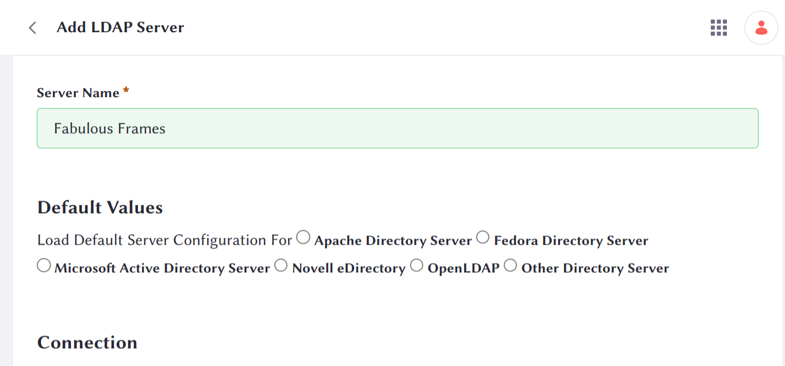
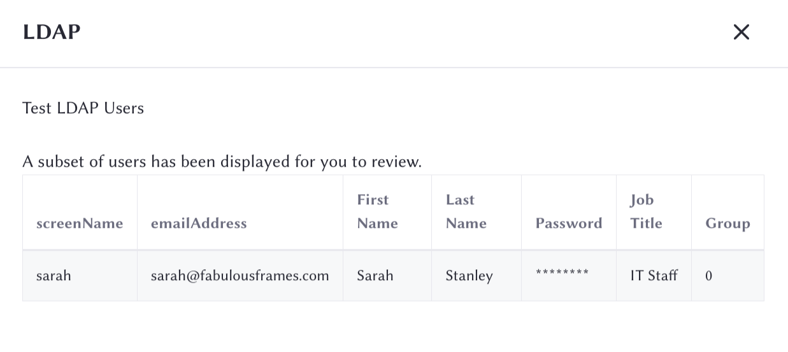

# Connecting to LDAP

You can configure an LDAP server at the system level or instance level. If you are on LXC-SM or self-hosted, you can choose the [configuration scope](https://learn.liferay.com/w/dxp/system-administration/configuring-liferay/understanding-configuration-scope) based on your needs. Note, when configuring at the system scope, you must specify each instance ID. If you're on LXC, you must configure LDAP at the instance scope. See [Connecting to an LDAP Directory](https://learn.liferay.com/w/dxp/users-and-permissions/connecting-to-a-user-directory/connecting-to-an-ldap-directory).

Clarity Vision Solutions must import user data from a company they just acquired. 

## Start and Populate an LDAP Directory

1. Start a new OpenLDAP container.

   ```bash
   docker run \
	   --env LDAP_ORGANISATION="Fabulous Frames" \
	   --env LDAP_DOMAIN="fabulousframes.com" \
	   --env LDAP_BASE_DN="dc=fabulousframes,dc=com" \
	   --name fabulousframesldap \
	   -p 389:389 \
	   -p 636:636 \
	   osixia/openldap:1.5.0
   ```

1. Find the IP address of the `fabulousframesldap` container. This will be used in the configuration step below.

   ```bash
   docker network inspect bridge
   ```

1. Generate an LDIF file to seed LDAP with a user and a user group.

   ```bash
   cat <<EOT >> sarah.ldif
   dn: cn=sarah,dc=fabulousframes,dc=com
   objectClass: inetOrgPerson
   objectClass: organizationalPerson
   objectClass: person
   objectClass: top
   cn: Sarah
   sn: Stanley
   givenName: Sarah
   mail: sarah@fabulousframes.com
   title: IT Staff
   userPassword: learn

   cn: fabulousframes
   dn: cn=fabulousframes,dc=fabulousframes,dc=com
   objectClass: groupOfUniqueNames
   objectClass: top
   uniqueMember: cn=sarah,dc=fabulousframes,dc=com
   EOT
   ```

1. In your shell, navigate to the same folder as the LDIF file. Copy the file into the container.

   ```bash
   docker cp sarah.ldif fabulousframesldap:/container/service/slapd/assets/test
   ```

1. Add the entry into the OpenLDAP server.

   ```bash
   docker exec fabulousframesldap ldapadd -x -D "cn=admin,dc=fabulousframes,dc=com" -w admin -f /container/service/slapd/assets/test/sarah.ldif -H ldap://localhost
   ```

## Connect Liferay to the LDAP Directory

1. Navigate to _Global Menu_ () &rarr; _Control Panel_ &rarr; _Instance Settings_. 

1. Under security, click _LDAP_.

1. In the left navigation, click _Servers_. 

1. Click _Add_.

1. In the new page, enter the LDAP connection information.

   * Server Name: `Fabulous Frames`
   * Base Provider URL: `ldap://[IP address]:389`
   * Base DN: `dc=fabulousframes,dc=com`
   * Principal: `cn=admin,dc=fabulousframes,dc=com`
   * Credentials: `admin`

   

   Click _Test LDAP Connection_. A popup window shows that Liferay has connected successfully to the LDAP server. Click the _X_ and close the window.

1. In the LDAP user information section, map your LDAP fields to the appropriate Liferay fields. Type `uid` into the _UUID_ field to map Liferay's UUID field to LDAP's `uid` field. This is necessary to export data to LDAP. Click _Test LDAP Users_ to preview the mapping of user fields.

   

1. In the LDAP groups section, enter `Fabulous Frames` into the _Description_ field. Click _Test LDAP Groups_ to verify that the `fabulousframes` user group is visible.

1. Click _Save_.

Clarity Vision Solutions' Liferay instance is now connected to Fabulous Frames's LDAP directory. 

Next: [Importing and Exporting users](./importing-and-exporting-users.md).

## Relevant Concepts

- [Connecting to an LDAP Directory](https://learn.liferay.com/w/dxp/users-and-permissions/connecting-to-a-user-directory/connecting-to-an-ldap-directory)
