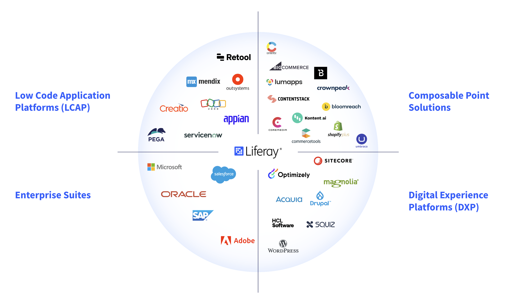

---
toc:
- ./competitive-landscape-and-liferay-positioning/enterprise-application-categories.md
- ./competitive-landscape-and-liferay-positioning/.md
uuid: f27cc155-9321-43ee-bbda-9e0698529f66
visibility: 
- Employee
- Partner
---

# Competitive Landscape & Liferay Positioning

**At a Glance**

* The market for both DXPs and Enterprise Applications is large and growing
* Liferay competes against many competitors, grouped into:
    * Enterprise Suites
    * Composable Point-Solutions
    * Low-Code Application Platforms (LCAP)
    * Digital Experience Platforms (DXP)
* Liferay’s fundamental differentiators provide guidance on where Liferay DXP is strong
* Battlecards are provided for the core competitors Liferay faces most often 

## Background

This module focuses on the competitive landscape Liferay is in, and provides details on Liferay’s positioning compared to the competitors.

After completing this module, you will have a basic understanding of the competitive mix, and understand how to position Liferay to have the best chance of winning.

```{note}
* View the [recording](https://learn.liferay.com/web/guest/d/l0-6-competitive-landscape-and-liferay-positioning) from the live workshop of this module.
* Download the [PDF](https://learn.liferay.com/documents/d/guest/l0-6-competitive-landscape-and-liferay-positioning-pdf) of the presentation used in the live workshop.
```

## The Market for Liferay

The market for Liferay is very large, and includes healthy growth:

* DXP Market: $14b with 12% annual growth
* Enterprise Application Market: $330b with 8% annual growth

This provides opportunities for Liferay and Lifeary’s Partners. But, the market is very competitive with a wide-range of vendors, which makes it difficult and confusing for customers to decide which solution is best for them.

## Enterprise Application Categories

Liferay’s competition can be broadly divided into four main categories

* Enterprise Suites
* Digital Experience Platforms (DXP)
* Low-Code Application Platforms (LCAP)
* Composable Point Solutions

Grouping our competitors this way allows us to highlight our unique strengths against different types of competitors.

### Enterprise Suites 

Enterprise suite vendors provide solutions for end-to-end business processes, including Enterprise Resource Planning (ERP), Supply Chain Management, and Customer Experience. Most large enterprises have complex backend applications provided by vendors like SAP and Oracle. 

DXP is only a small part of the offering for these vendors, and is therefore not a focus. As a result, these vendors provide best-of-suite, not best-of breed DXP solutions, like Liferay.

Using Oracle as an example, they have acquired 65 companies, and created from those acquisitions an enterprise application suite. 

### Digital Experience Platforms

Digital Experience Platforms have traditionally been monolithic - in that all of the components are provided by one vendor, and the customer is forced to use all of those components. To put it another way they are not traditionally composable.

The vendor might position them as a pre-integrated single technology stack, the reality for many DXPs is that they have been assembled through acquisition and are often not that well integrated, with each component having a different user interface, for example.  

For Liferay, it is a different story. Liferay DXP was developed in-house and is really best of breed when it comes to Portal, Commerce and CMS solutions. 

Over the last few years, an increasing number of DXP vendors have opened up their monolithic architecture to offer a composable architecture through the use of headless APIs.

### Composable Point Solutions

Composability is a system design principle that deals with the interoperability of components in an IT architecture.  The MACH alliance is an example of a group of vendors offering composable point solutions that interoperate based on this principle. A point solution is a solution that is designed to solve one particular problem e.g. CMS. 

These are individual vendors that focus purely on providing the best CMS, best headless CMS, best Commerce, etc. And they then rely on an open architecture to create a complete platform.  It’s kind of a lego approach to creating an enterprise architecture.

### Low-Code Application Platforms

Low-Code Application Platform (LCAP) vendors provide a platform on which it is easy to create and run applications with no, or very little, need to write code. LCAPs are used to quickly automate business processes, but usually don´t provide core DXP functionality, like Portals, Commerce or CMS. 

They allow the quick creation of applications to automate generic business processes, but these solutions will have to integrate with other applications to provide missing core functionality. 

LCAPs are quick and easy to use, but are limited in core capabilities and the ability to tailor applications is also limited.

## Enterprise Application Vendors

The graphic below shows the major vendors of each category grouped together.  

Note that not all of the vendors are pure-plays. For example, some Enterprise Suite vendors have pushed into low code over the last few years and some DXP vendors have added composability with Headless APIs.



## The best of all worlds in one vendor

In this model, Liferay is right at the center because we work effectively in all four areas because

* Liferay is at the core an integrated DXP. 
* Liferay integrates well with enterprise applications. For example, through integration with Salesforce.
* Liferay can be used as part of a composable architecture. For example, if a customer does not need to use the whole DXP, they can use Liferay’s headless CMS capabilities as part of a composed architecture. 
* Liferay has sophisticated low-code capabilities. 

It is important when competing in an opportunity, that Liferay’s capabilities and relative strengths are well presented depending on who the competition is.

Next, learn about [Liferay vs the Enterprise Application Categories](./competitive-landscape-and-liferay-positioning/enterprise-application-categories.md).
