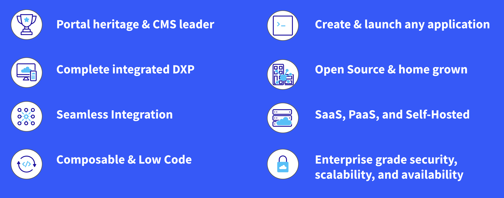
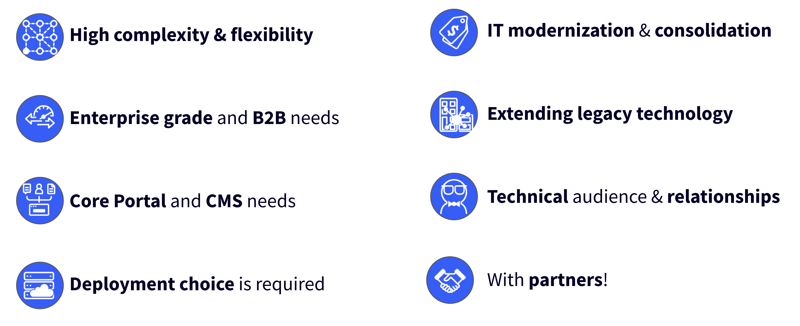

# Liferay Positioning

**At a Glance**

* Liferay competes against many competitors, grouped into:
  * Enterprise Suites
  * Composable Point-Solutions
  * Low-Code Application Platforms (LCAP)
  * Digital Experience Platforms (DXP)
* Liferay’s fundamental differentiators provide guidance on where Liferay DXP is strong
* Battlecards are provided for the core competitors Liferay faces most often

## Why Liferay Wins

Liferay wins when competing on the fundamental differences and respective advantages of the platform, not on features.

As an example, if a vendor sends out a feature-driven RFP to ten vendors, all will provide a response that indicates that all required features are provided. The real question is how does the platform solve their business problem?

```{note}
* View the [recording](https://learn.liferay.com/documents/d/guest/l0-6-competitive-landscape-and-liferay-positioning) from the live workshop of this module.
* Download the [PDF](https://learn.liferay.com/documents/d/guest/l0-6-competitive-landscape-and-liferay-positioning-pdf) of the presentation used in the live workshop.
```

## Liferay’s Fundamental Differentiators



Liferay’s fundamental differentiators are

* At the core Liferay has strong **portal heritage** and is a **leader in headless CMS**, as recently confirmed in the latest [IDC MarketScape for Hybrid-Headless CMS](https://www.liferay.com/idc-marketscape-for-hybrid-headless-cms).  
* Liferay DXP is a **completely integrated Digital Experience Platform**, which can be easily **integrated** to any enterprise data sources, platforms, and applications like legacy CRM, ERP, Marketing tools etc.
* Liferay is also **composable**, so core functionality can be used headless as part of a composable architecture. 
* Liferay can be extended and customized through a loosely-coupled approach, and tailored by the wide variety of **low-code** capabilities built into the platform.
* There are practically no limits to the different solutions that can be created using the Liferay platform to meet customers' complex enterprise needs. 
* Liferay’s **Open Source** roots give customers more choices. 
* Liferay is **organically grown**, which means that different parts of the platform are designed to work seamlessly together.
* Unlike many of our competitors, Liferay DXP offers SaaS, PaaS, and Self-Hosted deployment approaches.
* Liferay DXP is **enterprise grade**. Large enterprises depend on Liferay for its **security**, **scalability**, and **availability**.

## The Platform Challenge

A platform on its own may sell well with a technical audience (for example the CIO), but features do not appeal well by themselves to business buyers.

To also sell effectively to a business audience, it is important to highlight the possible solutions that can be created and how easy it is for business users to use and maintain a solution built with Liferay DXP.

## The Solution to the Platform Challenge

The solution to the platform challenge is to sell the Liferay platform as the foundation of endless enterprise solutions, based on proof points from real use cases and references.

This should be done alongside a credible industry partner. Partners already have the connections and the industry credibility to turn the Liferay platform into the turnkey solutions that customers need to solve their business challenges.

## Where Liferay Wins



### Complexity, Flexibility, Enterprise Grade, B2B

Liferay DXP sells well where the business requires tailored solutions, and where packaged applications simply do not meet the specific requirements. 

This is often the case in B2B business processes, as these are often complex and require a more tailored approach. This often goes hand-in-hand with the need for an enterprise grade solution. Enterprises run mission critical applications on the Liferay platform, requiring availability, scalability and security.

### Core Portal and CMS

Another area where Liferay wins often is when the core requirements are aligned to Liferay’s core solution strengths are - such as authenticated portals and CMS.

### Flexible Deployment Options

An often underestimated advantage of Liferay is the flexibility that SaaS, PaaS, and Self-hosted deployment options offer. Although SaaS has many advantages, it is not always suitable in all circumstances.

For example, particularly in highly regulated industries like the public sector and financial services, strict compliance requirements can rule out a SaaS solution in a public cloud. 

There is also a trend to move to hybrid cloud where some applications run on premise while being integrated with Cloud solutions. 

The deployment flexibility Liferay provides is unique in the market.

### IT Modernization, Consolidation, Legacy Technology

Almost every enterprise has already digitized at least some of their business processes, however some of the current solutions are outdated or have grown to be too complex for customers to manage (for example through acquisitions) which is leading to technical debt. 

Liferay DXP is an ideal solution to modernize and consolidate complex architectures and provide a seamless digital experience, and in doing so support a consolidation of the architecture, ultimately leading to reduction in complexity, maintenance and cost.

Extending legacy applications is also a frequently observed need. This is where enterprises would like to keep their legacy applications, but would like to extend the lives of these applications using latest innovations to give their enterprise a competitive edge without having to upgrade or re-implement these legacy applications entirely.

### Technical Audiences & Partners

Technical audiences often immediately see the value Liferay brings because of the nature of Liferay DXP as a platform on which almost any application can be implemented.

Technical audiences understand the power and flexibility of the Liferay platform. However, it is important to help non-technical audiences envision how their business challenges can be solved with solutions built on Liferay.

This is why Liferay’s partnerships are so powerful. We win with partners!

## Competitive Tools - Battlecards

Further competitive intelligence is available for 21 specific vendors in the competitive battlecards, which are provided on the [Partner Portal](https://partner.liferay.com/library?filters=15292668). 

The top section of each battlecard includes a section called “Quarterly Updates” which highlights anything new that the competitor has released or announced that may impact conversations with prospects.

Use this information to avoid spending a time scrolling through each battlecard trying to pick out what’s been updated.

We regularly monitor feedback and information that is posted in Liferay internal channels about competitors. The tool used to build the Battlecards also scrapes information from public online sources and populates certain parts of battle cards automatically.

But the most critical source of these updates are Liferay’s internal and Partner sellers because you meet with buyers, see competitors in opportunities, hear feedback from colleagues, champions and network.

It is highly encouraged that you are vocal and feed that intel back to us. If you are a partner please do this through your Channel Account Manager or local Account Executive. 

When a deal is won over a competitor, it helps everyone if the reasons for the win are known. Obviously the sales team did a great job! But, in addition to this most likely there was something in particular that made the win possible. 

It’s also important to know about deals that have been _lost_ to competitors as well because this can help to evolve the tools, and even the product, to be more competitive in the future.

## Available Battlecards

### Enterprise Suites

* [Adobe Experience Cloud](https://partner.liferay.com/d/adobe-experience-cloud-battlecard)
* [Microsoft SharePoint](https://partner.liferay.com/d/sharepoint-battlecard)
* [Oracle Service Cloud](https://partner.liferay.com/d/oracle-service-cloud-battlecard)
* [Salesforce Experience Cloud](https://partner.liferay.com/d/salesforce-experience-cloud)
* [SAP Hybris](https://partner.liferay.com/d/sap-hybris-battlecard)

### Composable Point Solutions

* [Backbase](https://partner.liferay.com/d/backbasebattlecard)
* [Bloomreach](https://partner.liferay.com/d/bloomreach-battlecard)
* [Contentful](https://partner.liferay.com/d/contentfulbattlecard)
* [LumApps](https://partner.liferay.com/d/lumapps-battlecard)
* [ShopifyPlus](https://partner.liferay.com/d/shopifyplus-battlecard)
* [Umbraco](https://partner.liferay.com/d/umbracobattlecard-20240202-ls4uv57r0h8ddnf8bf)

### Low-Code Application Platforms (LCAP)

* [Low-Code / No-Code](https://partner.liferay.com/d/low-code-no-code-platforms-battlecard)
* [MACH Alliance](https://partner.liferay.com/d/mach-alliance-battlecard)
* [OutSystems](https://partner.liferay.com/d/outsystems-battlecard)

### Digital Experience Platforms (DXP)

* [Acquia](https://partner.liferay.com/d/acquia-battlecard)
* [Drupal](https://partner.liferay.com/d/open-source-drupal-battlecard)
* [HCL Software](https://partner.liferay.com/d/hcl-battlecard)
* [Magnolia DX Core](https://partner.liferay.com/d/magnolia-dx-core-battlecard)
* [Optimizely](https://partner.liferay.com/d/optimizely-battlecard)
* [Sitecore](https://partner.liferay.com/d/sitecore-battlecard)
* [Wordpress VIP](https://partner.liferay.com/d/wordpress-vip-battlecard)

This list is being extended all the time, please check back for updates. The current collection represent vendors who are competed with

* Most often
* Especially with industries and solutions needs that match Liferay’s ideal customer profile
* Globally or in at least more than one country

Congratulations - you’ve now completed the Level 0 Selling Liferay learning path. Next you can move to Level 1 - with options for both business and technical selling roles.

[Back to Selling Liferay](https://learn.liferay.com/w/courses/selling-liferay)
