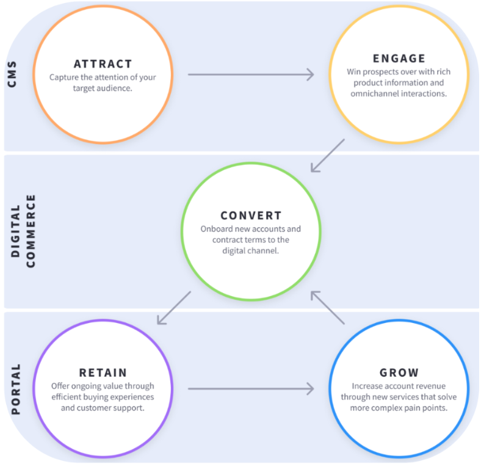
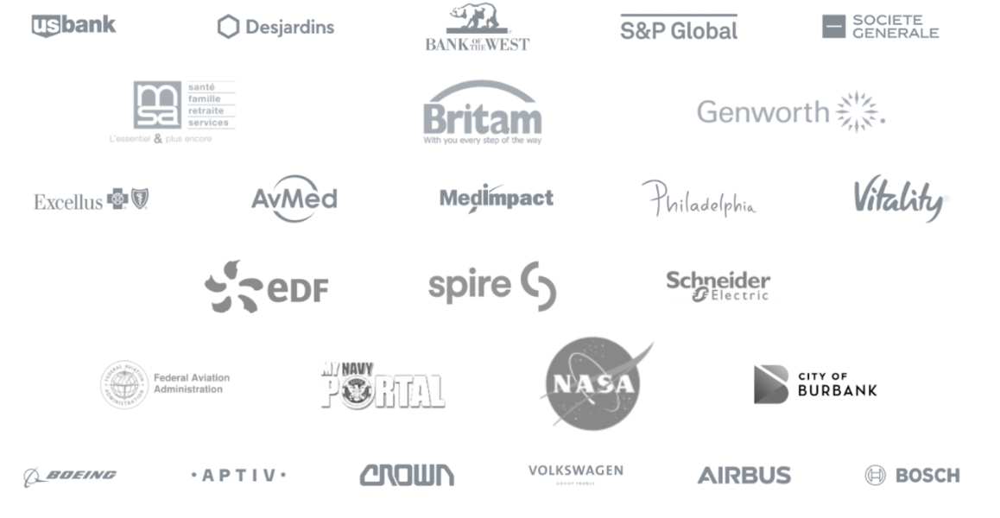

# What is a Digital Experience Platform

Digital Experience Platforms emerged with the convergence of Content Management, Digital Commerce, and Horizontal Portal technologies. While defined differently by different analysts, the broad definition is very similar.

Gartner defines a DXP as

> “A digital experience platform (DXP) is an integrated and cohesive piece of technology designed to enable the composition, management, delivery and optimization of contextualized digital experiences across multi-experience customer journeys.”

While Forrester, who were the first to call out Digital Experience Platforms distinctly from other offerings define a DXP as

> “Forrester distills a digital experience down to four solutions: 1) understanding the customer with data; 2) creating the experience with content; 3) tailoring that experience to fit the context with marketing; and 4) delivering value with commerce.“

Liferay defines a DXP as follows:

> “Enterprise software that provides the foundation for companies to deliver connected, contextualized digital experiences across multiple touchpoints for the entire customer journey.
> Put simply, a DXP is a single platform that has all the elements to deliver external and internal digital experiences.”



```{note}
* View the [recording](https://learn.liferay.com/web/guest/d/l0-1-introduction-to-liferay) from the live workshop of this module.
* Download the [PDF](https://learn.liferay.com/documents/d/guest/l0-1-introduction-to-liferay-pdf) of the presentation used in the live workshop.
```

## Liferay Portal Heritage

Portal solutions focus on the needs of the long-term relationship between organizations and their customers, employees, partners, suppliers, and so on.

A key differentiator of DXPs with portal heritage is the support for these needs through capabilities like authenticated experiences, and a focus on integration between the DXP and other systems.

Gartner has frequently recognized this in Liferay. For example in 2022, Gartner said

> “Liferay targets enterprise IT buyers with its powerful tooling and pure-play portal heritage.”

## Anatomy of a Digital Experience Platform

The basic anatomy of a Digital Experience Platform could be described as follows:

* First are the Digital Touchpoints where our Customers interact with their users---their customers, employees, citizens, businesses, partners, etc. These are the experiences that an end user has as they interact with the company which might be web, mobile, ChatBot, kiosk, IoT etc.
* These touchpoints then provide some sort of presentation layer---which may be supplied by the platform itself, or implemented via headless API capabilities. Liferay’s presentation layer is flexible enough to support all and any of these types of presentation technologies.
* These interfaces serve information and data sourced from various enterprise data sources or content authoring systems. These disparate data sources include CRM, ERP, HRIS, Marketing Automation tools, and many others.
* The DXP therefore must include some sort of integration layer---which might be native to the platform or some 3rd party tool like an Enterprise Service Bus (ESB)

The heart of a DXP, however, sits between the presentation and integration layers. This is the promise of a DXP's transformative power for a customer's business.

That promise is Contextual Delivery: delivering the right content to the right person at the right time in the right context.

Contextual delivery includes things like content management and authoring, web experience, analytics, personalization and segmentation, digital asset management, forms and workflow, digital commerce, no-code/low-code application building capabilities, easily deployed theming, and more.


## Solutions Across the Entire Customer Journey

Another way to look at what a DXP should provide is to look at the customer life cycle.  Typically this starts well before a customer becomes a customer, continues through engaging with the customer, converting them, and then retaining them by serving them well and growing them.


## Liferay Deployment Approaches

Our DXP deployment offerings include SaaS, PaaS and self-hosted options. Our SaaS offering---Liferay Experience Cloud---is a flexible, DXP-as-a-Service offering to create, launch, and optimize tailored solutions with the agility and convenience of SaaS.

## Tailored Solutions

Liferay DXP can be used to solve almost any business problem that our customers might face, but some classic example solutions include:

* Customer Portals - attract, serve, and empower customers
* Supplier Portals - simplify purchasing, support vendors, and increase profitability
* Partner Portals - collaborate, support, and grow partner revenue
* Employee Portals - keep employees productive, self-sufficient, and connected
* Public Websites - give customers a smooth digital journey and reap the benefits of their loyalty
* Digital Commerce - simplify buying and encourage repeat orders
* And many more…

## Example Customers

Liferay is flexible enough to serve complex needs of global enterprise customers, but is also being used successfully in many medium sized companies and public sector organizations using our platform for delivering digital experiences for their end users and customers.

Some global organizations using Liferay Platform for serving their customers and meeting their their digital experience needs include



## What’s Next

Congratulations! You've now completed the Introduction to Liferay module. 

Next: learn about the [Liferay Product Offering](../liferay-product-offering.md).
