# Base Sales Deck Structure

**At a Glance**

* All Base Sales Decks use the same basic structure:
  * Preamble, Title, Agenda, Key Statistics
  * Challenges, Sub-Challenges and Solutions
  * Case Studies
  * Technical Challenges and Solutions
  * Liferay Overview
  * Tailored Solutions on Liferay
* This section explains the use of the Manufacturing Base Sales deck for an example scenario

## Preamble Slide

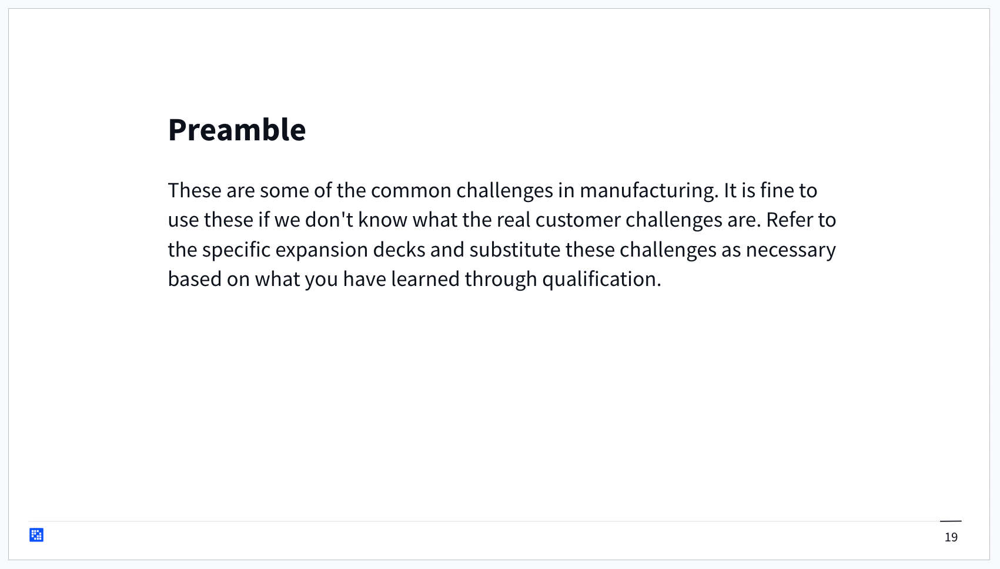

Evey deck starts with a preamble slide that provides some context and instructions on how to use the deck. These slides are marked to be “skipped” when presenting, and should not be shown to the client.  

## Title Slide

The title slide provides an opportunity for personalization by modifying the title, adding the client’s name or logo, the current date, and so on.

## Agenda Slide

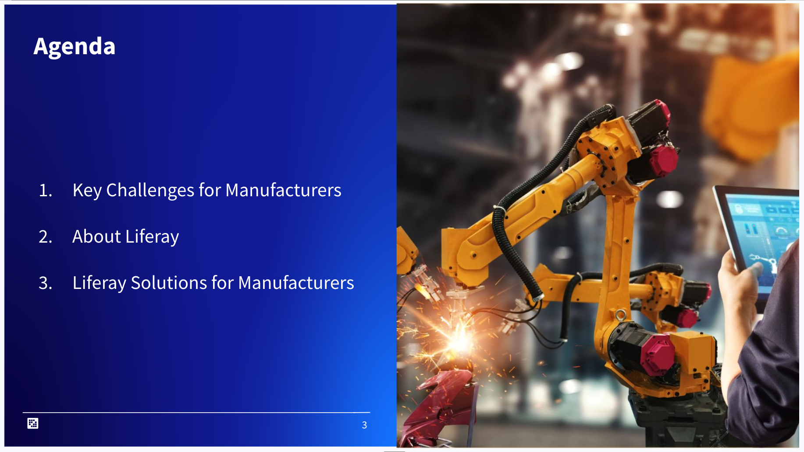

Each base deck provides an agenda that can be reviewed with the prospect before starting the presentation. The agenda should cover the base deck as-is, and should also cover situations where the base deck has been modified by including content from expansion decks.  

## Key Statistic Slide

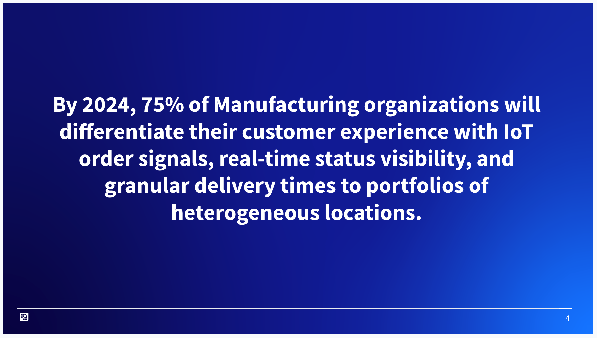

Next, a key statistic or analyst prediction is highlighted; something to provide a sense of urgency about the types of challenges that are going to be discussed. Again, this is another great opportunity to personalize. If the type of solution the customer is looking for is known, content can be used to back up that need. Or, if there is a better statistic or prediction that is more closely aligned with this specific customer or the sub-vertical that they operate in, the slide should be changed to reflect this.

## Key Challenges Slide

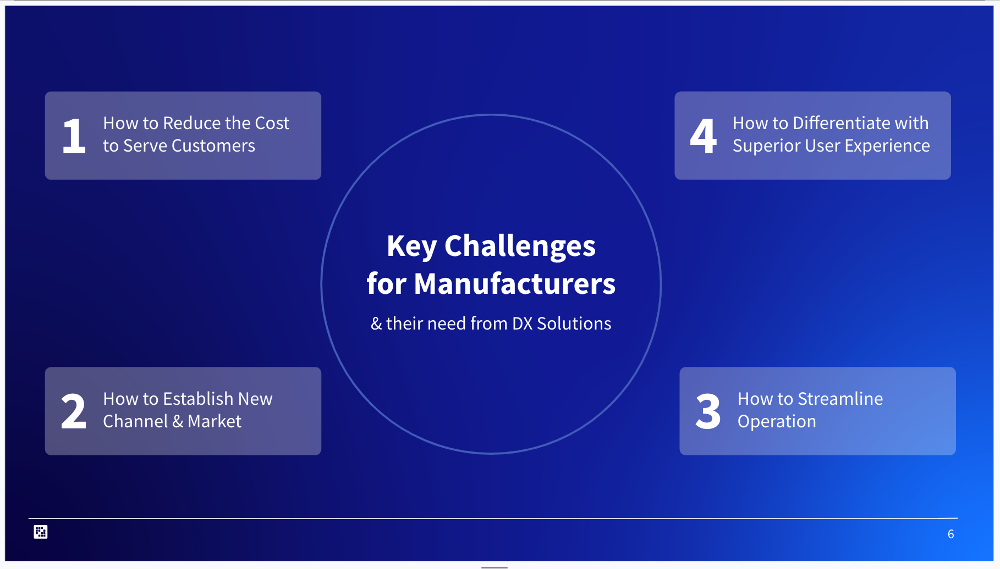

With the introduction out of the way, the main content of the presentation covers the Key Challenges that affect companies across the given industry.  

For each industry, typically four key challenges that we think are relevant to all companies in that industry are covered. When creating these presentations, Sales Enablement, Product Marketing and Industry Marketing work very closely to ensure that the messaging here is aligned with what is used throughout the Liferay website and other marketing assets. It is vital that the messaging that brought a prospect to this point is consistent and reinforced as they continue their customer journey.  

When presenting the deck to a prospect, the Account Executive should start with a brief introduction of the typical challenges Liferay sellers encounter, and pay close attention to how the audience responds to each of these. This can be an early indication of what challenges are most pertinent to the prospect, and an observant and prepared AE can quickly adapt the presentation to spend more time on challenges that are most relevant to their audience.  

Each slide contains well-documented speaker notes, which can be referred to while preparing the presentation.  

## Specific Challenges Slide

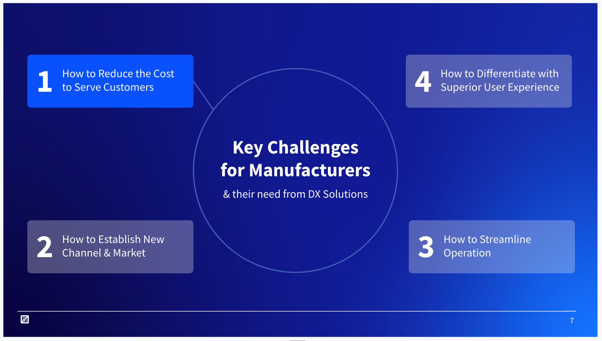

After introducing the challenges, the next step is to focus on a specific challenge. The first key challenge for Manufacturers is “How to reduce the cost to serve customers”.

## Sub-Challenges Slides

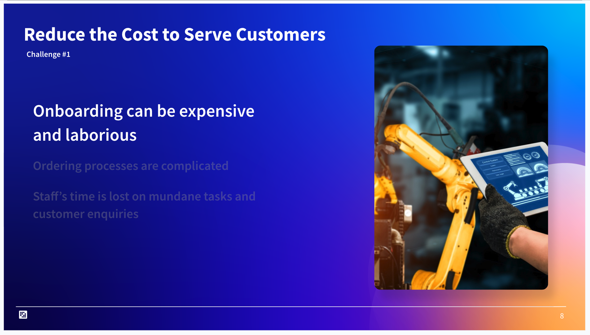

For each broad challenge several sub-challenges are presented. These sub-challenges should resonate with most prospects in the given industry. These sub-challenges have been selected because they are relevant and they can be solved using the capabilities of Liferay DXP.  

At this point the focus is just on the challenge, not jumping ahead to solutions. If the customer is responsive and engaged, feel free to get their thoughts on the challenge, and find out if it is something they are struggling with. If they aren’t struggling with these challenges, find out why they are not, and determine what solutions they have in place to address them. The solutions they have could be competitors to Liferay, or they could be complementary products that Liferay might be able to integrate with.  

The purpose of the deck of course is to help to stimulate a conversation, not just to do all of the talking.  

For Manufacturing, sub-challenges of “How to reduce the cost to serve customers” are:

1. Onboarding can be expensive and laborious
2. Ordering processes are complicated
3. Staff’s time is lost on mundane tasks and customer inquiries 

## Solutions to Sub-Challenges Slides

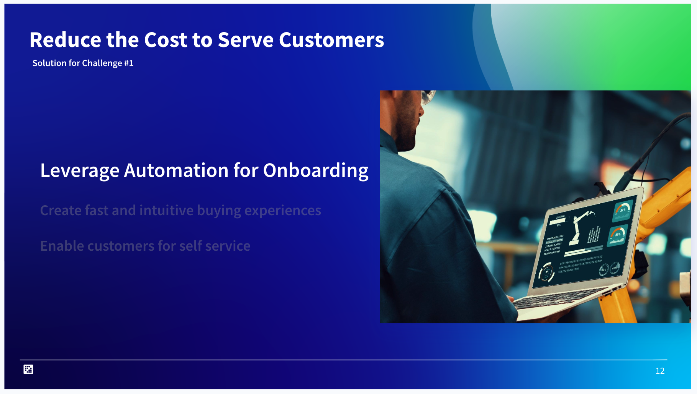

Once all of the sub-challenges have been presented, the focus turns to the solutions to these sub-challenges. These slides cover the solutions at a very high level. For example, how leveraging automation for onboarding can reduce the cost to serve new customers. 

Talking about the different tools Liferay provides for automating business processes is a possible step if it is appropriate to go deeper. This depends on how interested the customer is in the topic but always be aware of allowing enough time to continue to review the remaining sub-challenge solutions.

For Manufacturing the three Solutions to the sub-challenges are:

1. Leverage Automation for Onboarding
2. Create fast and intuitive buying experiences
3. Enable customers for self service

In this case there are as many solutions as there are sub-challenges, but this varies for different industries.

For each of the challenge and solution slides, there are well documented speaker notes provided for Account Executives to refer to.

## Case Studies Slides

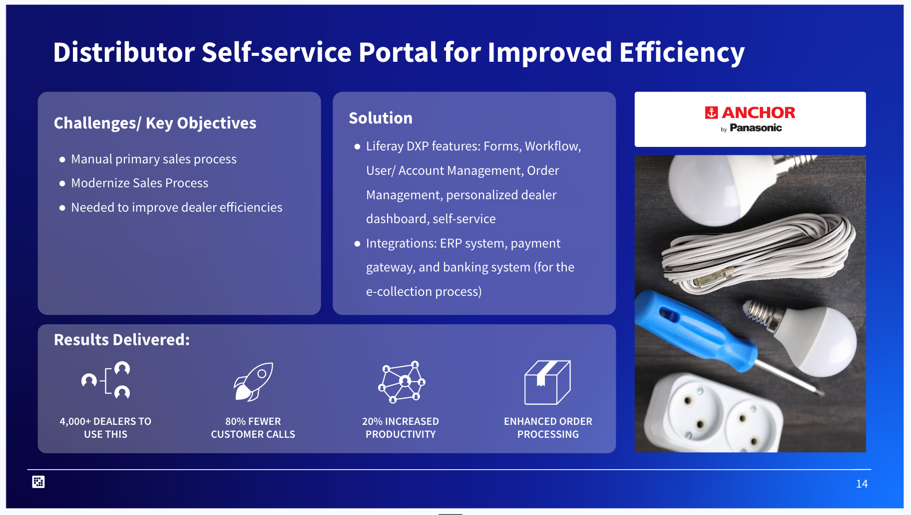

When possible two relevant case studies that provide some real world examples of Liferay solving the broad challenge are included. Ideally, one will be a larger global brand that most customers in the industry would immediately recognize and another a less well-known brand. This speaks to Liferay’s capabilities to address companies of different sizes. The case study section also includes speaker notes that will help tie the case study into the challenge just covered.  

These are example Case Studies, if there are others that are more relevant in a particular region, or particular sub-vertical, or where the local sales team has had direct involvement, this is another opportunity to personalize the deck. Use examples that will be the most effective for the prospect being presented to.

## Case Study Screenshot Slides

Some Case Studies may include additional screenshots, such as these from the Panasonic case study.

## Remaining Challenges, Sub-Challenges, Solutions, Case Studies Slides

Next, the deck moves to the second broad challenge, and repeats the process of presenting sub-challenges, then solutions, and finally relevant case studies.

## Technical Challenges Slide

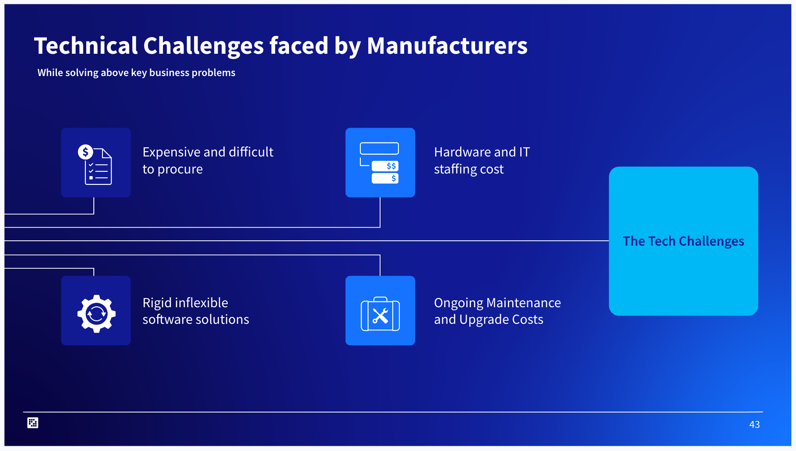

After the final broad challenge, the deck moves on to cover the types of challenges that naturally occur when technology is used to try to solve problems. This is an opportunity to set up a discussion on the benefits of Liferay Experience Cloud as a solution. The slide covers how enterprise software can be expensive and difficult to procure, and solutions can be rigid and inflexible.  

Customers either have to modify their business processes to align with the technology or have to create costly and difficult to maintain customizations that lock them into a specific product or version. Bringing new technology into an organization can also require provisioning new hardware and training IT staff to support the solution.

## Solutions to Technical Challenges Slide

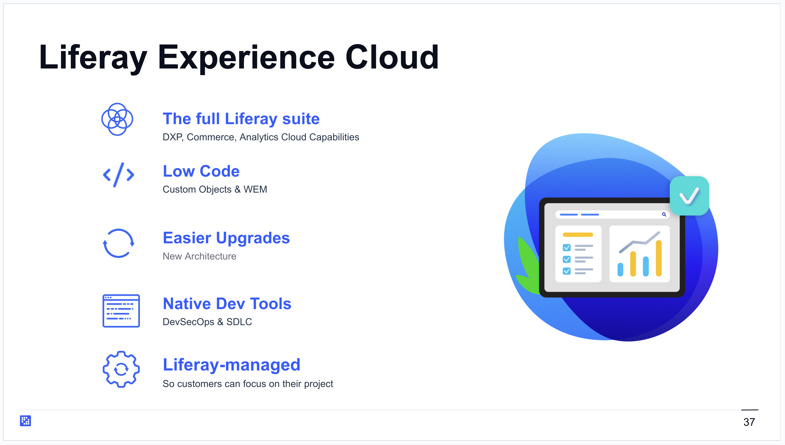

As in the previous sections, after discussing the challenges, the solution to those challenges is provided. For example, in this case by building a solution on Liferay Experience Cloud, each of those challenges can be addressed.

## About Liferay Slides

The next section covers Liferay as a company and business partner. This is a change from previous decks where the presentation started with “About Liferay”. The focus is deliberately on the customer and their needs first, and then Liferay second. Each of these slides has speaker notes and covers topics such as Liferay’s demographics, product information, and approaches to addressing the customer journey.  

## Tailored Solutions on Liferay

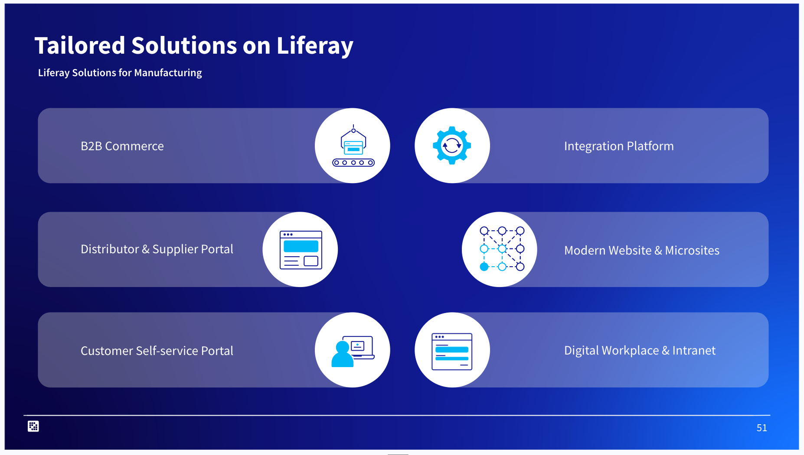

The final section addresses the types of solutions that Liferay has been used for in the particular industry. This slide varies with each industry and the solutions are not an exhaustive list. If the specific solution that the customer is looking for is known, emphasize that one solution, or add it to the list if necessary.  

This is a great opportunity to also talk about how the majority of Liferay customers actually use Liferay to power more than one solution. More solutions from a single subscription leads to a lower overall total cost of ownership and faster implementation times.  

Next: the [Expansion Desk Structure](./sales-presentations-expansion-deck.md) is described in the context of a second scenario.
