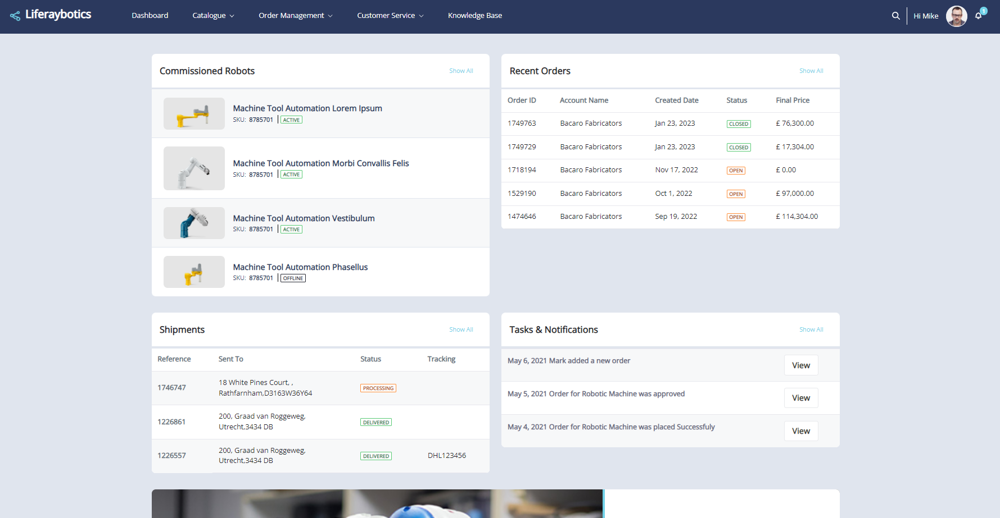
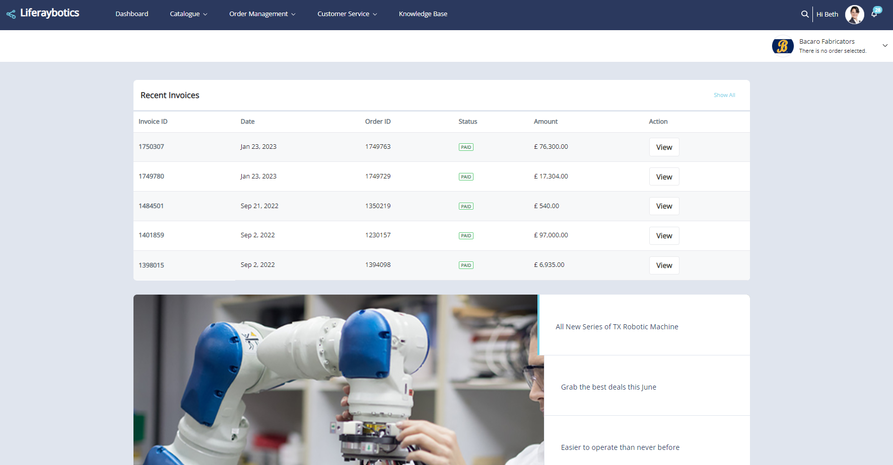
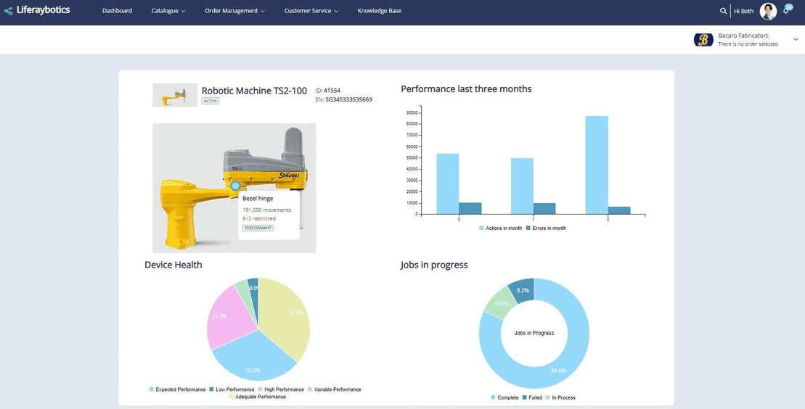

# Customer Portals

A Customer Portal is a website that provides customers with a single point of access to all relevant information about the products and services they are purchasing from a vendor.

A key point here is that the customer or the end user of the products or services provided by the organization are the primary users of the solution.

## Key Liferay DXP Capabilities for Customer Portals

The following of Liferay’s high-level capabilities are likely to be incorporated into most Customer Portal solutions:

* [Segmentation & Personalization](https://learn.liferay.com/w/dxp/site-building/personalizing-site-experience)
* [Identity Management & Access Control](https://learn.liferay.com/w/dxp/installation-and-upgrades/securing-liferay)
* [Low-Code / No-Code Application Building](https://learn.liferay.com/w/dxp/building-applications/objects)
* [Data Modeling & Process Automation](https://learn.liferay.com/w/dxp/process-automation)
* [Commerce](https://learn.liferay.com/w/commerce/index)
* [Design Systems & Experience Management](https://learn.liferay.com/w/dxp/site-building)
* Integration & Interoperability
* [Search](https://learn.liferay.com/w/dxp/using-search) & [Navigation](https://learn.liferay.com/w/dxp/site-building/site-navigation)
* [Headless APIs & Multichannel](https://learn.liferay.com/w/dxp/headless-delivery)
* [Collaboration & Knowledge Sharing](https://learn.liferay.com/w/dxp/collaboration-and-social)

For the purposes of this module there are two that are particularly relevant for Customer Portals:

* Segmentation & Personalization
* Integration & Interoperability

## Segmentation & Personalization

As discussed, one of the key needs of any customer portal is to provide tailored experiences to customers. Liferay provides OOTB Segmentation & Personalization capabilities that these tailored experiences require which ensures that the right content is delivered to the right audience, with meaningful recommendations, tailored search results, and much more.

As different types of buyers log into the site they are presented with a view tailored to their requirements. 

**Technical Buyer Dashboard**

Technical buyers see a dashboard that helps them quickly check on the status of equipment, re-order consumables, and learn about new products and services.

**Business Buyer Dashboard**

When business buyers visit the same page, they see a personalized dashboard that provides immediate access to order and shipment statuses, as well as invoices and the ability to make a payment.  

Liferay provides some key features that help achieve this desired business outcome, including a segment builder that allows the creation of segments based on demographic data (e.g., country, gender, language) or behavioral patterns (e.g., page visited, device, last login date).  Users can create as many different experiences for any given page as they need, each linked to a different user segment.  Each of these different experiences can present different widgets, fragments, and data based on the needs of the user.  

**Integration & Interoperability**

One of the key values that a Customer Portal provides is to bring together and unify all of the many disparate systems that are in use across the enterprise, so it is critical that a Customer Portal is built on technology that excels at integration.  

**Integration with IoT devices**

Integration can take many different forms.  For example, this might be integration with IoT devices in the field or in a manufacturing plant. This integration can quickly surface critical information and can help facilitate the reordering of consumables or spare parts, or scheduling pro-active service to help prolong the life of equipment and in doing so maximize the value of the investment in that equipment.

**Integration with Systems of Record**

Customer Portal integration might also involve surfacing key order and invoice data from a back office system of record.  In many cases, these back office systems don’t provide custom self-service directly, or the self-service experience leaves much to be desired.  When using Liferay as a frontend to these back office systems, customers get the right level of access with a consistent user experience and branding. 

With this in place the Customer Portal is a single pane of glass that provides users an unmatched view into their business relationship, and reduces friction that might impede future purchases. 

## Case Study - Airbus

A great example of a Customer Portal that makes effective use of both Segmentation & Personalization as well as Integration & Interoperability is Airbus Helicopters.  Airbus Helicopters provides the most effective civil and military helicopter solutions to its customers. In 2016, this division of the Airbus Group turned to Liferay to redesign its customer portal and put forward a more modern platform that is adapted to the customer journey of its helicopter operators, who constitute 24,000 users.

One of the key Challenges that Airbus was looking to solve was the ability to engage customers and simplify their operations.  Different types of users have different needs and Airbus was looking for a modern customer portal solution that could provide users with a more personalized experience.  By personalizing the experience, the process of onboarding and educating users becomes a lot easier and customers can also realize real productivity gains.

Another challenge that Airbus was facing was that there were many different third-party business applications that needed to be accessed by the helicopter operators.  Airbus needed a platform that excelled at solving complex integration challenges and could present those applications as part of a single customer journey.  They did not want to have their end users bouncing around between different applications with multiple logins and different user experiences.

By leveraging Liferay’s ability to segment users by their role and additional demographic and behavioral attributes, they were able to provide a tailored customer journey that surfaced the right information at the right time.  They were also able to draw upon Liferay’s superior integration capabilities to ensure that those third party applications were presented within the context of the Customer Portal, thereby giving their end users a more cohesive experience.

For more detailed information see [Airbus Helicopters](https://www.liferay.com/resources/case-studies/m-1) on liferay.com.

Next: [Digital Commerce Sites](./digital-commerce-sites.md). 
