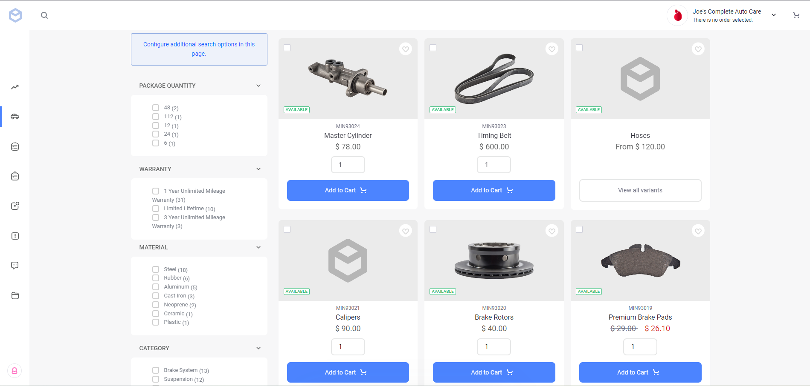
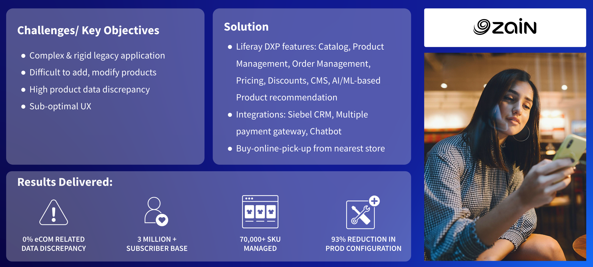

# Digital Commerce Sites

A digital commerce solution allows people or companies to buy physical goods, services, and digital products over the internet. These digital commerce sites could be Business to Business (B2B) solutions for business buyers to connect directly with manufacturers, distributors, and dealers to purchase goods and services. They could also be Business to Consumer (B2C), where an end user makes the purchase. These solutions also include more advanced scenarios such as B2B2C or Government to Citizen (G2C).

## Key Liferay DXP Capabilities for Digital Commerce

Particular focus when talking with prospects about Liferay DXP-based Digital Commerce sites should be given to

* [Commerce](https://learn.liferay.com/w/commerce/index)
* [Headless APIs and Multichannel](https://learn.liferay.com/w/dxp/headless-delivery)
* [Low-Code / No-Code Application Building](https://learn.liferay.com/w/dxp/building-applications/objects)
* [Data Modeling and Process Automation](https://learn.liferay.com/w/dxp/process-automation)
* [Content and Asset Management](https://learn.liferay.com/w/dxp/content-authoring-and-management)
* [Analytics](https://learn.liferay.com/w/analytics-cloud/index) and [Optimization](https://learn.liferay.com/w/dxp/site-building/optimizing-sites)
* [Segmentation and Personalization](https://learn.liferay.com/w/dxp/site-building/personalizing-site-experience)
* [Search](https://learn.liferay.com/w/dxp/using-search) and [Navigation](https://learn.liferay.com/w/dxp/site-building/site-navigation)
* Integration and Interoperability
* [Design Systems and Experience Management](https://learn.liferay.com/w/dxp/site-building)

Of the above topics, the two below are the most important: 

* Commerce
* Headless API and Multichannel

## Digital Commerce

Liferay DXP contains native digital commerce functionality that facilitates an experience-led digital buying journey for both B2B and B2C scenarios. Liferay helps companies own the commerce experience, eliminating silos between customer acquisition and nurture. 

On one platform, Liferay DXP combines content, products, and customer data to offer better experiences at every touchpoint. Liferay has not acquired any digital commerce products to integrate with Liferay DXP, but has innovated internally. This means that all the capabilities are part of a single architecture. Out-of-the-box, Liferay covers commerce, experience and automation, and integration capabilities. 

### Product Content Management

Liferay DXP provides OOTB functionality to create and manage different types of products. Using the product content management (PCM) capabilities, organizations can enrich products with descriptions, specifications, images, fact sheets, etc. Other key features are Product Listing Pages (PLP), Product Detail Pages (PDP), up-sell, cross-sell, product comparison, wishlist, cart, checkout, search and browse, etc. 

Catalog management functionality helps organizations create different catalogs to manage similar products. The pricing and discount engine helps organizations set product pricing and customer-specific price lists, and to create promotions and discounts.

Liferay uses Elasticsearch for enterprise search. Elasticsearch provides faceted search and filtering for more effective product browsing and discovery. Liferay’s payment and tax management capabilities provide native payment support with PayPal and credit and debit cards. Liferay’s native order engine facilitates end-to-end order management including shipment management.

## Headless APIs and Multichannel

Liferay's native capabilities help organizations reach customers in a true multi-channel way---from storefront, to mobile, to IoT. Some of the key features supporting the multichannel delivery Liferay applications are

* **Headless APIs** - Liferay offers OpenAPI based APIs that can be consumed using either REST or GraphQL. When using these headless APIs, organizations can focus on creating tailored experiences across multiple devices. 
* **Adaptive Media** - Liferay DXP dynamically adjusts images to best fit the screen size and network speed of each device, addressing experience and performance issues for all page types and products.
* **Mobile Support** - Rapidly develop native and hybrid apps, create mobile experiences, and define mobile device rules using Liferay DXP as a mobile backend.

## Case Study - Zain

Zain is one of the leading telecommunication companies in the Middle East, and Zain Kuwait is the group’s flagship operation. This is a complex B2C Digital Commerce Portal, and one of the first Liferay Digital Commerce use case implementations. Zain uses Liferay to provide an end-to-end buying journey and immersive customer experience. Currently there are more than 70,000 SKUs being managed for more than 3 million subscribers. 

Zain had a rigid legacy system which was complex to customize. It also had a decentralized product catalog, along with complex processes to configure products and execute promotions. Zain used Liferay's catalog and product information management capabilities to configure physical products such as smartphones, tablets, laptops etc., along with virtual products such telecom plans, antivirus, Google Pay cards etc. Using Liferay’s price and promotion features, Zain manages customer segment-specific pricing and creates discounts and promotions.

Liferay’s ML product recommendation capabilities are also being used by Zain. The entire order processing, shipment management, and inventory management has been implemented using Liferay.

Next: [External Websites](./external-websites.md).
