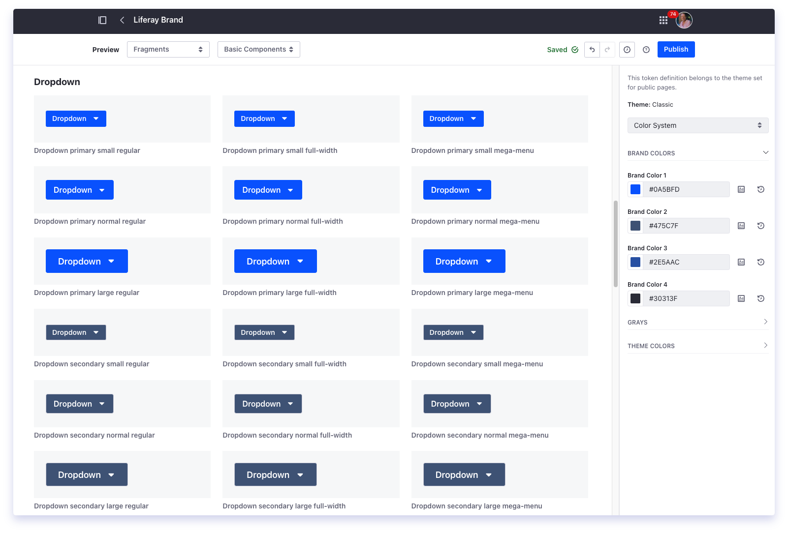
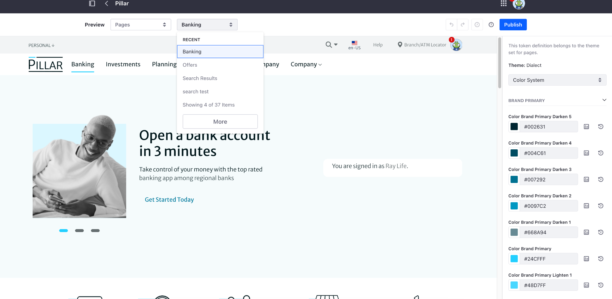
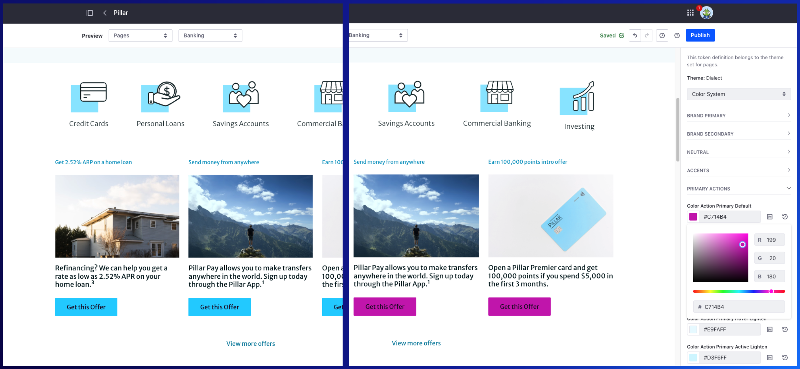

---
toc:
  - ./basics-of-styling/logos-favicons-masterpages.md
uuid: 0717de7f-94fd-47ce-98ec-59fc294dd26d
---

# Basics of Styling

**At a Glance**

* The key to a successful demo is engaging with the audience
* Updating the look and feel of an existing demo is an effective way to create engagement
* Liferay provides simple tools that require no development that change the look and feel:
  * Style Books
  * Site Logos
  * Favicons
  * Master Pages
* A Style Book is a set of visual rules that apply to a Site to provide a consistent visual experience across its pages

## Background

This module covers four areas that can be quickly and easily changed in a demo so that prospects can be confident that their design systems and styling can be applied to a Liferay application built to solve their business needs.

The topics covered are:

* Style Books, what they are and why they are used.
* Changing the site Logo.
* Changing the Favicon of a site built on Liferay.
* Master pages and what value they bring to a Liferay Solution.

These are the things that can be done to most quickly customize the styling of demos without doing any development work, but they are certainly not the only features Liferay has for styling. Later modules will cover these features, and more advanced ones, in detail.

```{note}
* View the [recording](https://learn.liferay.com/web/guest/d/se1-5-basics-of-styling-in-liferay) from the live workshop of this module.
* Download the [PDF](https://learn.liferay.com/documents/d/guest/se1-5-basics-of-styling-in-liferay-pdf) of the presentation used in the live workshop.
```

## What is a Style Book?

Put simply, a Style Book is a set of **visual rules** that apply to a **Site** to provide a **consistent visual experience** across its pages.

What that basically means is that Liferay provides a way to control the look and feel of a site including the colors, the fonts, the spacing between elements, and so on in a single feature called Style Books.

### How Style Books Work

**Landing Page**



High-level benefits of Style Books are:

* Bring customer design systems easily into Liferay.
* Ensure consistent look and feel across a Liferay site.
* Changes seen in real time, with no down-time.
* Any number of Style Books can be created to meet different requirements.
* Style Books set CSS variables to override default styling.

**Import existing design systems**

Style Books are a great way to bring a customer’s design system into Liferay easily, without the need to do any custom development.

For demo purposes it is easy to change any existing Liferay demo to closely match the prospect’s branding by matching their fonts, their colors, and so on.

At implementation time, Designers can easily implement these changes - without the need to write code, deploy the changes and wait for them to take effect.

**Ensuring consistent look and feel**

Applying the design site-wide via a Style Book ensures a consistent look and feel is applied across every page in that site.

**Make changes in real time**

Other benefits are that Liferay provides an editor that allows users and admins to change the values and see those changes in real time, so as the changes are made they are applied to a site without the need for any downtime.

**Support any number of different Style Books**

Liferay allows the creation of any number of Style Books to reflect different design requirements - for example a customer might have different color palettes for their public website and their customer self-service portal.

**Internals of Style Books**

All this information raises a question about how Style Books actually work. Internally each configuration change is setting a CSS variable, which in turn impacts the CSS that is loaded for all pages that the Style Book is applied to. This in turn overrides the default styling that Liferay applies out-of-the-box.

### Tips for demonstrating Style Books

The goal of this module is to provide sufficient information so that styling changes can be easily made to any pre-built Liferay demo. For early business-focused Liferay demos it is not usually needed to show creating or editing Style Books, but the following steps can be used as a guide to how to start working with Style Books, and how to demonstrate them quickly and simply if needed.

```{note}
Full documentation on creating and editing Style Books can be found [here](https://learn.liferay.com/web/guest/w/dxp/site-building/site-appearance/style-books/using-a-style-book-to-standardize-site-appearance).

```

A brief demo of Style Books consists of:

* Browsing the available Style Books
* Selecting a Page to test changes on
* Applying changes to colors
* Applying a Style Book to a page

**Browsing available Style Books**

Style Books are defined at the Site scope. To access them open the _Product Menu_ (), expand the _Design_ section, and choose _Style Books_.

To create a new Style Book simply click on the + icon.

**Testing Changes**



Within the UI for Style Books a user can select a number of views of the site to preview changes as they are made. The most immediate effect is by selecting a site Page to use for previewing changes.

Use the Preview dropdown menu at the top of the page and choose “Pages”, and then select the preferred site Page from the section dropdown menu.

**Changing Colors**



One of the simplest, and easiest for a prospect to see and therefore understand, ways to change the styling of the site is to demonstrate changing the color of buttons.

With the Style Book editor, change the dropdown menu in the right panel to “Color System”, scroll down to _Primary Actions_ and use the color palette selector to change the _Color Action Primary Default_.

For the best immediate impact, choose a new color which is obviously different from the existing color.

**Applying a Style Book to a Page**

Follow these steps to set any page's Style Book:

1. Click _Edit_ () near the top of the page.
2. Click _Page Design Options_ () on the sidebar.
3. Click to open the _Style Book_ tab.
4. Select the desired Style Book from the list.
5. Click _Publish_.

The page is published using the new Style Book.

Next: [Site Logos, Favicons and Master Pages](./basics-of-styling/logos-favicons-masterpages.md).
