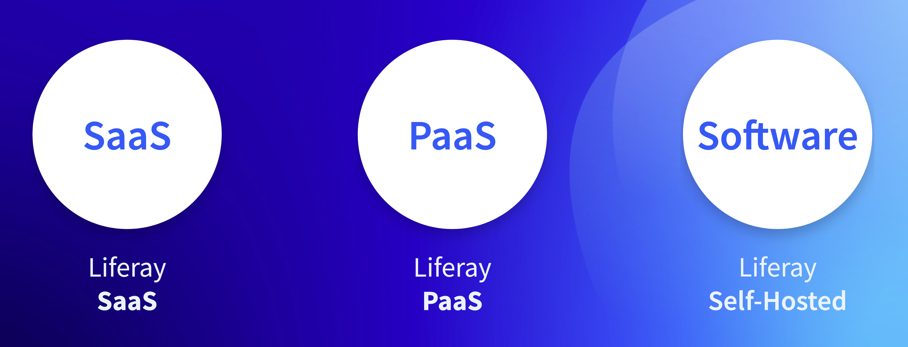
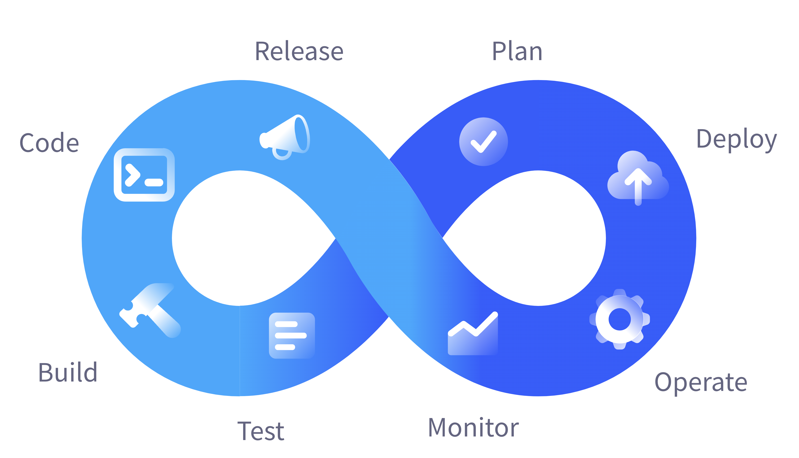

---
toc:
  - ./deployment-strategies/deployment-strategies-explained.md
  - ./deployment-strategies/choosing-the-right-deployment-strategy.md
uuid: c83f4e9a-9acc-47df-bc26-07b7d273c65c
---

# Deployment Strategies

**At a Glance**

* After choosing Liferay DXP to solve their business problems, the customer needs to choose where to host the Liferay application.
* There are considerations which will drive the decision to one approach or another, depending on the specifics of each project.
* Liferay provides three product deployment offerings:
  * Liferay Software - Self Hosted
  * Liferay Experience Cloud Self Managed - PaaS
  * Liferay Experience Cloud - SaaS
* Liferay’s preferred approach is SaaS first.

## Background

This module covers all of the deployment strategies as well as their characteristics, business values, and also how to determine which approach is most appropriate for each Prospect.

Though deployment strategies may not seem relevant to demoing Liferay, this topic often arises when learning more about the prospect and their needs.

```{note}
* View the [recording](https://learn.liferay.com/web/guest/d/se1-8-deployment-strategies) from the live workshop of this module.
* Download the [PDF](https://learn.liferay.com/documents/d/guest/se1-8-deployment-strategies-pdf) of the presentation used in the live workshop.
```

## Liferay’s Product

Before going through the Deployment strategy, it is important to highlight that, despite where the Application will live, the product that is deployed is always Liferay DXP.

The latest version of Liferay includes three main capability sets: the Digital Experience Platform core, Commerce, and Analytics. The product incorporates all the tools and features that will allow customers to develop their solutions and meet their business outcomes, with all customers having access to all of the features.


## Supporting Every Deployment Approach

Liferay has always been about preserving customer investment in their chosen software stack and infrastructure. As a result, Liferay has three product deployment offerings so customers can choose the approach that fits their requirements:

* **Liferay Experience Cloud SaaS** provides the full benefit of Liferay DXP without having to worry about infrastructure and upgrading related issues. Customers can focus on building solutions to solve business problems.
* **Liferay Experience Cloud Self-Managed** provides a platform-as-a-service offering tailored for the Liferay platform.
* **Liferay DXP Self-Hosted** allows a customer to choose exactly how and where they host their Liferay DXP implementation, providing them maximum flexibility but putting more responsibilities on them as well.



## SaaS First Approach

Even while offering customers the flexibility of three different Deployment strategies, Liferay’s approach - from both Engineering and Sales perspectives - is SaaS First.

This means that product initiatives are focussed on improving and expanding the experience and available tools and features for the SaaS option.

The role of any Sales representative, whether Liferay employees or Partners, is to lead the prospect to focus on solving their business problems with Liferay DXP, and start with the assumption that the deployment approach will be SaaS.

The module covers how Sales representatives can help prospects to determine whether it can or cannot be SaaS.

## Liferay Application Deployment Requirements

Irrespective of _how_ the Liferay application is ultimately deployed, the underlying requirements to support that deployment are the same. For the purposes of providing some context in this module an example prospect, LifeBank, is used.

* LifeBank is a company working on a digital transformation project and has decided that a digital experience platform with Low-Code / No-Code features along with Commerce and Analytics will benefit their customers.
* LifeBank plans to have a public-facing website, but one that will also provide the ability for customers to login so that they can access specific features and store personal information.
* LifeBank needs and wants to focus on the Business Value of having a Digital Experience Platform to create a tailored experience for its customers.

Based on this information, Liferay is a good fit for LifeBank.


## Hosting Liferay Applications

With LifeBank comfortable that their business requirements can be met with Liferay DXP, the next step is to help them to determine the best deployment approach.

Any software application typically needs a variety of infrastructure and software-related assets to be in place and configured appropriately, and Liferay is no different. For Liferay in particular there are six main considerations.


* **Infrastructure** - regardless of being on cloud or in a company physical facility, computer servers and network infrastructure need to be provided.
* **Platform Software** - involves all of the related software needed for the Application to be properly installed, such as a Database, a Search engine, a web server, and so on.
* **Architecture** - any business application has to be able to scale - maybe due to a new marketing campaign. It will need failure detection or high availability measures to ensure business continuity. It will need various environments for development and testing, along with production.
* **Monitoring** - circumstances might change, so the application needs to be constantly monitored and analyzed.
* **Security** - with cyber-threats becoming more and more common, users have to be securely connected, their data has to be protected, and so on. Also, Backup routines and Disaster Recovery plans need to be in place.
* **Upgrades and Updates** - the application will have to be updated and upgraded to keep providing new functionality or be patched with bug fixes or security fixes.

## Software Development Lifecycle



In addition to the key considerations outlined above, anything that involves changes to code - will have to go through a Software Development Lifecycle (SDLC) to ensure that changes don’t introduce their own issues. This includes but is not limited to, changes to include new functionality, update to existing customizations, and fixes to identified issues.

Next: [Liferay’s deployment strategies explained](./deployment-strategies/deployment-strategies-explained.md)
