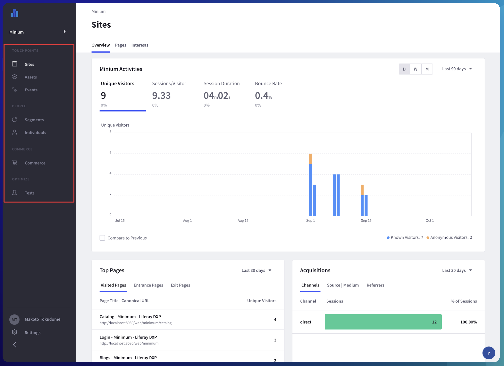

# Content Management and Analytics

**At a Glance**

* The basics of demonstrating Liferay’s experience management capabilities include:
  * Pages
  * Segmentation and Personalization
  * Content Management
  * Analytics
* Content Management offers the ability for non-technical users to add Web Content, Documents, Blogs, and so on. 
* Liferay’s Analytics capabilities allow administrators and marketers to understand how a Liferay site is performing, and to make improvements to it.

```{note}
* View the [recording](https://learn.liferay.com/web/guest/d/se1-4-experience-management) from the live workshop of this module.
* Download the [PDF](https://learn.liferay.com/documents/d/guest/se1-4-experience-management-pdf) of the presentation used in the live workshop.
```

## Content Management

Liferay offers a robust content management system (CMS) that allows non-technical users to create, manage, and organize content. Liferay supports many different types of content including [Web Content](https://learn.liferay.com/w/dxp/content-authoring-and-management/web-content), [Documents and Media](https://learn.liferay.com/w/dxp/content-authoring-and-management/documents-and-media), Collections, [Blogs](https://learn.liferay.com/w/dxp/content-authoring-and-management/blogs) and more.

During the demo, a number of benefits can be highlighted:

1. With Liferay’s CMS capabilities users can easily create content and ensure it contains the right information and displays correctly across different devices and channels.
2. Users can save time and effort creating content with reusable components, such as documents, images, videos, and other elements, that can be stored in one location and shared across multiple sites.
3. Users can quickly organize, search, or preview digital assets for their sites.
    1. Content can be organized in folders and subfolders.
    2. [Categories and tags](https://learn.liferay.com/w/dxp/content-authoring-and-management/tags-and-categories) can be assigned to make it easy for end users to find the right content, and compare or select the right products or services.

### Tips for the Demo

* **WYSIWYG editor**. Instead of creating new content, it is more effective to show pre-created content and show how it can be edited using the built-in WYSIWYG editor.
* **Different displays for different assets**. Show how different types of content can be defined, for example Articles, Case Studies, Press Releases and be displayed in different ways
* **Translation**. If localization is important to the prospect, show how content can be translated manually or automatically.
* **Content publication**. Mention that Liferay includes content publication capabilities which support scheduled publishing, automatic expiration, and so on.
* **Integrated with native frameworks**. Talk about the fact that all content (Web Content, Blogs, Documents, etc.) are integrated with core Liferay capabilities like the permission framework, search engine, workflow engine.
* **Office 365 and Google Drive integration**. If the prospect is interested in document management, mention the native integration offered by Liferay DXP with [Office 365](https://learn.liferay.com/w/dxp/content-authoring-and-management/documents-and-media/devops/enabling-document-creation-and-editing-with-microsoft-office-365) and [Google Drive](https://learn.liferay.com/w/dxp/content-authoring-and-management/documents-and-media/devops/google-drive-integration). These integrations allow users to create documents with the tools they are familiar with inside Liferay with the benefits of leveraging all the mentioned DXP capabilities.

## Analytics

Liferay’s [Analytics capabilities](https://learn.liferay.com/w/analytics-cloud/getting-started/viewing-the-analytics-dashboard) can help customers understand how their users are interacting with content, and this is a crucial tool that helps them to deliver more relevant and tailored experiences. Liferay Analytics Cloud helps organizations to optimize digital experience outcomes with analytics that identify areas for improvement.



To demo Analytics, make sure there is enough data in the environment to provide meaningful results. An empty environment has no graphs, no asset to measure, no interests analysis, and should definitely not be shown. Ensure that the demo environment has enough data on it to be sure the customer understands the value of the product.

Whenever demonstrating Liferay’s Analytics capabilities, or when talking about it, highlight the key advantages of using the solution compared to other tools, like for example Google Analytics.

Liferay Analytics was designed to provide a seamless experience for customers and is natively integrated with Liferay DXP. There is no need for customers to manually add javascript code into every page in their site. Analytics tracking is enabled with easy [configuration](https://learn.liferay.com/w/analytics-cloud/getting-started/connecting-liferay-dxp-to-analytics-cloud) through the Liferay UI. In addition to this, Customers can view page performance directly from the DXP, without needing to access the Analytics console.

Reports and asset analytics are provided out of the box that would otherwise need to be built by triggering custom events on site pages. For example, analytics on document downloads, on forms and abandonment rates, on query searches, on interests users demonstrated, and more.

Liferay also provides out of the box capabilities to run [multivariate testing](https://learn.liferay.com/w/analytics-cloud/optimization/a-b-testing) via simple configuration on any page that needs to be assessed. In most cases it is not practical to prepare data to show a running A/B test in a demo because of the amount of time and number of interactions needed to complete a test, but this is not usually a barrier to talking to prospects about the feature.

Prospects are more interested to know that A/B testing is provided, and that it is straightforward to set-up, rather than to actually see the results. One option is to show how to set up an A/B test, and then explain that results can only be obtained by having users access the page repeatedly over time to generate data.

As covered in the personalization section, using Analytics gives the advantage of being able to segment the audience using behavioral and historical data. Using this data provides an opportunity for organizations to give their users even more tailored personalized experiences.

Congratulations - that’s the end of the module on Experience Management - next learn how to tailor the look and feel of an existing demo in the [basics of styling Liferay](../basics-of-styling.md).
