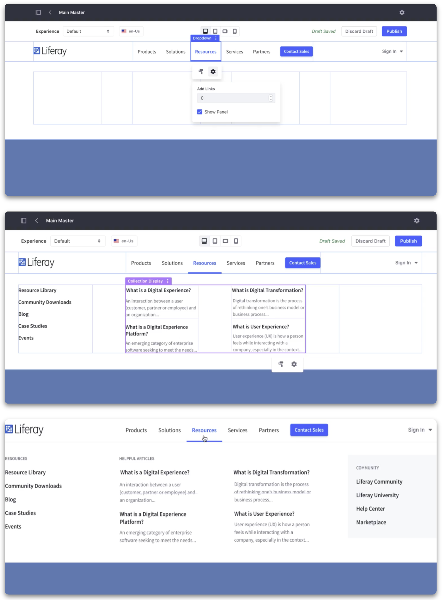
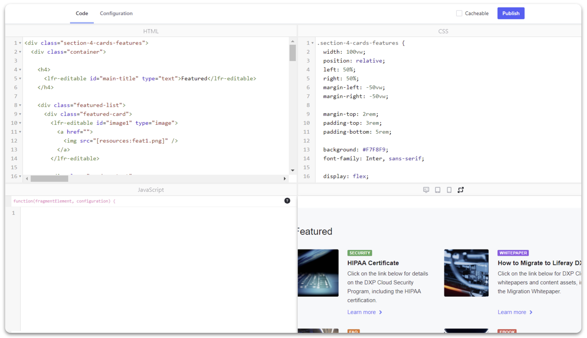
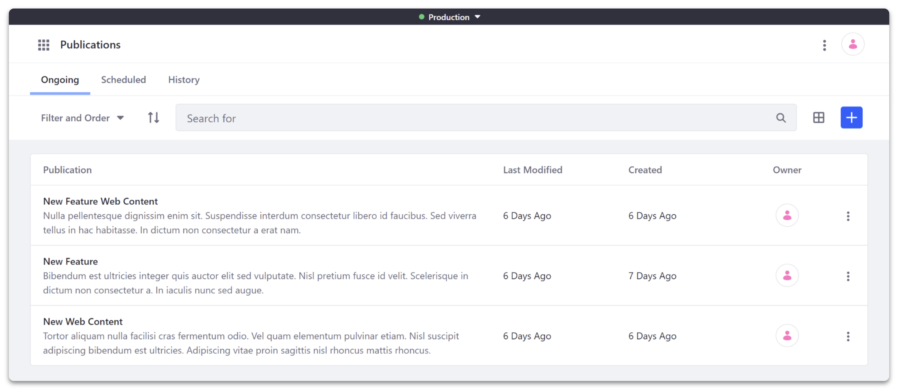
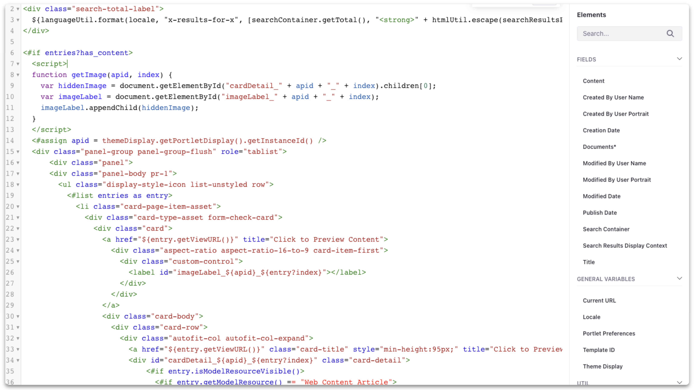

---
toc:
  - ./extending-liferay/low-code-no-code.md
  - ./extending-liferay/client-extensions.md
uuid: fff3c165-26ff-48d7-8937-cdc26f1b0062
---

# Ways to Extend Liferay 

**At a Glance**

* Extending Liferay is a crucial aspect of leveraging the platform's full potential
* By customizing Liferay with specific business needs in mind, digital experiences which tailored to the needs of the users can be created
* This module coves five key ways to extend Liferay
    * Editors
    * Configuration 
    * Low Code
    * Integrations
    * Client-Extensions

## Background

Liferay DXP is a full-featured digital experience platform and provides a wide range of capabilities out-of-the-box which can be used to implement sophisticated solutions for customers.

Even with this wide-range of capabilities each customer will have requirements that cannot be met solely with out-of-the-box features. Liferay has always been a flexible platform that allows customizations and extensions to be made in order that each customer’s unique requirements can be delivered.

This module outlines the key approaches that can be used to extend, configure, and customize Liferay to meet those customer needs.

```{note}
* View the [recording](https://learn.liferay.com/web/guest/d/se1-7-extending-liferay) from the live workshop of this module.
* Download the [PDF](https://learn.liferay.com/documents/d/guest/se1-7-extending-liferay-pdf) of the presentation used in the live workshop.
```

## Some Traditional Customizations

Up to and including Liferay DXP 7.3 the primary method of extending Liferay was via writing Java OSGi Modules: e.g. portlets, hooks, etc. This enabled developers to add, remove, and modify functionality with ease while achieving a high degree of flexibility and customization. 

OSGi modules are deployed to, and extend, the core of the platform, which introduces a number of challenges:

* Modifying the core impacts upgrades due to changes in APIs and so on
* Customers are unable to access new features in the newer releases of Liferay DXP without going through a full upgrade

## Latest version of Liferay DXP

It is important to note that:

* The latest version of Liferay DXP includes three main capability sets: Digital Experience Platform core, Commerce, Analytics
* This offers customers both a simplified product line but also access to quarterly updates
* Updates contain not only includes fixes to known issues, but new features as well


## Extending Liferay - Editors

One way to extend Liferay DXP is via the various Editors that are provided out of the box. For example through using the features provided via Liferay’s Experience Management capabilities.

These methods allow users a visual way to build and configure pages. Some notable examples are:

* Fragments
* Publications
* Themes
* Stylebooks
* Templates

### Fragments

[Fragments](https://learn.liferay.com/web/guest/w/dxp/site-building/creating-pages/page-fragments-and-widgets/using-fragments) are one of the building blocks which can be used to create rich pages in Liferay DXP. Fragments are intended to be used by Content Authors and Page Creators.



Thanks to Liferay's drag-and-drop interface, adding fragments to pages, and configuring them once added is a straightforward process which can be done by anyone, regardless of their technical expertise. Users can also save pre-configured sets of fragments as [Fragment Compositions](https://learn.liferay.com/web/guest/w/dxp/site-building/creating-pages/page-fragments-and-widgets/using-fragments/saving-fragment-compositions), which can then be added to any other page to speed up the process of creating similar pages.

**Developing Page Fragments**



Further to this, developers can create new fragments from scratch, through the editor within the UI, or via a CLI tool. Developers use a combination of HTML and optionally CSS, JavaScript and Freemarker to build new fragments to serve almost any purpose.

See: [Developing Page Fragments](https://learn.liferay.com/web/guest/w/dxp/site-building/developer-guide/developing-page-fragments)

### Publications



The [publications](https://learn.liferay.com/w/dxp/site-building/publishing-tools/publications) feature enables content creators to prepare changes and publish them on a schedule. This can support normal regular publishing processes, and can also be used for special changes - for example a seasonal promotion which involves updating images, adding new pages, and so on.

Customers can create a Publication and invite the necessary users to make their changes before publishing them.

### Themes

[Themes](https://learn.liferay.com/en/w/dxp/site-building/site-appearance/themes/introduction-to-themes) provide a flexible way to customize the look and feel of Liferay sites. Themes require a deployment of code to DXP and as such are not supported for customers of Liferay Experience Cloud SaaS.

### Stylebooks


[Style Books](https://learn.liferay.com/en/w/dxp/site-building/site-appearance/style-books/using-a-style-book-to-standardize-site-appearance) are sets of visual standards which apply to a Site, such as colors, fonts, and spacing. This allows the layout for every page to be designed independently while maintaining a consistent experience across each of them.

### Templates



Templates are a powerful tool for customizing the appearance and behavior of Liferay's user interface. Liferay provides a way of creating reusable templates, used to change the look and feel of content and pages. 

Once written in their editor, templates can be selected by the users, such as the marketing team, allowing them to easily display content on pages.

At a technical level, templates use combinations of HTML, CSS, Javascript, and are based upon a popular scripting language called Freemarker. 

See also:

* [Web Content Templates](https://learn.liferay.com/web/guest/w/dxp/content-authoring-and-management/web-content/web-content-templates)
* [Information Templates](https://learn.liferay.com/w/dxp/site-building/displaying-content/using-information-templates)
* [Widget Templates](https://learn.liferay.com/w/dxp/site-building/displaying-content/additional-content-display-options/styling-widgets-with-widget-templates)

## Extending Liferay - Configuration

While not technically extending Liferay, another effective way to ensure that Liferay is meeting a customer’s specific needs is through the configuration options. These allow developers and administrators to extend the platform's functionality without writing any code.
 
Some examples of configuration options include:

* System Settings
* Instance Settings

### System Settings

[System Settings](https://learn.liferay.com/w/dxp/system-administration/configuring-liferay/system-settings) allows administrators to configure the global settings for the Liferay portal. Including site, mail or search settings, and more.

```{note}
When Liferay DXP is deployed through the Liferay Experience Cloud SaaS offering, System Settings are not available.
```

### Instance Settings

Instance Settings are a powerful tool for customizing the behavior and appearance of a specific Liferay instance. Instance Settings allow administrators to configure a wide range of options, including authentication, email, language, search settings, and more.

### Virtual Instances

A [Virtual Instance](https://learn.liferay.com/w/dxp/system-administration/configuring-liferay/virtual-instances) is a logical separation of Liferay's resources, which allows administrators to create multiple, independent sites within a single Liferay installation. Each Virtual Instance has completely separate data and configurations. Each is accessed via a unique domain name and for all intents and purposes, is a separate Liferay-based implementation which shares an installation with additional instances.

```{note}
When Liferay DXP is deployed through our Liferay Experience Cloud SaaS offering, Customers are not able to create Virtual Instances. Effectively their environment is a virtual instance, within a shared cluster shared with other Customers. Within this Virtual Instance they are able to create additional Sites, up to the limits provided for their chosen subscription Plan.
```

Next: [Extending Liferay with Low-Code / No-Code capabilities](./extending-liferay/low-code-no-code.md)
