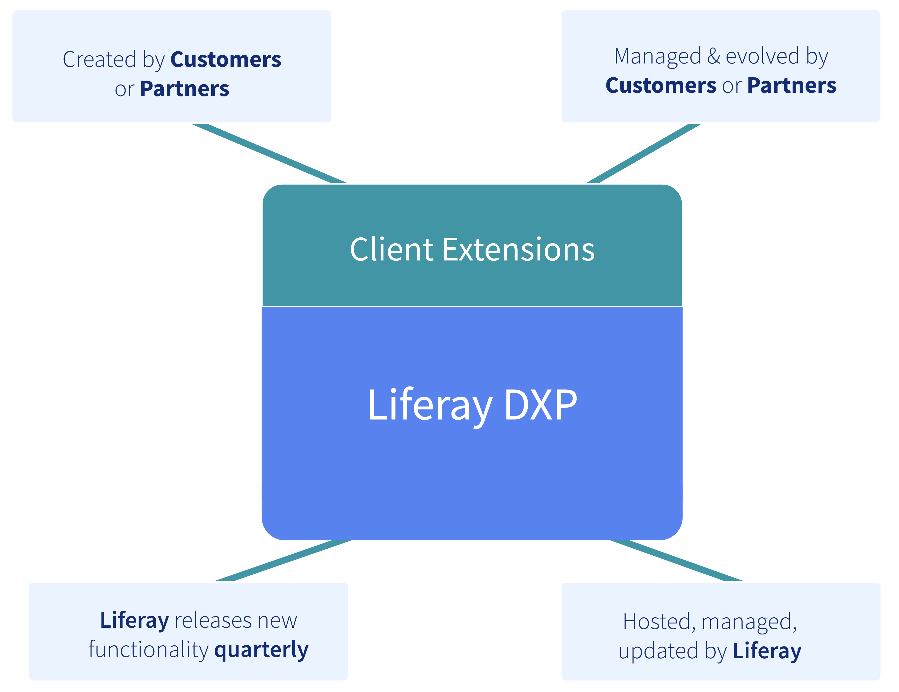

# Extending Liferay with Client Extensions

**At a Glance**

* Extending Liferay is a crucial aspect of leveraging the platform's full potential
* By customizing Liferay with specific business needs in mind, digital experiences tailored to the needs of users can be created
* Client Extensions provide a new way to extend Liferay that is decoupled from the platform core
* Decoupling custom code from Liferay’s core ensures quicker and easier upgrades and frees developers to use the languages and frameworks they are familiar with

```{note}
* View the [recording](https://learn.liferay.com/web/guest/d/se1-7-extending-liferay) from the live workshop of this module.
* Download the [PDF](https://learn.liferay.com/documents/d/guest/se1-7-extending-liferay-pdf) of the presentation used in the live workshop.
```

## Extending Liferay - Client Extensions (Code)



Last but not least, with Liferay DXP, there is now a new exciting way to customize Liferay, via Client Extensions. Which is in fact, extending Liferay using code.

Whenever the various methods of extending Liferay covered in the module so far do not meet a customer's business expectations, client extensions can be used to solve the customer’s business problems.

Client extensions sit outside of Liferay, but communicate with Liferay DXP using Headless API’s. Liferay provides examples of all types of Client Extensions and the required tools to successfully build and deploy the supported Client Extensions.

It is important to also mention that Liferay DXP is updated on a Quarterly basis. With customizations isolated from the core Liferay platform, upgrade processes are much easier.

Advantages of this loosely coupled approach include:

* Decoupling customizations, configurations, and extensions from Liferay DXP means that Liferay is able to release new updates much faster and streamline the delivery
* Instead of waiting a year or more for new features and capabilities, Liferay provides quarterly releases of Liferay DXP
* Not only does this accelerate time-to-market with new improvements and features, Partners and Liferay’s Customer Success teams have the ability to stay engaged with customers more frequently, promoting and incorporating new capabilities into their customers’ solutions

**Decoupled Customizations**


Decoupling customizations from the DXP core also results in less issues with the overall delivery. This also means that there is no longer the requirement to find and train Liferay-specific developers, instead developers can be hired who have expertise in popular frontend JavaScript frameworks like REACT, Angular, Vue, or backend frameworks like Spring Boot etc, which can communicate back to Liferay DXP via Headless-API.

Partners will play a critical role in helping customers:

* Create SDLC for extensions
* Low code development
* Code for backend services or frontend development
* Performance of these custom solutions
* Maintaining the customization, where required

Another thing to note here is, client extensions can live anywhere. Customers or partners can choose to deploy client extensions in their own infrastructure, if they like.

## Increased Business Opportunities

This new approach also creates additional business opportunities for Liferay partners. Whereas in the past, partners had to build new versions of their applications with every new version of Liferay.

With Client Extensions clean separation can be established since APIs are consistent across updates. Partners can not only save time on updating existing solutions, but also accelerate time-to-market for new business opportunities like connectors, solutions, and more. 

## How to talk about extending Liferay in demos

So why is this all important? What does all this mean? And why should prospects be informed of the various methods that are available to extend Liferay?

The core message is that even though Liferay comes with a wide range out-of-the-box capabilities it is important to remember that Liferay is not a turnkey application.

Customers or partners have to implement the solution required to solve their business problems and Liferay provides a wide range of capabilities which make it possible to deliver to those business requirements using customizations and extensions to the platform.

Due to Liferay’s flexible nature, applications and solutions that are built for Customers can be tailored to their specific needs. As such solutions can grow and evolve as the Customer’s business expands and changes - using features not previously used before, or building extensions for additional custom requirements.

This also gives our Customers and Partners a competitive advantage because they can differentiate themselves from their competitors by offering unique features or functionality which are not available in turnkey solutions.

## Additional Information

* [Fragments](https://learn.liferay.com/w/dxp/site-building/creating-pages/page-fragments-and-widgets/using-fragments), [Publication](https://learn.liferay.com/w/dxp/site-building/publishing-tools/publications), [Themes](https://learn.liferay.com/w/dxp/site-building/site-appearance/themes) & [StyleBooks](https://learn.liferay.com/web/guest/w/dxp/site-building/site-appearance/style-books)
* [Forms](https://learn.liferay.com/w/analytics-cloud/touchpoints/assets/forms), [Workflow](https://learn.liferay.com/w/dxp/process-automation/workflow), [Collections](https://learn.liferay.com/w/dxp/content-authoring-and-management/collections-and-collection-pages), [Objects](https://learn.liferay.com/w/dxp/building-applications/objects)
* [Open Office](https://learn.liferay.com/w/dxp/content-authoring-and-management/documents-and-media/devops/enabling-openoffice-libreoffice-integration), [O365](https://learn.liferay.com/w/dxp/content-authoring-and-management/documents-and-media/devops/enabling-document-creation-and-editing-with-microsoft-office-365), [Google Drive](https://learn.liferay.com/w/dxp/content-authoring-and-management/documents-and-media/devops/google-drive-integration), [Live Chat](https://learn.liferay.com/w/dxp/site-building/personalizing-site-experience/enabling-automated-live-chat-systems/getting-a-chat-provider-account-id/livechat), [DocuSign](https://learn.liferay.com/w/dxp/content-authoring-and-management/documents-and-media/uploading-and-managing/enabling-docusign-digital-signatures), [Talend](https://learn.liferay.com/w/dxp/system-administration/data-integration/liferay-talend-components-overview), [Mulesoft](https://learn.liferay.com/web/guest/w/commerce/add-ons-and-connectors/mulesoft), [SAP Connector](https://marketplace.liferay.com/p/sap-business-objects-connector), [Headless](https://learn.liferay.com/w/dxp/headless-delivery)
* [Client Extensions](https://learn.liferay.com/w/dxp/building-applications/client-extensions)

Congratulations, that’s the end of this module, next learn about [Deployment Strategies](../deployment-strategies.md) for Liferay.
