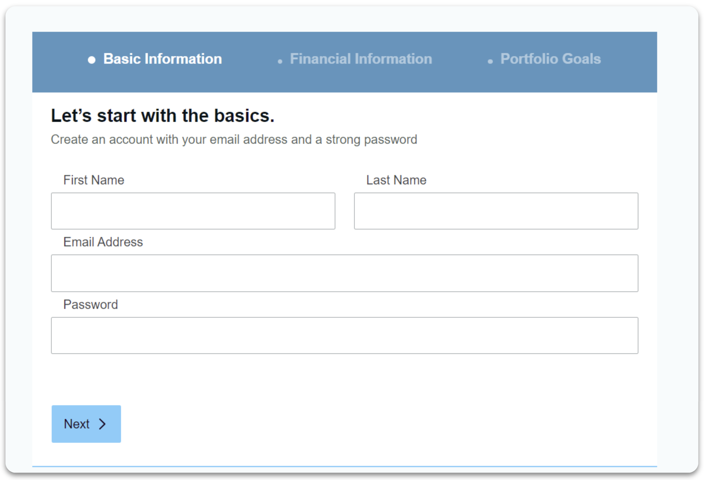
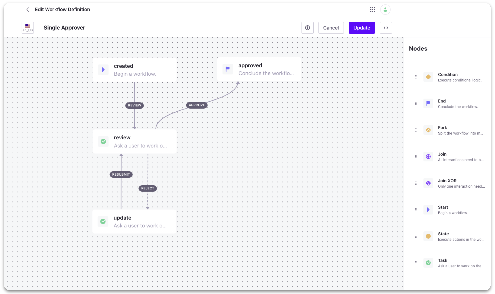
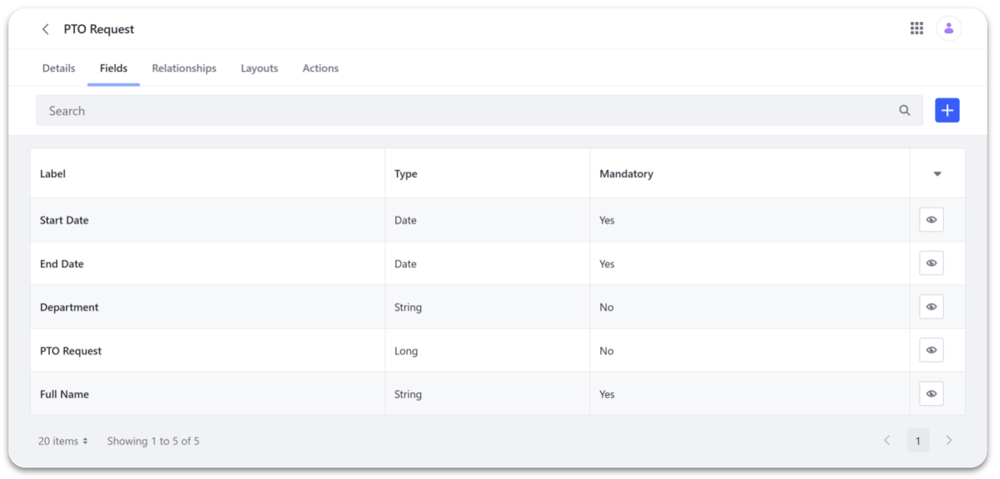

# Extending Liferay with Low-Code/No-Code and Integrations

**At a Glance**

* Extending Liferay is a crucial aspect of leveraging the platform's full potential
* By customizing Liferay with specific business needs in mind, digital experiences tailored to the needs of users can be created
* Low-Code / No-Code capabilities allow the platform to be extended by writing little to no code
* Integrations with external systems allows incorporation of data from those systems into a Liferay application

## Extending Liferay - Low-Code/ No-Code

Using a Low-Code and No-Code approach is becoming increasingly popular as it allows developers and business users to create custom functionality without extensive coding knowledge or experience.

Low-Code and No-Code are actually not new concepts to Liferay as many of the existing features in Liferay DXP are designed with this principle in mind.

Some quick examples in Liferay DXP are:

* Forms
* Workflow
* Collections
* Objects

### Forms



[Forms](https://learn.liferay.com/w/dxp/process-automation/forms) provide robust capability to gather required user data. For example, customer feedback or a job application etc.

The Forms application can be used to create simple forms, like surveys, to complex, multi-page applications, using rules to dynamically alter the form fields based on prior user input.

## Workflows



[Workflows](https://learn.liferay.com/w/dxp/process-automation/workflow) allows administrators to review and approve content such as Blogs, Web Content and Wikis - before they are published.

Workflow processes can also integrate with Users, Groups, and Roles as reviewers and approvers.

### Collections


[Collections](https://learn.liferay.com/w/dxp/content-authoring-and-management/collections-and-collection-pages) are sets of content items and other assets which can be used to group and filter information.

A typical use case for collections would be, for example, to have a section in your product web page, which shows new customer success stories automatically as they are published.

### Objects



[Objects](https://learn.liferay.com/w/dxp/building-applications/objects) is a new feature that can be used to create business applications without writing any code or deploying modules.

Points to note here:

* Entities and processes can be modeled with objects to help create great Digital Experiences
* From a mortgage simulator, to an e-learning platform, almost any functionality that might need to be included in Liferay can be created with Objects
* Such out-of-the-box features allow developers to add new capabilities and override native Liferay functions - without modifying the core of Liferay DXP

## Extending Liferay - Integrations

Liferay DXP can also be extended using integrations. This allows Liferay to connect with existing systems and tools, including Customer Relationship Management (CRM) systems, Enterprise Resource Planning (ERP) systems, among others.

Liferay provides several integration points which allow customers to integrate with external systems, services, or applications.

Examples include:

* OpenOffice and LibreOffice
* Microsoft Office 365
* Google Drive
* Live Chat & Chatbot
* DocuSign
* ETL Tools
* Enterprise Service Bus
* ERP Platforms
* Headless APIs

### OpenOffice and LibreOffice

[OpenOffice and LibreOffice](https://learn.liferay.com/w/dxp/content-authoring-and-management/documents-and-media/devops/enabling-openoffice-libreoffice-integration) integration with Liferay allows users to view and edit office documents directly within the portal using Liferay's built-in document viewer and editor. This can be useful for collaborating on documents within a Liferay portal, without needing to download the document, edit it locally, and then upload it back to the portal.

### Microsoft Office 365

[Microsoft Office 365](https://learn.liferay.com/w/dxp/content-authoring-and-management/documents-and-media/uploading-and-managing/creating-documents/creating-and-editing-documents-with-microsoft-office-365) OneDrive for Business integration allows users to use the Microsoft Office 365 applications to create and edit documents which are then stored in Liferay’s Documents and Media library.

Also with Office 365's Exchange Online calendar, if integrated, users are able to view and manage their calendars directly within the Liferay portal.

### Google Drive

Liferay can also be integrated with Google Drive in two different ways:

1. [Enabling Document Creation and Editing with Google Drive](https://learn.liferay.com/w/dxp/content-authoring-and-management/documents-and-media/devops/google-drive-integration/enabling-document-creation-and-editing-with-google-drive)
2. [Enabling Links to Google Drive Documents](https://learn.liferay.com/w/dxp/content-authoring-and-management/documents-and-media/devops/google-drive-integration/enabling-links-to-google-drive-documents)

The fundamental difference between these two modes is where the documents are ultimately stored - in both cases the documents are created and edited using Google’s browser-based applications.

* In the first mode the documents are ultimately stored directly in Liferay’s Documents and Media library
* In the second they are stored in Google Drive with shortcuts to those documents stored in Liferay

### Live Chat & Chatbot

Liferay DXP provides comprehensive support for a number of [Live Chat](https://learn.liferay.com/w/dxp/site-building/personalizing-site-experience/enabling-automated-live-chat-systems) platforms. Enabling this integration adds a chat window to sites on the Liferay instance and can be used to enable improved support and site experience for your users.

Liferay also integrates with chatbot services, such as Zendesk or Hubspot, to provide automated chat functionality. This can be useful for providing support to users outside of normal business hours or for handling simple queries.

### DocuSign

[DocuSign](https://learn.liferay.com/web/guest/w/dxp/content-authoring-and-management/documents-and-media/uploading-and-managing/enabling-docusign-digital-signatures) digital signatures can also be integrated with Liferay documents. 

DocuSign is a service which manages documents to be signed electronically. This integration allows the management and collection of signatures on documents.

### ETL Tools

Liferay is able to integrate with ETL (Exchange-Transform-Load) tools like [Talend](https://learn.liferay.com/web/guest/w/dxp/system-administration/data-integration/liferay-talend-components-overview). Thanks to Liferay’s Talend Components, customers can import and export data to and from Liferay. For example, user data, web contents or products, can be imported from and exported to other systems such as a CRM, an ERP or database.

### Enterprise Service Bus

Liferay is also able to integrate with architectures like an Enterprise Service Bus (ESB). [MuleSoft](https://learn.liferay.com/w/commerce/add-ons-and-connectors/mulesoft) is a well known ESB which also has a Liferay connector. A typical use case for Liferay would be for customers to automate workflows between Liferay and other applications, such as ERP or CRM systems.

### ERP

Liferay allows integration with ERP platforms such as SAP. SAP’s Liferay Connector, can be used to import and export data from and to Liferay onto SAP systems.

Examples include customer data, product data, and sales data etc. But, there are many more possible use cases.

### Headless APIs

Liferay [Headless integration](https://learn.liferay.com/w/dxp/headless-delivery/using-liferay-as-a-headless-platform) provides developers with a flexible and efficient way to integrate Liferay's back-end functionality with their own applications, using modern REST APIs.

* This approach provides developers with greater control over the user experience, and enables faster time-to-market for their applications.

```{note}
* Some of above mentioned integrations might not be possible with Liferay SaaS
* Please check with your designated Liferay contact on the latest supported integrations if you are using Liferay SaaS.
```

Next [Extending Liferay with Client Extensions](./client-extensions.md)
