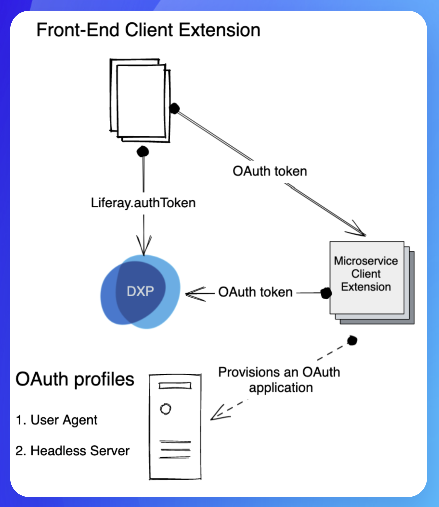
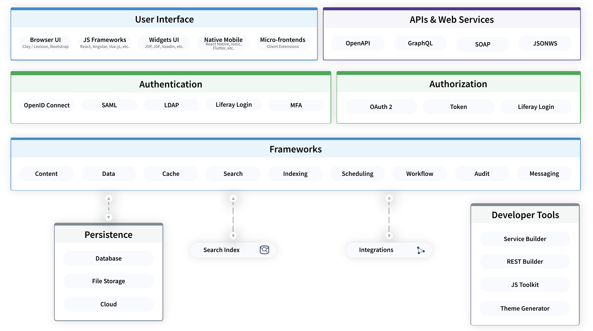

# Liferay Authorization

**At a Glance**

* Authentication determines who is allowed to login to an application.
* Authorization determines what they are allowed to do once logged in.
* Liferay provides robust, granular authorization capabilities.
* Liferay supports OAuth 2.0 to enable access for Liferay users to applications that reside _outside_ Liferay.
* Strong security is vital as it is the number one consideration in the OWASP top 10.

```{note}
* View the [recording](https://learn.liferay.com/documents/d/guest/se1-3-liferay-authentication) from the live workshop of this module.
* Download the [PDF](https://learn.liferay.com/documents/d/guest/se1-3-liferay-authentication-pdf) of the presentation used in the live workshop.
```

## Authorization

Authentication determines whether a user is allowed to login or not. Authorization,

* Determines what an authenticated user can do.
* Restrict access to assets like sites, pages, content, images, documents and so on.
* Provides different _levels_ of access like view, edit, create, delete.
* Is defined in Liferay by assigning Permissions to Roles, and granting Roles to Users.

It is important to call out to prospects that Liferay’s Authorization capabilities not only control what a user can see, but also what they can do - whether they can edit assets, create new ones, delete existing ones and so on.

Liferay provides a granular model to grant different permissions (View, Edit, Create etc.) to almost any aspect of the system, to one or more Roles, and in turn to allow users to belong to one or more Roles. 

This allows different types of users to interact differently with the same asset. A normal user might be able to view a Page, but an Administrator is able to Edit that page, delete it, and so on.

## Liferay Authorization and OAuth 2.0

Liferay’s authorization capabilities determine how an authenticated user can interact within the Liferay application.

In addition to these native authorization capabilities Liferay provides support for OAuth 2.0, which is an industry standard authorization protocol.

OAuth 2.0 can be used with Liferay to grant authenticated Liferay users access to resources and applications that are not part of Liferay. In plain language terms this is like your neighbor saying “I authorize you to go into my house to feed my cat while I’m on holiday”.

It is highly unlikely that a Liferay demo will need to include a demo of Liferay’s OAuth 2.0 capabilities. It is likely however that a prospect’s Infosec team is going to be interested in. In addition it is important to note that Liferay’s Client Extensions make use of OAuth 2.0 so that the Client Extension can seamlessly and securely access Liferay resources.

An example of the OAuth communication process between Liferay and Client Extensions is shown below.



## Tips for showing Authorization

**Incognito Browser Sessions**

* Use an Incognito browser session to simultaneously login as a second user
* Easily shows how the system can look and behave differently for different users:
  * A search page that shows different results.
  * A collection display that has different content.
  * etc.

**Permissions apply to almost anything**

* Dramatically different looking pages can be shown by removing permissions for certain applications (Widgets).
* If a user doesn’t have permission to view a particular page it won’t even appear in their navigation.

**Permissions apply to APIs too**

* Permissions, and therefore Authorization, apply to access through the Liferay UI.
* Permissions also apply to any access made through Liferay’s Headless APIs.

**Introduce Personalization**

* Authorization provides an opportunity to introduce Personalization and ‘Experiences’.
* Sometimes it’s useful to restrict access to information - which you do by using permissions because that will lock out every possible access if you don't give it.
* This is very binary - a user either has access or they don’t.
* In many cases certain information might need to be presented at certain times, to guide a user to what you want them to see, but there might not be a requirement to block access entirely.
* Personalization provides a way to support this - by creating user Segments, and then building Experiences for pages that are tied to a segment.
* Each Experience can display exactly what you want or what might be relevant to a user belonging to that Segment.
* It is important to not use Permissions to block access if it is not required. Most applications require a combination of permissions _and_ personalization.

## Where Authentication and Authorization fit



While doing a demo on authentication and authorization it's good to show a high level overview on where the authentication and authorization level is.

Prospects can see that Liferay has a top level authentication and authorization mechanism so everything can be secured.

The point being that any user or system attempting to access Liferay, whether it is through any user interface or any API, must be first authenticated and then authorized before they can access any information stored in Liferay, or exposed through integrations to external systems.

## Broader Implications of Authentication and Authorization

Strong Authentication and Authorization capabilities are a key consideration of any web-based application. An important topic related to Authorization is the OWASP top 10.

* OWASP (the Open Worldwide Application Security Protocol) is a non-profit organization that works to improve the security of software.
* The OWASP Top 10 provides guidance on the most critical security risks to web applications.
* “Broken Access Control” has become increasingly important. In 2017 it was ranked fifth, but moved to the number 1 position in 2021. 

Protection against unauthorized access is a very important topic to discuss, and take into account the legal compliance and accountability that the Customer or Prospect has.

Trust will increase with a proven and secure platform - and that’s something that is core to Liferay’s capabilities.

## Advanced Approaches beyond Level 1!

This section provides some additional approaches that might be utilized in demos, however these are not typically covered in an initial 30-minute demo:

* Keycloak
* Auth0
* Azure AD
* Multi-factor Authentication

**Keycloak**

If single sign-on needs to be demonstrated and a service like Okta is not available, it is possible to run an instance of Keycloak. Keycloak is an open source software product to allow single sign-on with identity and access management.

One of Liferay’s consultants has provided a [blog](https://liferay.dev/blogs/-/blogs/liferay-sso-step-by-step) covering setup steps for Keycloak.

**Auth0**

Third-party services like Auth0 from Okta can be used to set up SAML or OpenID Connect authentication.

Liferay provides support for these types of services out-of-the-box and requires only basic configuration to make it work.

**Azure AD**

Another similar approach is to use Microsoft Azure AD which also has SAML support. 

**Multi-Factor Authentication**

Many times prospects ask about multi-factor authentication of course with the Liferay authentication mechanism there is a multi-factor authentication module that can be configured - or at least discussed as covered earlier.

## Summary

Congratulations - that’s the end of this module.

The key points here are that the point to start talking about the different authentication and authorization methods in a demo is when login takes place.

For some customers, Liferay’s native authentication and authorization capabilities will be sufficient.

But for many others, whether the requirement is to build an Intranet using SAML to implement Single Sign-On, or to allow users to use credentials that already exist via OpenID Connect, it is important to discuss the broad range of capabilities that Liferay provides out-of-the-box.

Once Authenticated the flexibility provided by the native and granular Roles and Permissions capabilities, coupled with the ability to use OAuth 2.0 to authorize access to external resources as well, means that customers should be confident that their applications will be safe, secure, and accessible.

Next: [Experience Management](../experience-management.md).
