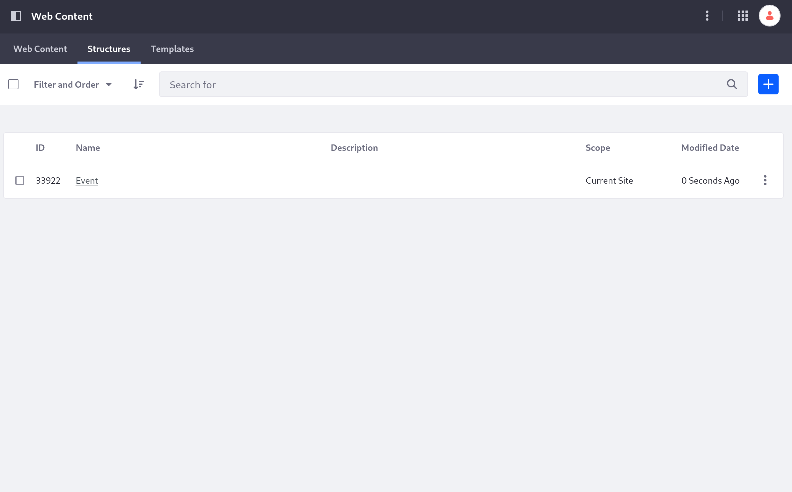
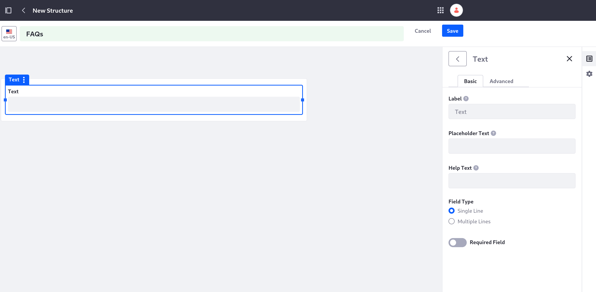
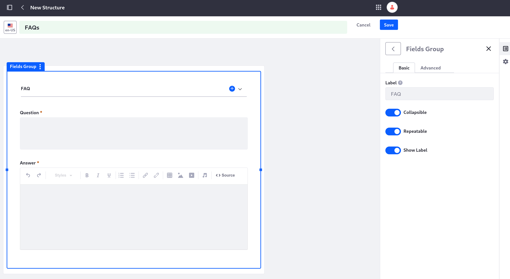

# Adding a Structure for Frequently Asked Questions

It's always helpful to have a list of answers to frequently asked questions on your site, but you'll need to group many questions together. You also need to be able to easily add or remove questions from the list.

Here, you'll create a structure with a *repeatable field* to allow creating articles with any number of questions. A repeatable field is one that you can have as many instances of as you want. In this case, you'll add a repeatable pair of text fields (the question and answer).

## Start Creating the FAQs Structure

1. Log in as Preston Palmer, your public site administrator, if you haven't already.

1. Navigate to the Site Menu &rarr; *Content & Data* &rarr; *Web Content*.

1. Click the *Structures* tab.

1. Click Add (  ) to add a new structure.

   

1. Click into the title field at the top of the page, and name the structure "FAQs".

1. Click the *Properties* button (  ) to access the structure's properties, and enter this description: "Generic structure for a set of common questions and answers."

Now you're ready to configure the structure with the necessary fields.

## Configure the FAQs Structure's Fields

1. Click the *Builder* button (  ) to reopen the Builder menu.

1. From the Builder menu, drag a *Text* field into the body of the structure.

   The text field is added to the structure, and the menu on the right automatically changes to its configuration.

   

1. Set these values in the text field's configuration:

   * **Label**: Question

   * **Field Type**: *Multiple Lines*

   * Enable the *Required Field* toggle.

1. Click the *Advanced* tab and change the *Field Reference* value to `QuestionText`.

   Using this instead of the automatically generated reference value makes it easier to reference it in the template later.

1. Exit the text field's configuration, and drag a second Text field from the Builder menu onto the first one.

   This adds both fields into a field group containing them.

1. Set these values in the second text field's configuration:

   * **Label**: Answer

   * **Field Type**: *Multiple Lines*

   * Enable the *Required Field* toggle.

1. Click the *Advanced* tab and change the *Field Reference* value to `AnswerText`.

1. Click the fields group containing the two text fields to access its configuration, and set these fields:

   * **Label**: Question Group

   * Enable the *Repeatable* toggle.

   

1. Click the *Advanced* tab and change the *Field Reference* value to `QuestionGroup`.

1. Click *Save* at the top of the page.

Now the structure is ready to use, and you can add FAQs or Event web content articles to your site.

These types of content can't be displayed properly without templates for them though. You'll add a [template for your Event structure](./adding-a-template-to-display-an-event.md) next.

## Relevant Concepts 

* [Assigning Permissions to Web Content Structures and Templates](https://learn.liferay.com/web/guest/w/dxp/content-authoring-and-management/web-content/web-content-structures/assigning-permissions-to-structures-and-templates)
* [Configuring Structure Fields](https://learn.liferay.com/web/guest/w/dxp/content-authoring-and-management/web-content/web-content-structures/configuring-structure-fields)
* [Understanding Web Content Structures](https://learn.liferay.com/web/guest/w/dxp/content-authoring-and-management/web-content/web-content-structures/understanding-web-content-structures)
