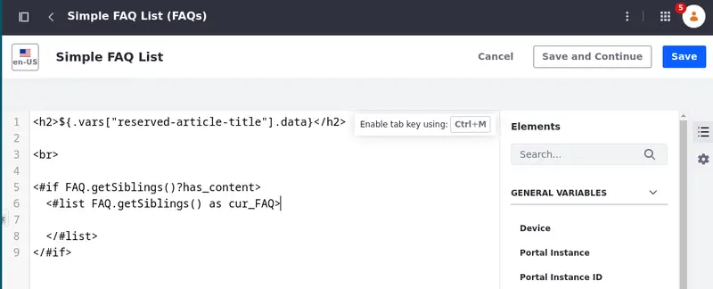
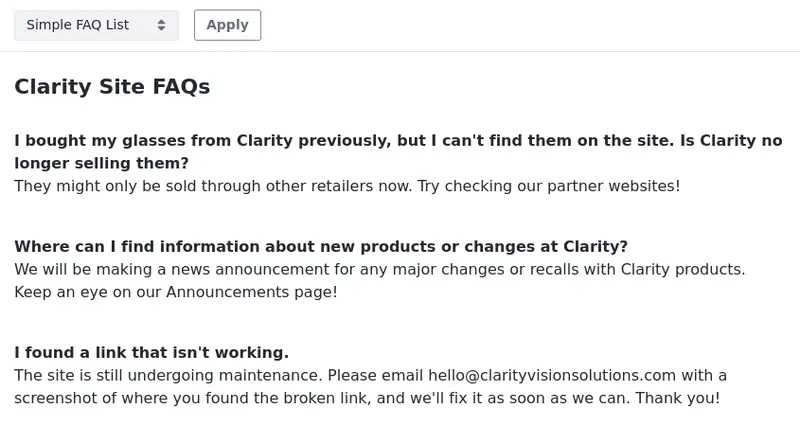
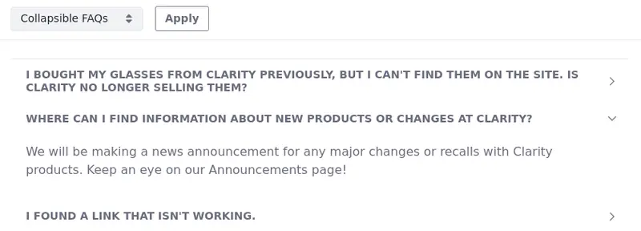

# Adding a Template to Display FAQs

The template for FAQs needs to be able to display not only each field you added, but also every repetition of a question and answer the article *could* have.

Here, you'll make use of a [FreeMarker list](https://freemarker.apache.org/docs/ref_directive_list.html) to ensure every question and answer appears.

## Start Creating the Template

1. Log in as Preston Palmer, your public site administrator (if you haven't already).

1. Navigate to the Site Menu () &rarr; *Content & Data* &rarr; *Web Content*.

1. Select the *Templates* tab and click *Add* ().

1. In the Properties menu () (on the right side of the screen), click *Select Structure* beside the Structure field and select the FAQs structure.

   The new template is associated with the FAQs structure. Use this alternative method or the one mentioned in the previous exercise to create a template and associate it with a structure.

   

<!-- Eric, here's where you'd change the navigation if you want to do it differently for the two templates. -Rich -->

1. Still in the Properties menu, enter this into the *Description* field: `A simple template to list each question and answer.`

1. At the top of the page, enter `Simple FAQ List` as the title.

## Configure the Template's Fields

Next, format the list of FAQ articles.

<!-- I saw references to using Enter in order to tell the user to skip lines to add the new lines of code. I am not sure if this is needed as there are pictures showing how the code will look like in the end. Initially, I had eliminated them, but I brought them back for now. - Eric -->

<!-- I think that's just to format the code. It's good practice. -Rich -->

1. Click *Elements* () to reopen the Elements menu.

1. Click into the body of the template and delete the placeholder text.

1. From the Elements menu, scroll down to the fields under Journal and click *Title*.

   This automatically fills in code that uses the title value.

1. Surround the code with H2 heading HTML tags (`<h2>`), like this:

   ```html
   <h2>${.vars["reserved-article-title"].data}</h2>
   ```

1. Press Enter twice to add two new lines and add an HTML tag for a new line (`<br>`) to separate the title from the list of FAQs.

1. Press Enter twice to add two new lines and, from the list of fields in the Elements menu, click *FAQ*.

   <!-- this question group was called sth else when created -->
   <!-- I altered the code here to reflect the name used in the field reference (FAQ). --Eric -->

   Because the FAQ group is a repeatable field, this adds a FreeMarker list that iterates over each instance in the displayed content.

   

1. Copy this segment in the middle of the inner FreeMarker `<#list></#list>` tags:

   ```html
   <#if (cur_FAQ.QuestionText.getData())??>
      ${cur_FAQ.QuestionText.getData()}
   </#if>

   <#if (cur_FAQ.AnswerText.getData())??>
      ${cur_FAQ.AnswerText.getData()}
   </#if>
   ```

   This is similar to clicking both the *Question* and *Answer* fields from the fields list, but it uses `cur_FAQ` to reference each specific question and answer in the list, each time it iterates.

1. Surround the whole line with the question field's text (`${cur_FAQ.QuestionText.getData()}`) in *bold* text HTML tags (`<b>`), like this example:

   ```html
   <b>${cur_FAQ.QuestionText.getData()}</b>
   ```

1. Press Enter twice to add two new lines and add an HTML tag for a new line (`<br>`) after each of the question and answer blocks of FreeMarker tags. Wrap up by pressing Enter once again.

   

1. Click *Save*.

Now you have a template that displays each question and answer wherever you display a FAQs article, and you can display both of your new types of web content properly on your site.

<!-- I'm not sure if the screenshots were needed, but I thought it would be nice if the user could see what the code looked like once it was rendered on screen. - Eric -->



Next, import a second template for the FAQs structure.

## Import Another Template

While you're still on the Templates page, make sure the top of the page reads "Templates for Structure: FAQs"

1. Still on the Templates page, click *Add* () to create another new template.

   ```{note}
   The top of the Templates page reads "Templates for Structure: FAQs" to remind you that adding a new template still associates it with the FAQs template. If you access the Templates tab normally (without clicking *Manage Templates* for the structure), you need to set the structure manually when you're creating it.
   ```

1. Download and unzip the template resource:

<!-- This link is not working yet. - Eric -->

   ```bash
   curl https://resources.learn.liferay.com/courses/latest/en/liferay-c8m2.zip -O
   ```

   ```bash
   unzip liferay-c8m2.zip
   ```

1. At the top of the page, click *Actions* () &rarr; *Import Script*.

   

1. Upload the FreeMarker template you downloaded (`faq-web-content-template.ftl`) and click *Open*.

   The template body is filled with the new template's FreeMarker code. This template uses the same techniques as the previous template you added, but it also includes [Clay components](https://learn.liferay.com/web/guest/w/dxp/building-applications/developing-a-java-web-application/using-mvc/tag-libraries/clay-tag-library) and an embedded button component.

1. Enter "Collapsible FAQs" as the new template's name.

1. Click *Save*.

Now you have a template that collapses the answers by default, for a cleaner look and feel.



Next: [add some articles](./adding-the-sites-first-web-content.md) with your new content types.

## Relevant Concepts

* [Creating Web Content Templates](https://learn.liferay.com/web/guest/w/dxp/content-authoring-and-management/web-content/web-content-templates/creating-web-content-templates)
* [Mapping Web Content Templates to Fragments](https://learn.liferay.com/web/guest/w/dxp/content-authoring-and-management/web-content/web-content-templates/mapping-web-content-templates-to-fragments)
